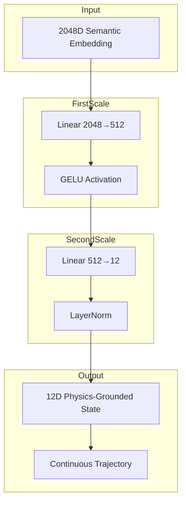

# Patent Figure Generation Pipeline

## When to Use
- Preparing patent application figures for USPTO filing
- Creating technical diagrams for patent disclosure
- Generating reproducible figure sources for AI agents
- Converting between figure formats (Mermaid → PNG/PDF, Python → SVG)
- Ensuring USPTO compliance (300+ DPI, vector preferred)

## Format Strategy

### AI Agent Accessibility Priority
| Format | AI Parseability | Regeneration | Patent Office | Use Case |
|--------|-----------------|--------------|---------------|----------|
| Mermaid (.mmd) | ✅ Excellent | ✅ Easy | ⚠️ Convert | System architecture, flowcharts |
| Quarto (.qmd) | ✅ Excellent | ✅ Reproducible | ✅ Yes | Combined figure document |
| SVG (.svg) | ⚠️ Good (XML) | ⚠️ Hard to edit | ✅ Yes | Technical diagrams |
| Python (.py) | ✅ Excellent | ✅ Reproducible | ✅ Yes | Plots, graphs, mathematical viz |
| PNG (.png) | ⚠️ Poor (raster) | ❌ Cannot edit | ✅ Yes (300+ DPI) | Final submission |
| PDF (.pdf) | ⚠️ Mixed | ❌ Hard to modify | ✅ Preferred | Final submission (vector) |

### Recommended Workflow
```
Source (AI-friendly) → Render → Patent Office Format
Mermaid (.mmd) → mmdc → PNG (300 DPI) or PDF (vector)
Python (.py) → matplotlib → PNG + SVG + PDF
SVG (.svg) → Inkscape → PDF (vector)
Quarto (.qmd) → quarto render → PDF (combined)
```

## Tool Installation

### Required Tools
```bash
# Quarto (document rendering)
wget https://quarto.org/download/latest/quarto-linux-amd64.deb
sudo dpkg -i quarto-linux-amd64.deb
quarto --version  # Verify: v1.6.39+

# Mermaid CLI (Mermaid diagram rendering)
uv tool install @huggingface/mermaid-cli  # v0.1.3+
mmdc --version  # Verify installation

# Python plotting (matplotlib)
uv add matplotlib  # Or: pip install matplotlib

# SVG manipulation (optional)
sudo apt install inkscape  # For SVG → PDF conversion
```

### Installation Verification
```bash
# Test Mermaid rendering
echo "graph TD; A --> B" | mmdc -o test.png
# Expected: test.png created

# Test Quarto rendering
echo "# Test" > test.qmd && quarto render test.qmd
# Expected: test.pdf created

# Test matplotlib
python -c "import matplotlib.pyplot as plt; plt.plot([1,2,3]); plt.savefig('test.png')"
# Expected: test.png created
```

## Figure Types

### FIG. 1: System Architecture (Mermaid)
**Source:**

**Render command:**
```bash
mmdc -i fig01.mmd -o fig01.png -w 2000 -H 1200 -b transparent
mmdc -i fig01.mmd -o fig01.pdf -w 2000 -H 1200
```

### FIG. 2-4: Technical Diagrams (Hand-coded SVG)
**Source:**
```xml
<svg width="800" height="600" xmlns="http://www.w3.org/2000/svg">
  <rect x="100" y="100" width="200" height="100" fill="none" stroke="black"/>
  <text x="200" y="150" text-anchor="middle" font-family="Arial">Encoder</text>
</svg>
```
**Render command:**
```bash
inkscape --export-filename=fig02.pdf fig02.svg
inkscape --export-filename=fig02.png --export-dpi=300 fig02.svg
```

### FIG. 5-6: Mathematical Plots (Python/matplotlib)
**Source:**
```python
import matplotlib.pyplot as plt
import numpy as np

x = np.linspace(-2, 2, 1000)
y = x**4 - 2*x**2  # Double-well potential

fig, ax = plt.subplots(figsize=(8, 6))
ax.plot(x, y, linewidth=2)
ax.set_xlabel('State Variable')
ax.set_ylabel('Potential Energy')
ax.set_title('HIHO Double-Well Potential')
ax.grid(True, alpha=0.3)
plt.savefig('fig05.png', dpi=300, bbox_inches='tight')
plt.savefig('fig05.svg', bbox_inches='tight')
plt.savefig('fig05.pdf', bbox_inches='tight')
```
**Run command:**
```bash
python plot_hiho.py  # Generates PNG + SVG + PDF
```

### Combined Document (Quarto)
**Source:**
```markdown
---
title: "FLUME Patent Figures"
format: pdf
documentclass: article
geometry: margin=1in
---

## FIG. 1: System Architecture

{ width=80% }

## FIG. 2: VAE Encoder-Decoder

{ width=80% }

## FIG. 5: HIHO Double-Well Potential

{ width=80% }
```
**Render command:**
```bash
quarto render figures.qmd --output figures.pdf
```

## USPTO Compliance Requirements

### Format Requirements
- **PDF**: Vector format (preferred for line drawings)
- **PNG**: 300+ DPI minimum (600 DPI recommended)
- **Color**: Black and white only (no color for utility patents)
- **Size**: 8.5" × 11" (Letter) or A4
- **Margins**: 1" minimum on all sides

### Technical Requirements
- **Resolution**: 300+ DPI for raster, vector preferred
- **Line weight**: 0.5pt minimum (visible when printed)
- **Text**: 12pt minimum font size
- **Reference numerals**: Required for all elements
- **Figure labels**: FIG. 1, FIG. 2, etc. (centered below)

### Prohibited Elements
- Color (unless necessary and petition filed)
- Photographs (rarely allowed in utility patents)
- Shading/gray scale (use hatching instead)
- Borders around figures

## Multi-Format Generation Workflow

### Step 1: Create AI-Friendly Sources
```bash
# Directory structure
docs/patents/figures/
  mermaid/
    fig01_architecture.mmd
    fig07_journey.mmd
    fig08_multi_scale.mmd
  svg/
    fig02_vae.svg
    fig03_12d_state.svg
    fig04_trajectory.svg
  python/
    plot_hiho.py
    plot_training.py
  figures.qmd  # Combined document
```

### Step 2: Render Mermaid Diagrams
```bash
cd docs/patents/figures/mermaid
for f in *.mmd; do
  mmdc -i "$f" -o "${f%.mmd}.png" -w 2000 -H 1200 -b transparent
  mmdc -i "$f" -o "${f%.mmd}.pdf" -w 2000 -H 1200
done
# Output: fig01.png, fig01.pdf, fig07.png, fig07.pdf, fig08.png, fig08.pdf
```

### Step 3: Render Python Plots
```bash
cd docs/patents/figures/python
python plot_hiho.py      # Generates fig05.png, fig05.svg, fig05.pdf
python plot_training.py  # Generates fig06.png, fig06.svg, fig06.pdf
```

### Step 4: Convert SVG to PDF
```bash
cd docs/patents/figures/svg
for f in *.svg; do
  inkscape --export-filename="${f%.svg}.pdf" "$f"
  inkscape --export-filename="${f%.svg}.png" --export-dpi=300 "$f"
done
# Output: fig02.pdf, fig02.png, fig03.pdf, fig03.png, fig04.pdf, fig04.png
```

### Step 5: Render Quarto Document
```bash
cd docs/patents/figures
quarto render figures.qmd --output figures.pdf
# Output: figures.pdf (all figures in single document)
```

### Step 6: Verify Compliance
```bash
# Check PNG resolution
identify -verbose fig01.png | grep -i resolution
# Expected: Resolution: 300x300 (or higher)

# Check PDF vector status
pdffonts fig01.pdf  # Should show fonts, not raster
# If error: figure is vector (good)

# Check file size (too large = raster)
ls -lh *.pdf  # Vector PDFs should be <500KB
```

## Critical Patterns

### Pattern 1: Dual-Format Strategy
Generate BOTH standalone AND embedded:
- **Standalone**: Individual PNG/PDF for patent office submission
- **Embedded**: Quarto PDF for AI agent consumption + reproducibility

### Pattern 2: Source Preservation
Keep AI-friendly sources:
- Mermaid (.mmd) for diagrams
- Python (.py) for plots
- SVG (.svg) for technical drawings
- Quarto (.qmd) for combined document

### Pattern 3: Reference Numeral Consistency
Use consistent numbering across all figures:
- FIG. 1: 100-series (110, 120, 130, 140, 150)
- FIG. 2: 200-series (210, 220, 230)
- FIG. 3: 300-series (310, 320, 330)
- Cross-reference in specification

### Pattern 4: Resolution Hierarchy
Prioritize vector formats:
1. PDF (vector) - USPTO preferred
2. SVG (vector) - Editable, XML-based
3. PNG (300+ DPI) - Fallback for raster
4. Never: JPEG (lossy compression)

### Pattern 5: Reproducibility Documentation
Include regeneration commands:
```markdown
## Regeneration Commands

FIG. 1: `mmdc -i mermaid/fig01.mmd -o mermaid/fig01.pdf -w 2000 -H 1200`
FIG. 5: `python python/plot_hiho.py`
All figures: `quarto render figures.qmd --output figures.pdf`
```

## Error Handling

### Mermaid Rendering Errors
```bash
# Error: "mmdc: command not found"
# Fix: Install Mermaid CLI
uv tool install @huggingface/mermaid-cli

# Error: "Syntax error in diagram"
# Fix: Validate Mermaid syntax
mmdc -i fig01.mmd -o /dev/null 2>&1 | head -20

# Error: "Output file too large"
# Fix: Reduce dimensions
mmdc -i fig01.mmd -o fig01.png -w 1600 -H 900
```

### Python Plotting Errors
```python
# Error: "FancyBboxPatch not found"
# Fix: Use standard patch types
from matplotlib.patches import Rectangle  # Not FancyBboxPatch

# Error: "Font not available"
# Fix: Use system fonts
plt.rcParams['font.family'] = 'DejaVu Sans'

# Error: "Savefig produces empty file"
# Fix: Call savefig before show()
plt.savefig('output.png')  # Before plt.show()
```

### Quarto Rendering Errors
```bash
# Error: "Quarto not found"
# Fix: Install Quarto
wget https://quarto.org/download/latest/quarto-linux-amd64.deb
sudo dpkg -i quarto-linux-amd64.deb

# Error: "LaTeX compilation failed"
# Fix: Install LaTeX dependencies
sudo apt install texlive-latex-base texlive-latex-extra

# Error: "Figure not found"
# Fix: Check relative paths
# Use: 
```

## Figure Index Template

### Create PATENT_FIGURES_INDEX.md
```markdown
# Patent Figures Index

## Figure Catalog

| Figure | Source | PNG | PDF | SVG | Description |
|--------|--------|-----|-----|-----|-------------|
| FIG. 1 | mermaid/fig01.mmd | ✓ | ✓ | - | System architecture |
| FIG. 2 | svg/fig02_vae.svg | ✓ | ✓ | ✓ | VAE encoder-decoder |
| FIG. 3 | svg/fig03_12d_state.svg | ✓ | ✓ | ✓ | 12D physics-grounded state |
| FIG. 4 | svg/fig04_trajectory.svg | ✓ | ✓ | ✓ | Continuous trajectory |
| FIG. 5 | python/plot_hiho.py | ✓ | ✓ | ✓ | HIHO double-well potential |
| FIG. 6 | python/plot_training.py | ✓ | ✓ | ✓ | Training convergence |
| FIG. 7 | mermaid/fig07.mmd | ✓ | ✓ | - | Journey tracking |
| FIG. 8 | mermaid/fig08.mmd | ✓ | ✓ | - | Multi-scale reasoning |

## Regeneration Commands

```bash
# All Mermaid figures
for f in mermaid/*.mmd; do mmdc -i "$f" -o "${f%.mmd}.png" -w 2000 -H 1200; done

# All Python plots
python python/plot_hiho.py && python python/plot_training.py

# All SVG conversions
for f in svg/*.svg; do inkscape --export-pdf="${f%.svg}.pdf" "$f"; done

# Combined document
quarto render figures.qmd --output figures.pdf
```

## USPTO Compliance Status

- Resolution: All PNG files 300+ DPI ✓
- Format: All PDFs vector ✓
- Color: Black and white only ✓
- Size: 8.5" × 11" or scalable ✓
- Margins: 1" minimum ✓
```

## Tools Required
- Quarto v1.6.39+ (document rendering)
- Mermaid CLI v0.1.3+ (Mermaid diagrams)
- Python 3.10+ with matplotlib (plots)
- Inkscape (SVG → PDF conversion, optional)
- ImageMagick (PNG verification, optional)

## Time Estimates
- Tool installation: 30 minutes
- Creating source files: 2-4 hours (8 figures)
- Rendering all formats: 30 minutes
- Compliance verification: 15 minutes
- **Total**: 3-5 hours

## Ethical Considerations
- Full attribution in figure captions (e.g., "12D state per Smith (1962)")
- Acknowledge prior art inspirations
- Cite mathematical derivations (Shoulders, Greenyer)
- Maintain reproducibility for PHOSITA
