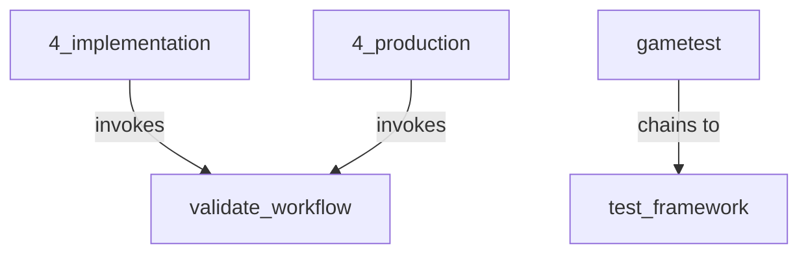

# BMAD Traceability Report

## Summary Statistics

- **Agents**: 27
- **Workflows**: 74
- **Tasks**: 7
- **Invocations**: 7
- **Party Configs**: 4

## Matrix Files Generated

- `matrix`: TraceabilityMatrix
- `return`: Dict[str, Path]

## Cycle Detection

✓ No workflow cycles detected

## Orphan Detection

## Dependency Graph

