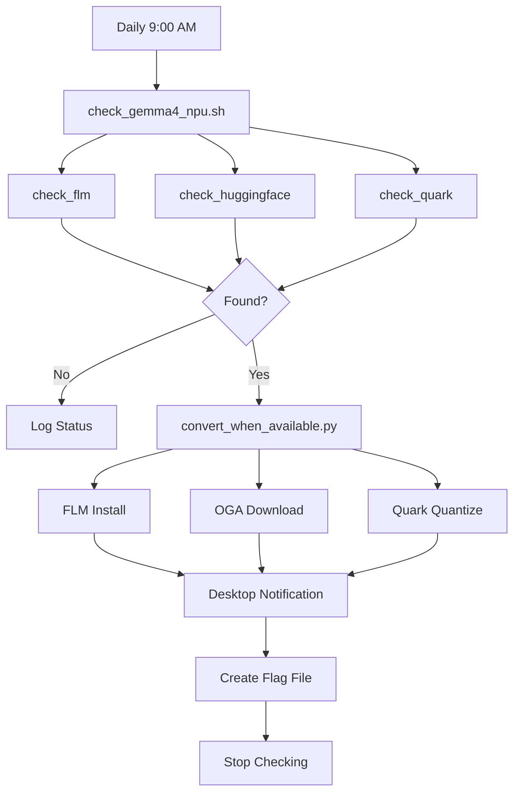

# Gemma 4 NPU Daily Automation System

## System Overview

Automated daily monitoring (9:00 AM) that checks for Gemma 4 NPU availability across three sources and auto-converts/downloads when detected.

## Architecture



## Components

### 1. Cron Job
```cron
0 9 * * * /home/mike-anderson/gemma4-npu-conversion/check_gemma4_npu.sh >> /home/mike-anderson/gemma4-npu-conversion/cron_gemma4.log 2>&1
```

### 2. Check Script (`check_gemma4_npu.sh`)
- **FLM Check**: `flm list --filter all | grep gemma4`
- **HuggingFace Check**: `huggingface.co/api/models?search=amd/gemma-4`
- **Quark Check**: SDK architecture support
- **Lock Prevention**: PID-based file locking
- **Status Persistence**: JSON status file

### 3. Conversion Script (`convert_when_available.py`)
Three conversion paths:

| Source | Method | Steps |
|--------|--------|-------|
| FLM | `flm pull <variant>` | Download pre-built |
| HuggingFace | `huggingface-cli download` | Get OGA model |
| Quark | `quark.onnx.ModelQuantizer` | Quantize ONNX export |

### 4. Management Tool (`setup_cron.sh`)
Commands:
- `install` - Add cron job
- `remove` - Remove cron job
- `status` - Show current status
- `test` - Run check immediately

## Status Tracking

### Status File (`gemma4_status.json`)
```json
{
  "status": "unavailable|available",
  "source": "flm|huggingface|quark",
  "timestamp": "2026-04-10T21:50:19-04:00",
  "next_check": "2026-04-11T21:50:19-04:00",
  "models": "..."  // If available
}
```

### Completion Flag (`gemma4_npu_converted.flag`)
Created upon successful conversion. Stops further checks.

## Monitoring Sources

### Priority 1: FLM Model List
```bash
flm list --filter all | grep gemma4
# Output: gemma4:2b ⏬, gemma4:4b ⏬, etc.
```

### Priority 2: HuggingFace AMD
```bash
curl -s "https://huggingface.co/api/models?search=amd/gemma-4"
# Look for: amd/gemma-4-2b-it-onnx-ryzenai-npu
```

### Priority 3: Quark Architecture Support
```python
from quark.onnx.quantization.config.config import SUPPORTED_MODELS
'gemma4' in [m.lower() for m in SUPPORTED_MODELS]
```

## Automation Behavior

### When Gemma 4 Not Available
1. Log: "✗ Gemma 4 not yet available"
2. Update status.json with "unavailable"
3. Exit cleanly
4. Next check: Tomorrow 9:00 AM

### When Gemma 4 Available
1. Update status.json with "available" + source
2. Trigger appropriate conversion method
3. Test converted model
4. Create completion flag
5. Send desktop notification
6. Log success extensively
7. Future checks skip (flag file exists)

## Commands

```bash
cd ~/gemma4-npu-conversion

# Check current status
./setup_cron.sh status

# Run immediate check
./setup_cron.sh test

# View execution logs
tail -f cron_gemma4.log

# Check JSON status
cat gemma4_status.json | jq

# Remove automation
./setup_cron.sh remove
```

## Systemd Alternative

Created but not enabled by default:

```bash
# Enable systemd timer
systemctl --user daemon-reload
systemctl --user enable gemma4-check.timer
systemctl --user start gemma4-check.timer

# Check status
systemctl --user status gemma4-check.timer
```

## Expected Timeline

Historical AMD FLM releases:
- Gemma 2 → AMD support: ~2 months
- Gemma 3 → AMD support: ~2 months
- Gemma 4 → AMD support: Unknown (monitoring daily)

## Integration Points

### Current Status
- ✅ Cron job active
- ✅ Scripts executable
- ✅ Log rotation (manual)
- ✅ Status persistence
- ✅ Lock prevention
- ⚠️ Quark path may fail (protobuf 2GB limit)

### Recommended Actions
1. Monitor logs weekly: `tail -100 cron_gemma4.log`
2. Check HF AMD repo: https://huggingface.co/amd
3. Manual FLM check: `flm list | grep gemma4`

## Success Criteria

When automation succeeds:
- [x] `gemma4_npu_converted.flag` created
- [x] Desktop notification shown
- [x] Model verified working on NPU
- [x] Cron job stops (flag prevents re-checking)
- [x] Log shows full conversion details

## Files

```
~/gemma4-npu-conversion/
├── check_gemma4_npu.sh          # Daily check
├── convert_when_available.py    # Auto-conversion
├── setup_cron.sh               # Management
├── README_AUTOMATION.md        # User docs
├── AUTOMATION_COMPLETE.md      # Setup summary
├── gemma4_status.json          # Status tracking
├── cron_gemma4.log             # Execution log
├── gemma4_npu_converted.flag   # Completion marker
└── .config/systemd/user/       # Systemd files
    ├── gemma4-check.service
    └── gemma4-check.timer
```

---
*Created*: 2026-04-10
*Schedule*: Daily 9:00 AM
*Current Status*: ✅ Active and monitoring
*Next Action*: Wait for AMD Gemma 4 release
