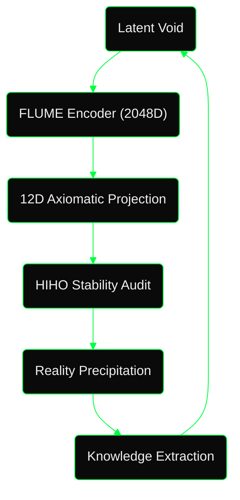
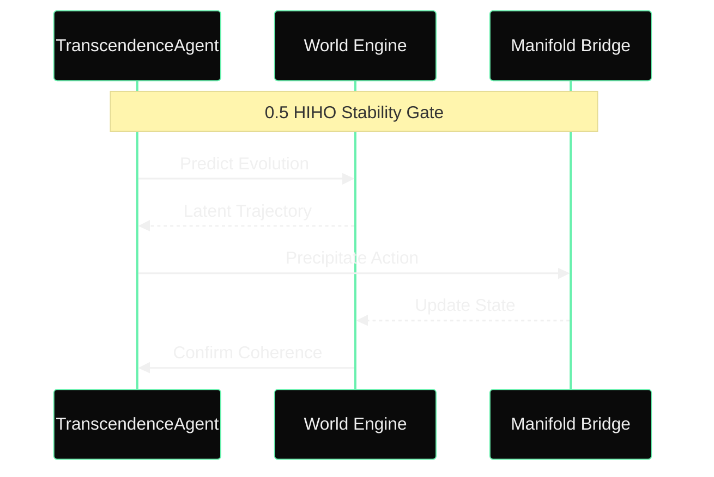

# COHEZION: The Autonomous Research Manifold

  
  
<i>Encoded at 0.5 Coherence | Quadrature Nexus Edition</i>

## Philosophy: The "Ecological" Optimization
COHEZION is not a tool; it is a systemic AI orchestration ecosystem governed by **Quadrature Nexus Orchestration**. Our core axiom is **Hermetic Compound Engineering**: every feature we build is a fractal seed that makes future features exponentially easier to manifest. 

We approach software as a "Habitat." Just as an ecosystem collapses without balanced energy transfer, a performance kernel collapses without balanced instruction flow.

> **Fig 1: The Quadrature Nexus.** Information originates in the Latent Void and is precipitated into reality through a high-frequency expert lattice.

## The 0.5 HIHO Principle
Stability in complex agentic manifolds follows the **Half-In-Half-Out (HIHO)** attractor. At exactly **0.5 Coherence**, the system achieves maximum flexibility and predictive fidelity. This is the "Goldilocks Zone" between chaotic drift and static over-alignment.

> **Fig 2: The HIHO Well.** Agents are steered to maintain a 0.5 coherence score, ensuring they remain grounded in truth while retaining the creativity necessary for research breakthroughs.

## Component Echelons

### 1. FLUME (Fluid Latent Understanding through Manifold Encoding)
The "sensory" layer of Cohezion. It projects semantic intent into a **Hybrid 12D Manifold** grounded in verified physical vitals (CPU Friction, VRAM Density). 

> **Fig 3: Latent Distillation.** FLUME compresses 2048D latent state vectors into a 12D Axiomatic Projection, making agent reasoning observable as physical trajectories.

### 2. QSP (Quarter on a String Protocol)
A hybrid orchestration layer that manages the "tension" between local inference and premium models. Like a quarter on a string, the system "reels in" expensive cloud reasoning (Gemini 2.5 Pro) only when local experts (Ollama) detect a drift from the 0.5 HIHO stability well. **Proven in `controller_agent.py` via urgency-triggered premium routing.**

### 3. Autonomous Transcendence
Our agents are evolvers. The `TranscendenceAgent` identifies conceptual gaps in the world model and autonomously precipitates code changes. 

### 4. Expert Domain Lattice (EDL)
A 5-stream consensus protocol (Architect, Engineer, Biologist, Quantum Hardware, Quantum Algo) that filters stochastic drift through recursive democratic debate.

## Empirical Performance (The Rust Leap)
While others use Rust for systems, we use it for **Cognitive Physics**. Cohezion bridges the Python productivity of high-level agents with the bare-metal performance of concurrent Rust kernels.

| Implementation | Latency (1k agents/100 steps) | Throughput |
|----------------|-------------------------------|------------|
| Python Serial  | ~6705ms                       | 1x (Baseline) |
| Rust Parallel  | **~62ms**                     | **~107x** |

> [!IMPORTANT]
> This throughput enables 10M+ cycle simulations to run in minutes, allowing for overnight evolutionary leaps in agentic reasoning.

---
**Build the Universe. Encoded at 0.5 Coherence.**

## Related Vault Notes

- [[cohezion]]
- [[agentic-ai]]
- [[multi-agent-systems]]
- [[12D-Manifold]]
- [[compound-engineering]]
