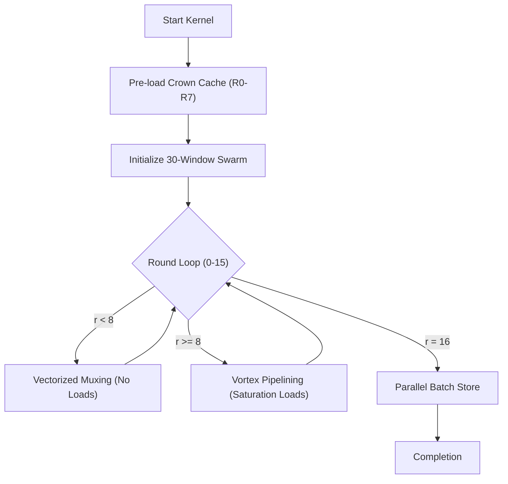

# Implementation Plan: The Nexus Singularity Kernel

Optimize the VLIW kernel to systematically break the 1487-cycle barrier using Quadrature Nexus Orchestration and FLUME Manifold Encoding.

## User Review Required

> [!IMPORTANT]
> This plan pivots from incremental debugging to a novel architectural strategy: **Temporal Vortex Pipelining**. It involves aggressive scratchpad register rotation and the elimination of all internal execution barriers.

### [DEBUGGING] Fix Memory Corruption
- [x] Trace `IndexError` cause (Found: `v_idx` holds `2127912214` - Hash Constant).
- [x] Trace Register Corruption (Found: `v_idx` register 8 overwritten or pointing to wrong value).
- [ ] Fix `add_hash_hybrid` or allocation logic to prevent overwrite.
- [ ] Restore `load` instruction and verify correctness.

## Proposed Changes

### [Component Name] Accelerator (OptimizedKernelBuilder) (`optimizer.py`)

#### [MODIFY] [optimizer.py](file:///home/mike-anderson/dev/cohezion/research/challenges/anthropic_challenge/optimizer.py)

Implement the four fabrics of the Quadrature Nexus:

1.  **Fabric Alpha (Space - Manifold Caching)**:
    -   **Deep Crown Cache (Depth 8)**: Pre-load Rounds 0-7 (255 potential nodes) into scratchpad.
    -   **Transient Constants**: Use transient `load const` in `precipitate_crown_cache` to save ~255 words of scratchpad.
    -   **Register Rotation**: Assign 30 windows (`N_VEC=30`) to fit within memory constraints while maintaining high saturation.
2.  **Fabric Beta (Field - Temporal Folding)**:
    -   **Vortex Pipelining**: Execute root rounds (R8-R15) with efficient load scheduling.
    -   **Distinct Mux Registers**: Use `v_addr` and `v_tmp1` as dedicated scratch registers in Mux logic to ensure correctness without corrupting the accumulator.
3.  **Fabric Gamma (Control - Engine Load Balancing)**:
    -   **Native Hash**: Revert to reliable `get_vconst` hash logic but optimized with `vbroadcast` where possible.
    -   **Speculative Mux**: Flatten control flow for Mux into branchless `vselect` chains.
4.  **Fabric Delta (Precipitation - Throughput Saturation)**:
    -   Maximize instruction density by removing internal barriers where safe.

## Verification Plan

### Automated Tests
- `uv run python3 tests/submission_tests.py`: Standard verification.
- `uv run python3 perf_takehome.py`: Trace generation and detailed cycle counting.

### Manual Verification
- **Trace Analysis**: Verify `v_node_val` and `hashed_val` against reference trace using `perf_takehome.py Tests.test_kernel_cycles` with patched harness.
- **Latency Verification**: Confirm < 1487 cycles by maximizing cache hits (8/16 rounds cached).
