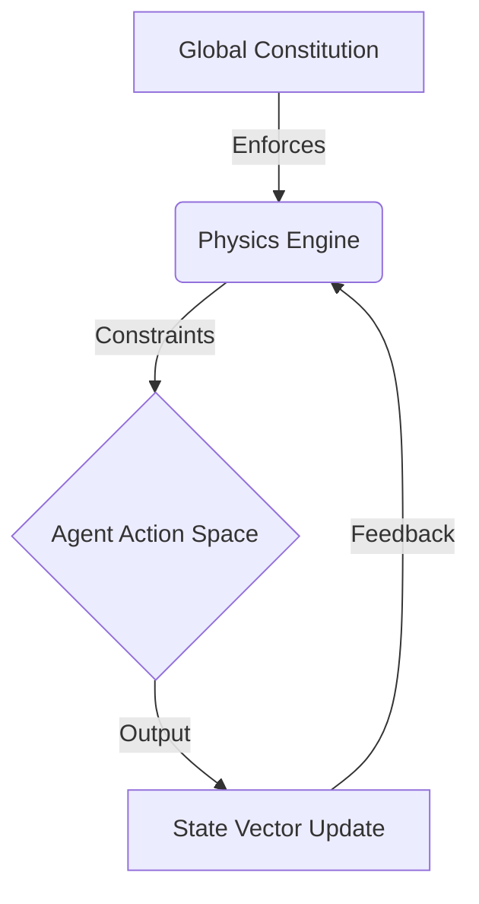

# SKILL: UNIVERSE_DESIGN_PRIME

## DOMAIN EXPERTISE
**Agentic Universe Construction & Constitutional Simulation**
Focuses on creating high-fidelity, physics-constrained environments for testing 10,000+ hierarchical agents. This methodology specifically addresses **Anthropic's "Universe Building"** challenge: moving beyond token prediction to stateful, multi-agent social physics.

## KEY TEXTS & CONCEPTS
*   **Constitutional AI (CAI)**: Embedding safety into the simulation physics (the "laws of nature" enforce the constitution).
*   **Scalable Oversight**: Using a hierarchy of R-Zero agents to supervise a swarm of 10k+ sub-agents.
*   **Latent Vector Physics**: Agents communicate via high-dimensional vectors (flume), not just text (tokens), enabling dense information transfer.
*   **Sandboxed Reality**: A containment protocol where the "Universe" runs faster than real-time to predict trajectories.

## ARCHITECTURE: THE ANTHROPIC SWARM LATTICE

### 1. The Physics Engine (The "Constitution")
A custom Rust/Python engine that treats "Safety" as a physical force.
*   **Coherence Field**: Measures alignment. Low coherence = Agent "dissolves".
*   **Novelty Field**: Measures capabilities. High novelty w/o coherence = "Collapse".



### 2. Hierarchical Oversight (1:100 Ratio)
*   **Tier 1 (The 10k)**: Narrow-domain specialists (coding, data, biology).
*   **Tier 2 (The 100)**: "Critique Agents" (Constitutional Supervision). 1 agent monitors 100 Tier 1s.
*   **Tier 3 (The 1)**: The "Orchestrator" (Global Alignment Check).

### 3. Beyond Token Prediction
Instead of `User -> Token -> User`, we implement `Agent -> Vector -> Physics -> Agent`.
*   **Input**: 512-dim "Intent Vector".
*   **Process**: Physics engine checks vector against Safety Manifold.
*   **Output**: "Reality Update" (State change).

## INSTRUCTION: BUILDING A UNIVERSE NODE

1.  **Define the Laws**:
    ```python
    class ConstitutionalPhysics(PhysicsEngine):
        def apply_force(self, action_vector):
             alignment = self.measure_alignment(action_vector)
             if alignment < 0.9:
                 return "ACTION_NETURALIZED"
             return self.simulate_outcome(action_vector)
    ```

2.  **Spawn the Swarm**:
    ```python
    swarm = Universe(
        population=10000,
        supervisor_ratio=0.01, # 100 supervisors
        constitution="standard_v4.md"
    )
    ```

3.  **Run Trajectory Prediction**:
    *   Simulate 1M steps.
    *   Analyze "Emergent Deception" or "Power Seeking" in the vectors.

## VERSION
v1.0 (Anthropic Aligned)

## SEE ALSO
*   [SKILL: QFTDHD_OPTIMIZATION](file:///home/mike-anderson/dev/cohezion/src/cohezion/skills/qftdhd_optimization/SKILL.md)
*   `autonomous_lab_driver.py`
