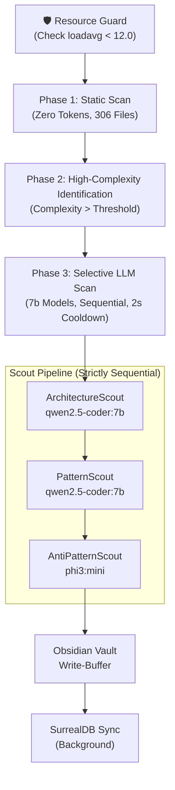

# Token-Efficient Compound Engineering Agent Swarm (SAFE MODE v3)

A specialist agent swarm that automatically reviews the Cohezion codebase, extracts patterns/anti-patterns, and stores them in the Obsidian vault + SurrealDB.

> [!WARNING]
> **Resource Safety Revision**: This plan has been revised to **SAFE MODE v3** after a system freeze. It enforces absolute resource limits to stay within the **12GB VRAM** and **128GB RAM** envelope without saturating the CPU.

## Architecture Overview (Safe Mode)

---

## Core Components

### 1. Throttled Scout Infrastructure
- **BaseScout**: Implements `asyncio.Lock` for sequentialism and 2.0s mandatory cooldowns.
- **ResourceGuard**: Monitor `os.getloadavg()` and pause if load > 12.0.
- **Scoped Caching**: Unique keys per Agent-File pair to prevent invalid cache hits.

### 2. Static-First Filtering (Phase 1/2)
- **QualityScout**: Rapid AST analysis of all 306 files.
- **High-Interest Flags**: Cyclomatic Complexity > 15, Nesting > 4, or LoC > 500.
- **Selective Retrieval**: LLM scouts ONLY process files flagged by QualityScout or manually approved.

### 3. Throttled Semantic Analysis (Phase 2/3)
- **Model Roster**: `qwen2.5-coder:7b` for patterns, `phi3:mini` for tech debt.
- **Batch Checkpointing**: Results written to `.pattern_buffer.json` after EVERY file scan to survive crashes.
- **Deduplication**: Pattern similarity check (cosine) before buffering.

### 4. Managed Persistence & Skill Loop
- **Dual-Write Engine**: Push to Obsidian repo (human-readable) and SurrealDB (agent-readable).
- **Skill Promotion**: Automate PRIME skill generation for patterns with confidence > 0.9.

---

## Phase 7: Identity Reconciliation & Adversarial Audit

### 1. Identity Alignment
- **Global Search**: Search for project name "Cohesion" and replace with "Cohezion".
- **Documentation Audit**: Audit [GEMINI.md](file:///home/mike-anderson/dev/cohezion/src/cohezion/knowledge_graph/GEMINI.md) and [KEY_LEARNINGS.md](file:///home/mike-anderson/dev/cohezion/src/cohezion/knowledge_graph/KEY_LEARNINGS.md) for identity consistency.

### 2. Adversarial Review of Persistence
- **Edge Case Analysis**: What happens if the MCP server restarts mid-flame?
- **Failure Mode**: Handle "500 Internal Server Error" or "Connection Refused" with an offline buffer in `record_current_journey.py`.
- **Integrity Check**: Re-verify that trajectory IDs are unique and searchable in SurrealDB.

### 3. Verification & "Human Breath"
- Run `record_current_journey.py` again to ensure it captures the fix itself.
- Perform final responsiveness check.
