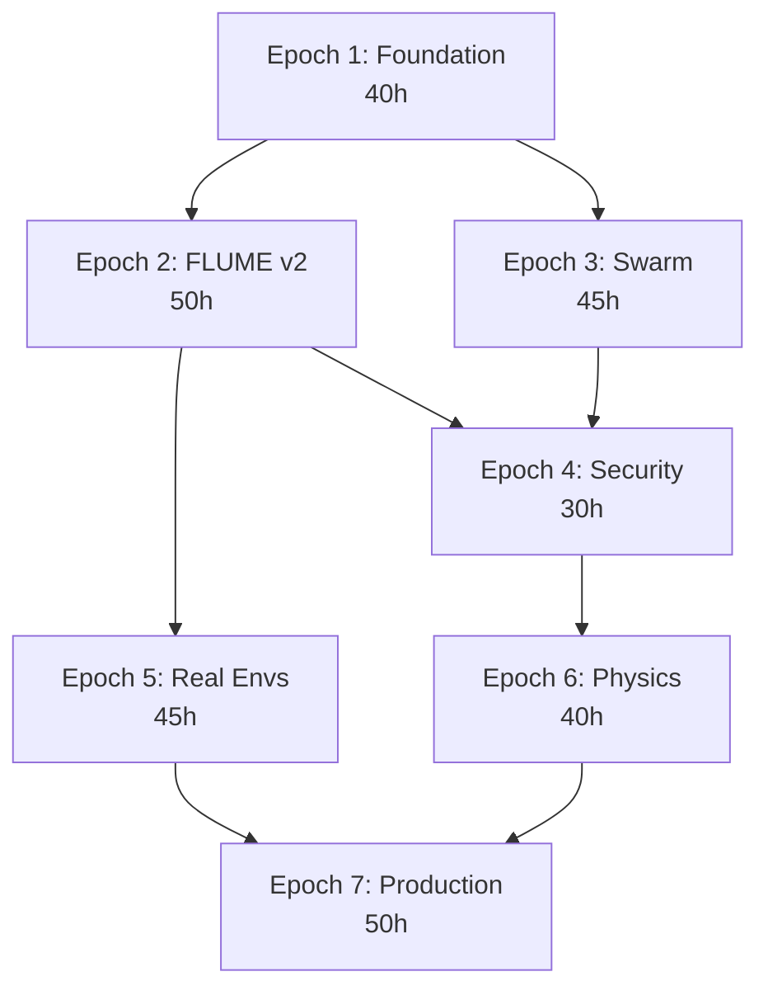

# 300-Hour Autonomous Execution Plan

_Created: 2026-02-24 • Aligned with COHEZION_CHARTER + MISSION_JOURNAL Phase 26_

## Sprint Retrospective (Session 75)

| Metric               | Before → After                 |
| -------------------- | ------------------------------ |
| Import gate failures | 13/384 → **0**                 |
| Missing modules      | 4 → **0** (functional stubs)   |
| Smoke tests          | 0 → **11 passing**             |
| Skip list            | 0 → **7** (optional deps only) |
| Pre-commit hooks     | 6 → **8** (+Gate 1 & 2)        |
| 24MB `.pt` files     | staged → **excluded**          |

**What worked**: Gate 1 immediately proved its value — 13 silent import failures caught on first run. Compound engineering: each stub became real infrastructure (ModelRegistry has task routing, evaluator has 4 criterion classes).

**Lesson**: Cleanup is never one-pass (Learning 103 confirmed again). A pre-survey skip list would save cycles.

---

## Plan Architecture

```
300 hours = 7 Epochs × ~43 hours each
Each Epoch = multiple 30-min sprints with checkpoints
```



---

## Epoch 1: Foundation Hardening (40h)

_Goal: Make the codebase trustworthy for autonomous operation_

### 1.1 Test Suite Isolation (8h) — Risk: Low

- [ ] Scan 230 test files for external service calls (SurrealDB, Ollama, MCP)
- [ ] Add `@pytest.mark.integration` markers throughout
- [ ] Create `conftest.py` fixtures: `mock_ollama`, `mock_surrealdb`, `mock_mcp`
- [ ] Ensure `pytest tests/ -m "not integration"` completes in <30s
- [ ] Add timeout decorators to all async tests (prevent hangs)
- **Acceptance**: `pytest tests/` finishes in <60s without external deps

### 1.2 Lint Cleanup: 153 → 0 (8h) — Risk: Low

- [ ] Auto-fix 9 safe fixes via `ruff --fix`
- [ ] Fix F841 (unused vars), B006 (mutable defaults), E722 (bare except)
- [ ] Triage security rules (S-prefixed) — add justified ignores
- [ ] Fix `enhanced_simulator.py` — 80+ type errors (biggest single file)
- [ ] Add type annotations to all untyped class attributes
- **Acceptance**: `ruff check src/cohezion/` returns 0 errors

### 1.3 Gate 3: Coverage Threshold (4h) — Risk: Low

- [ ] Measure current coverage baseline
- [ ] Create `tests/smoke/test_coverage.py` — fails if coverage < threshold
- [ ] Set initial threshold at measured baseline (ratchet-only)
- [ ] Add to pre-commit hooks
- **Acceptance**: Coverage threshold enforced on every commit

### 1.4 TODO/FIXME Debt Resolution (4h) — Risk: Low

- [ ] Audit all 21 TODO/FIXME markers across `src/cohezion/`
- [ ] Resolve or convert to tracked issues with context
- [ ] Priority: `security/guardrail_adapters.py` (3), `cache/cache_warmer.py` (2)
- **Acceptance**: All existing TODOs either resolved or linked to issues

### 1.5 Documentation Audit (8h) — Risk: Low

- [ ] Enforce NumPy-style docstrings on all public functions (402 files)
- [ ] Auto-generate API reference with `pdoc` or `sphinx-autodoc`
- [ ] Update README.md metrics (tests, files, packages, endpoints)
- [ ] Create `ARCHITECTURE.md` from live codebase analysis (not from memory)
- **Acceptance**: Every public function has docstring; API docs auto-generated

### 1.6 Dependency Hygiene (8h) — Risk: Low

- [ ] Audit `pyproject.toml` — remove unused deps, pin versions
- [ ] Create optional dependency groups: `[ml]`, `[sim]`, `[security]`
- [ ] Ensure `uv pip install cohezion` works with minimal deps
- [ ] Validate all optional deps are in skip list with comments
- **Acceptance**: Clean install with no warnings; dependency groups documented

---

## Epoch 2: FLUME v2 Pipeline (50h)

_Goal: Complete the latent trajectory engine with real semantic embeddings_
_Continues from Phase 26 (MISSION_JOURNAL)_

### 2.1 Bootstrap Training Data (10h) — Risk: Medium

- [ ] Generate 10K+ diverse task descriptions covering all 5 Expert Streams
- [ ] Use Ollama `nomic-embed-text` to produce 768D embeddings
- [ ] Create contrastive pairs: paraphrases (positive) + unrelated (negative)
- [ ] Export as `.npy` dataset with train/val/test splits (80/10/10)
- **Acceptance**: Dataset ≥10K samples with balanced domain coverage

### 2.2 VAE Training Run (10h) — Risk: Medium

- [ ] Train VAE v2 with KL annealing (β: 0→0.1 over 30% warmup)
- [ ] Free-bits (0.125/dim) to prevent KL collapse
- [ ] Active unit monitoring — target ≥200/256 active
- [ ] Checkpoint every 10 epochs to `data/flume/checkpoints_v2/`
- [ ] Train for 200 epochs minimum
- **Acceptance**: Green-light criteria met:

| Metric                 | Threshold |
| ---------------------- | --------- |
| KL divergence          | > 0.1     |
| Reconstruction cos_sim | > 0.95    |
| Paraphrase P@1         | > 0.85    |
| Spearman ρ             | > 0.90    |
| Active units           | ≥ 200/256 |

### 2.3 Latent Space Navigation (15h) — Risk: Medium

- [ ] Implement `ManifoldExplorer` — walk the latent space via geodesics
- [ ] Interpolation API: `flume.interpolate(z1, z2, steps=10)`
- [ ] Nearest-neighbor retrieval from latent space
- [ ] Morphospace stability wells (from v1 preserved patterns)
- [ ] Momentum-based trajectory prediction with counterfactual branching
- **Acceptance**: Smooth semantic interpolation between any two task embeddings

### 2.4 SemanticCache Integration (10h) — Risk: Low

- [ ] A/B test: FLUME v2 vs hash-based cache keys
- [ ] Integrate `FlumeVAE.encode()` into `SemanticCache` as embedding backend
- [ ] Measure cache hit rate improvement
- [ ] Cosine similarity threshold for "similar enough" cache hits
- **Acceptance**: Cache hit rate measurably improves over hash-based keys

### 2.5 CLI Entry Point (5h) — Risk: Low

- [ ] `cz flume train` — launch training run with config
- [ ] `cz flume eval` — evaluate checkpoint against green-light criteria
- [ ] `cz flume explore` — interactive latent space navigation
- [ ] `cz flume export` — export trained model for deployment
- **Acceptance**: All 4 CLI commands functional and documented

---

## Epoch 3: Swarm Intelligence (45h)

_Goal: Bring the Expert Domain Lattice to life_
_Charter §8: EDL, §4: Abstraction as Primary_

### 3.1 Topology Engine (10h) — Risk: Medium

- [ ] Expand `topology.py` stub into full EDL graph manager
- [ ] Dynamic node provisioning based on task complexity
- [ ] Fabric assignment (Space/Field/Control/Precipitation)
- [ ] Load balancing across regional swarms
- [ ] Health monitoring per node with auto-replacement
- **Acceptance**: Topology graph manages ≥5 concurrent regional swarms

### 3.2 Expert Stream Routing (15h) — Risk: High

- [ ] Implement 5 expert streams per Charter: Architect, Engineer, Biologist, Quantum HW, Quantum Algo
- [ ] Task classification → stream assignment using FLUME embeddings
- [ ] Cross-stream consultation protocol (when one expert needs another)
- [ ] Consensus stabilization per Charter §1 (0.5 coherence rule)
- [ ] Integrate `ModelRegistry` for model selection per stream
- **Acceptance**: Task routed to correct stream ≥90% of the time

### 3.3 QuadratureNexus Orchestration (10h) — Risk: High

- [ ] Complete `executive.py` with full orchestration logic
- [ ] Democratic debate protocol for multi-stream consensus
- [ ] Idempotency keys per Charter §6
- [ ] FLUME trajectory logging for every decision
- **Acceptance**: Multi-stream task execution with consensus logging

### 3.4 Swarm Monitoring Dashboard (10h) — Risk: Medium

- [ ] Real-time topology visualization (WebSocket + D3)
- [ ] Stream health metrics and coherence tracking
- [ ] FLUME latent space 2D/3D projection (t-SNE/UMAP)
- [ ] Historical trajectory replay
- **Acceptance**: Live dashboard showing swarm state

---

## Epoch 4: Security & Reliability (30h)

_Goal: Production-grade security posture_
_GEMINI.md §3.4: Security_

### 4.1 Guardrail Completion (10h) — Risk: Low

- [ ] Resolve 3 TODO markers in `guardrail_adapters.py`
- [ ] Complete `guardrail_factory.py` with configurable pipeline
- [ ] Prompt injection defense with `prompt_guard` module
- [ ] Output filtering with PII redaction
- [ ] Rate limiting on all API endpoints
- **Acceptance**: All security hooks active with test coverage

### 4.2 Audit Logging (10h) — Risk: Low

- [ ] Structured JSON audit log for all agent actions
- [ ] Log rotation and retention policy
- [ ] Searchable audit trail via API endpoint
- [ ] Alert rules for suspicious patterns (prompt injection attempts, excessive failures)
- **Acceptance**: Every agent action logged with queryable trail

### 4.3 Circuit Breaker Hardening (10h) — Risk: Medium

- [ ] Expand `reliability.get_circuit()` with per-service configuration
- [ ] Connection pool tuning based on historical load patterns
- [ ] Graceful degradation cascade (full service → cache → static fallback)
- [ ] Chaos testing: random service failure injection
- **Acceptance**: System survives any single service failure gracefully

---

## Epoch 5: Real Environments Framework (45h)

_Goal: Agents that solve real tasks in sandboxed environments_

### 5.1 Evaluator Framework (15h) — Risk: Medium

- [ ] Expand `evaluator.py` stub with advanced criteria (API response, timing, output parsing)
- [ ] Environment provisioning (Docker containers for isolated task execution)
- [ ] Task scenario library: coding, debugging, refactoring, documentation
- [ ] Automated scoring with multi-criteria rubrics
- **Acceptance**: ≥20 task scenarios with automated evaluation

### 5.2 Agent Benchmarking (15h) — Risk: Medium

- [ ] GAIA-style task harness
- [ ] Multi-model comparison: local (Qwen, DeepSeek) vs cloud (Gemini, Claude)
- [ ] Cost/quality Pareto analysis per task type
- [ ] Regression detection: model updates that degrade performance
- **Acceptance**: Benchmark suite with reproducible scores

### 5.3 Self-Play Improvement Loop (15h) — Risk: High

- [ ] Agent attempts task → evaluator scores → feedback → retry
- [ ] FLUME trajectory encoding of improvement journey
- [ ] Skill extraction from successful strategies (Learning 107: OMEGA Distiller)
- [ ] Progressive difficulty scaling (Learning 109)
- **Acceptance**: Agent measurably improves on repeated task attempts

---

## Epoch 6: Physics & Simulation (40h)

_Goal: Grounded universe simulation per Charter §2-3_

### 6.1 HIHO Engine Hardening (10h) — Risk: Low

- [ ] Centralize all HIHO calculations through `HihoVectorEngine` (Learning 124)
- [ ] Memory-bounded perception buffer (Learning from crash investigations)
- [ ] Temporal dilation integration (Learning 108)
- [ ] Validate convergence at 25M cycles (Learning 63)
- **Acceptance**: All HIHO calculations use shared engine; no inline physics

### 6.2 Mass Simulation Pipeline (15h) — Risk: Medium

- [ ] Move compute-heavy simulation to Rust via PyO3 (Protocol: Polyglot)
- [ ] Batch processing with rayon (Learning 28: FFI batching)
- [ ] Streaming results to SurrealDB (not filesystem — anti-pattern)
- [ ] FLUME v2 embedding of agent trajectories
- **Acceptance**: 10K agent × 100 epoch simulation in <5 minutes

### 6.3 Allostatica Challenge Engine (15h) — Risk: Medium

- [ ] Difficulty-adaptive challenge generation
- [ ] Multi-domain challenges (LENR, MHD, Quantum Bio, EVOs)
- [ ] R-Zero scoring with difficulty adjustment
- [ ] Edge case detection and cataloging
- **Acceptance**: 50+ challenges with automated difficulty scaling

---

## Epoch 7: Production Readiness (50h)

_Goal: Deployable platform with monitoring and CI/CD_

### 7.1 CI/CD Pipeline (15h) — Risk: Low

- [ ] GitHub Actions workflow: lint → test → type-check → coverage → build
- [ ] Docker image for Cohezion API
- [ ] Cloud Run deployment via `/deploy` workflow
- [ ] Automated release with semantic versioning
- **Acceptance**: Push to main → automated deployment

### 7.2 Observability Stack (15h) — Risk: Medium

- [ ] Prometheus metrics for all services
- [ ] Grafana dashboards: swarm health, FLUME latent quality, API latency
- [ ] Structured logging with correlation IDs
- [ ] Alert rules: coherence drift, high error rate, VRAM pressure
- **Acceptance**: Full observability stack with dashboards

### 7.3 API Completion & Documentation (10h) — Risk: Low

- [ ] OpenAPI spec auto-generated from FastAPI
- [ ] API versioning strategy (v1/ prefix)
- [ ] WebSocket endpoints for real-time swarm monitoring
- [ ] SDK client library (`cohezion-client` package)
- **Acceptance**: Complete OpenAPI spec with client SDK

### 7.4 Performance Optimization (10h) — Risk: Medium

- [ ] Profile hot paths with `py-spy`
- [ ] Redis L1 cache integration (from Session 54 work)
- [ ] Connection pool tuning based on production load
- [ ] Memory profiling and leak detection
- **Acceptance**: API p99 latency < 200ms for standard requests

---

## Timeline Summary

| Epoch         | Hours   | Focus                             | Risk     | Dependencies |
| ------------- | ------- | --------------------------------- | -------- | ------------ |
| 1. Foundation | 40      | Tests, lint, docs, deps           | Low      | None         |
| 2. FLUME v2   | 50      | Training, navigation, cache       | Medium   | E1           |
| 3. Swarm      | 45      | EDL, routing, orchestration       | High     | E1           |
| 4. Security   | 30      | Guardrails, audit, circuits       | Low-Med  | E1-E3        |
| 5. Real Envs  | 45      | Evaluation, benchmarks, self-play | Med-High | E2           |
| 6. Physics    | 40      | HIHO, mass sim, challenges        | Medium   | E2           |
| 7. Production | 50      | CI/CD, observability, API         | Med      | E4-E6        |
| **Total**     | **300** |                                   |          |              |

## Autonomous Execution Protocol

Each sprint follows the established pattern:

1. **Email milestone** (update MISSION_JOURNAL)
2. **Work** (30-min focused sprint, never >60 min)
3. **Test** (run gates + relevant tests)
4. **Email milestone** (update KEY_LEARNINGS)
5. **Retrospective** (extract patterns/anti-patterns)

> [!IMPORTANT]
> **Checkpoint policy**: Every 10 hours, create a retrospective learning entry and update MISSION_JOURNAL. Every 50 hours (epoch boundary), full audit + user review via `notify_user`.

## Related Vault Notes

- [[multi-agent-systems]]
- [[cohezion]]
- [[workflow-orchestration]]
- [[compound-engineering]]
- [[momentum-based-trajectory-prediction-with-counterfactual-branching]]
- [[morphospace-stability-wells]]
- [[surrealdb]]
- [[universe-simulation]]
