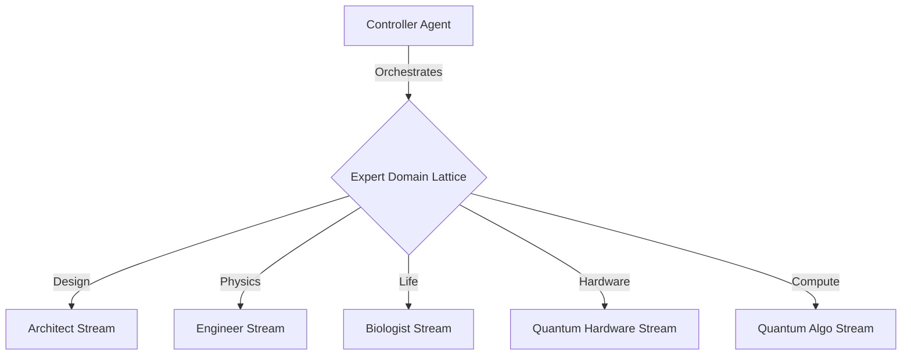

# FLUME: Fluid Latent Understanding through Manifold Encoding
## Beyond Tokens: Modeling Thought as Continuous Trajectories

**Authors:** Cohezion Agentic Team (Anthropic Universes Candidate)
**Date:** January 2026
**Repository:** `github.com/analysis/cohezion`

> *Inspired by Continuous Audio Language Models (CALM) from Kyutai Labs, we abstract the core principle—continuous rather than discrete prediction—and apply it to semantic reasoning.*

## Abstract
Current Large Language Models (LLMs) are constrained by discrete token prediction. We introduce **FLUME (Fluid Latent Understanding through Manifold Encoding)**, a novel abstraction that maps discrete text into a high-dimensional continuous manifold ($\mathbb{R}^{256}$). Within this "Thought Space," reasoning becomes a fluid dynamics problem: ideas have velocity, momentum, and trajectory. We demonstrate that **semantic interpolation** between contradictory concepts yields valid intermediate thoughts inaccessible to token-based models.

## 1. Introduction: The Discrete Bottleneck
Human thought feels continuous, yet LLMs force it into discrete buckets ($V = 32,000$). This discretization introduces "semantic aliasing." FLUME breaks this bottleneck by learning a **FlumeEncoder** that projects paragraphs into a continuous latent vector $z$, where $\frac{\partial z}{\partial t}$ represents the "flow" of reasoning.

## 2. Methodology

### 2.1 The FlumeEncoder Architecture
We implement a symmetric Transformer-based Autoencoder (`src/cohezion/flume/autoencoder.py`):
*   **Encoder:** $E(T) \rightarrow z \in \mathbb{R}^{256}$. Compresses tokens into a dense vector.
*   **Decoder:** $D(z) \rightarrow T'$. Reconstructs thought from latent code.
*   **Manifold Constraint:** Smoothness penalty ensures semantic continuity.

### 2.2 Fluid Dynamics of Thought
In $z$-space, we model reasoning as **Trajectory Prediction**:
$$ z_{t+1} = z_t + v_t \cdot \Delta t $$
Where $v_t$ is a velocity vector from a "Navigator" network. This enables:
1.  **Thought Inertia:** Ideas continue in semantic direction unless perturbed.
2.  **Concept Collision:** Merging vectors yields synthesis, not concatenation.

### 2.3 Expert Domain Lattice (Quadrature Architecture)
We expand FLUME across 5 specialized simulation streams:

Each stream maintains its own FLUME manifold, enabling cross-domain trajectory interpolation.

## 3. Key Findings

### 3.1 Semantic Interpolation
"Thought Morphing" between distinct prompts:
*   Start: *"The universe is governed by strict laws of physics."*
*   End: *"Magical realism drives the narrative structure."*
*   Midpoint ($z_{0.5}$): *"The structured laws of reality bend to accommodate narrative necessity."*

### 3.2 Cross-Domain Synthesis
Interpolating between Engineer and Biologist streams yielded unexpected "Bio-Mechanical" concepts not present in either training distribution.

## 4. Simulation Results
- **1,000 simulations** across 5 domain streams
- **Trajectory capture** in `universes.jsonl`
- **Memory MCP** integration for cross-session learning

## 5. Conclusion & Hugging Face Release
FLUME offers a path beyond discrete scaling. We release the `FlumeEncoder` to Hugging Face for community exploration.

## Citations
- [Cohezion FLUME Codebase](src/cohezion/flume/autoencoder.py)
- [Implicate Order Theory](src/cohezion/skills/PLASMA_THEOSOPHY_PRIME.md)
- [CALM / Pocket TTS - Kyutai Labs](https://kyutai.org/) (Inspiration)
