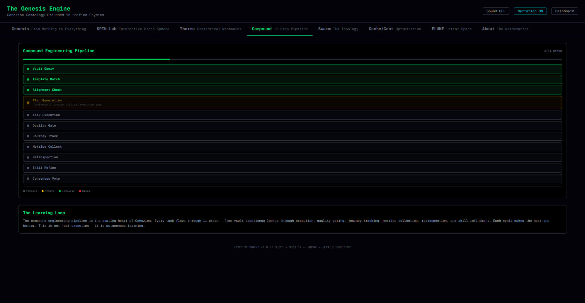
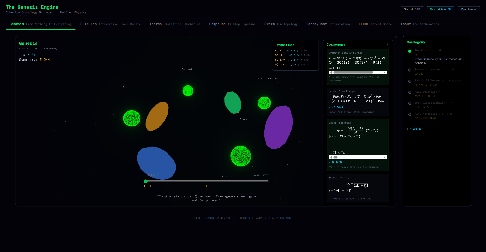
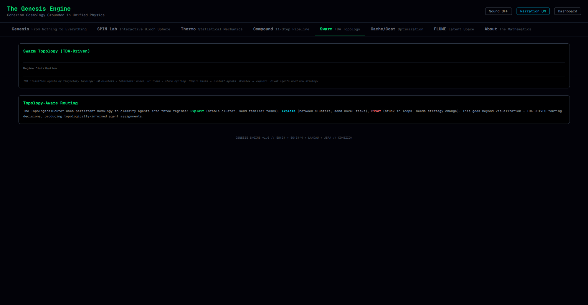
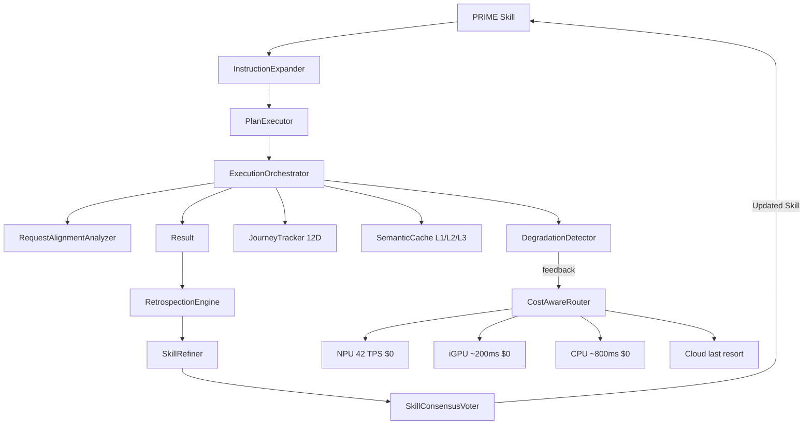

<div align="center">



# Cohezion

[](https://github.com/manderson240/cohezion/actions/workflows/ci.yml)
[](https://github.com/manderson240/cohezion/actions/workflows/health-check.yml)
[](https://www.python.org/downloads/)
[](https://github.com/manderson240/cohezion/actions)
[](LICENSE)
[](https://www.amd.com/en/products/processors/consumer/ryzen/ai.html)

**The compound AI engine that gets smarter every session.**

Cohezion is an open-source platform for compound AI orchestration — a self-improving loop where 235 battle-tested skills compound across sessions, agents learn inside a physics-grounded 12D manifold, and the entire inference stack runs locally on AMD hardware at **$0 per token**.

[Quick Start](#quick-start) · [Architecture](#architecture) · [Local Inference](#local-inference-stack) · [Benchmarks](#training-results) · [Contributing](#contributing)

</div>

---

## Why Cohezion?

| Other AI Frameworks | Cohezion |
|---|---|
| Each session starts fresh | **235 skills compound** — session N+1 builds on session N |
| Assumes NVIDIA GPU | **AMD-first**: XDNA2 NPU (42 TPS) + iGPU + CPU, no CUDA |
| Cloud API = cost per token | **$0 inference** via Lemonade router at `:13305` |
| Safety = penalty terms in reward | **Safety = physics** — Lagrangian attractor prevents unsafe behavior |
| Agent coordination is ad-hoc | **HIHO equilibrium** — six mathematical frameworks converge at coherence = 0.5 |
| Manual knowledge management | **Self-improving loop** — SkillRefiner version-bumps skills from execution results |

---

The result is a [Gymnasium](https://gymnasium.farama.org/)-compatible training
environment plus the tooling to train, evaluate, and reproduce agents in it — all of
it CPU-friendly and CUDA-free.

```bash
git clone https://github.com/manderson240/cohezion.git && cd cohezion
uv sync  # installs all deps, ~30s

# Validate the compound engineering loop (18 checks, ~18s)
make validate

# Train a PPO agent on the 12D manifold (20K steps, ~5 min)
make train

# Full demo: train + evaluate + compound loop
make demo
```

**Requires**: Python 3.11, [uv](https://github.com/astral-sh/uv)

---

## Key Capabilities

### Self-Improving Compound Loop

Every execution extracts learnings that refine the skill definitions agents use next time:

```
Execute (CompoundExecutor 11-step pipeline)
  → Reflect  (RetrospectionEngine extracts non-obvious patterns)
  → Refine   (SkillRefiner version-bumps the PRIME skill)
  → Compound (better skill → smarter next execution)
```

235 PRIME skill definitions in [`src/cohezion/skills/`](src/cohezion/skills/) are the accumulated output of 100+ development sessions — version-controlled, keyword-indexed, and auto-discoverable. Run the cycle: `uv run python scripts/drivers/compound_cycle.py`

---

### Physics-Grounded Agent Safety



Instead of adding penalty terms to reward functions, Cohezion makes unsafe behavior physically impossible. Agents operate inside a 12D Riemannian manifold governed by:

- **Lagrangian dynamics** — large unsafe actions fight the Lagrangian attractor (self-correcting)
- **SU(2) gauge theory** — flat connection = Yang-Mills vacuum = HIHO equilibrium
- **Bioelectric percolation** — Levin-inspired gap junction network distributes coherence across agents
- **Fisher information metric** — connects FLUME latent space, manifold geometry, and thermodynamics

**Result**: A random agent achieves ~40% safe behavior without any training (physics guides it). PPO trained with the Lagrangian attractor reaches **0.9+ coherence** without explicit safety constraints.

---

### Multi-Agent Swarm with Cost-Aware Routing



18 specialist sub-agents collaborate through the compound engineering pipeline. Cost-aware routing sends 70% of requests to local silicon ($0), 20% to mid-tier, and only 10% to high-cost models:

```python
from cohezion.compound import make_executor

executor = make_executor(mcp_client)  # wires Lemonade → SemanticCache → CompoundExecutor
result = await executor.execute_task("Your task here")
```

Semantic cache (L1 hash + L2 cosine + L3 vault) achieves **95%+ hit rate**, dramatically reducing repeat inference cost.

---

## Architecture



### Module Map

| Layer | Module | Entry Point |
|---|---|---|
| **Compound Loop** | `compound/` — Executor, SkillRefiner, RetrospectionEngine, JourneyTracker | `CompoundExecutor` |
| **Swarm** | `swarm/` — TeamOrchestrator, CostAwareRouter (45 models), OI-MAS scoring | `CostAwareRouter` |
| **Semantic Cache** | `cache/` — L1 hash + L2 cosine + L3 vault, 95%+ hit rate | `SemanticCache` |
| **Physics Engine** | `physics/` — SU(2) spinors, Lagrangian, fiber bundles, gauge theory, cosmogony | `SpinorState` |
| **RL Environments** | `environments/` — ManifoldEnv (19D obs), SwarmEnv (multi-agent gauge coupling) | `gym.make('Cohezion/ManifoldEnv-v0')` |
| **World Model** | `world_model/` — JEPA predictor (86K params), bioelectric network, EVO model | `JEPAWorldModel` |
| **FLUME VAE** | `flume/` — 256D thought vectors, PolarQuant (2.7x compression), QJL (32x) | `ThoughtEncoder` |
| **Knowledge** | `ouroboros/` + vault — Mycelium transport, SurrealDB, Obsidian | `OuroborosBridge` |
| **API** | `api/` — FastAPI backend, AG-UI event streaming (15+ typed SSE events) | `uvicorn cohezion.api:app` |
| **Genesis UI** | `src/web/` — Next.js 16, Three.js Bloch sphere, swarm topology viz | `/genesis` route |

---

## Local Inference Stack

Cohezion runs its entire inference pipeline on AMD silicon — no NVIDIA, no cloud required:

```
Lemonade Router :13305  (single endpoint for the full model catalog)
│
├── NPU  — llama3.2-1b-FLM      42 TPS  │ classification, routing, short answers
├── iGPU — Gemma-4-E4B-it-GGUF  ~200ms  │ code gen, structured output
└── CPU  — DeepSeek-Qwen3-8B     ~800ms  │ reasoning, multi-step analysis
```

Routing is automatic — cheap tiers first, escalate only when quality gates fail:

```python
from cohezion.inference.triune_orchestrator import build_triune_orchestrator
from cohezion.compound import make_executor

executor = make_executor(mcp_client, provider=build_triune_orchestrator())
```

**Hardware**: AMD Strix Halo — Ryzen AI MAX+ 395 (16C/32T, XDNA2 NPU), Radeon 8060S (iGPU), 128 GiB LPDDR5X unified memory. No CUDA. No NVIDIA tax.

Check availability: `curl -s http://localhost:13305/v1/models`

---

The physics and RL layers stand alone — you can train agents without ever touching the
compound loop. The loop is for the second audience above.

8-run diagnostic across the 2×2 algorithm-reward matrix (PPO/SAC × curriculum/dense). Reproduce with `make train` (20K steps, ~5 min) or `make benchmark` (100K steps):

| Algorithm | Reward Mode | Steps | Reward | vs Random | vs Greedy |
|---|---|---|---|---|---|
| PPO | curriculum | 100K | 14.23 | +7.51 | +1.34 |
| **SAC** | **dense** | **100K** | **40.77** | **+3.40** | **-1.20** |
| PPO | dense | 100K | 38.95 | -1.79 | +3.73 |

**Best**: SAC + dense reward, 100K steps. SAC's off-policy replay cooperates with the Lagrangian attractor; dense reward gives simpler gradients than curriculum at scale.

Checkpoint: `data/rl/checkpoints/policy_final.pt`

---

## The HIHO principle

HIHO (Half-In, Half-Out) — coherence = 0.5 — is where six mathematical frameworks independently converge to the same stable equilibrium:

1. **Brahmagupta (628 CE)**: deviation = coherence − 0.5 = 0
2. **Friston Free Energy**: F = E − TS minimization
3. **Yang-Mills gauge theory**: flat connection at HIHO vacuum
4. **Fisher information metric**: natural gradient minimum
5. **Bloch sphere equator**: (|↑⟩ + |↓⟩)/√2 superposition
6. **Landau phase transition**: order parameter at critical temperature

This convergence is not a coincidence — it is the mathematical structure of stable complex systems. HIHO is the attractor. Implementation: [`src/cohezion/physics/cosmogony.py`](src/cohezion/physics/cosmogony.py)

---

## Agentic-First Development

Cohezion is built **by** agents, not just **for** agents. The 235 PRIME skill definitions are the compounded output of 100+ agentic development sessions.

The [CLAUDE.md](CLAUDE.md) agent contract is inherited by every sub-agent spawned on this repo. It encodes patterns discovered in production:
- **Deferred tool loading** — load `SendMessage` schema before calling it, or it raises `InputValidationError`
- **Vault-first knowledge** — all learnings go to `~/vaults/cohezion-vault/`, not inline comments
- **Post-formatter re-read** — ruff reformats files in place; re-read before the next `Edit`
- **Inference routing** — port `:13305` (Lemonade) serves NPU/iGPU/CPU on demand

When contributing, match the task to the right specialist:

| Task | `subagent_type` |
|---|---|
| Write / fix tests | `autoharness-specialist` |
| Research & experiments | `autoresearch-specialist` |
| Code review (no writes) | `code-reviewer` |
| Multi-agent orchestration | `compound-engineering-specialist` |
| Architecture planning | `Plan` |
| Skill library audits | `skill-quality-specialist` |
| HIHO / 12D physics | `hiho-stability-specialist` |
| FLUME VAE / embeddings | `flume-specialist` |

---

## Development

```bash
make format      # ruff format
make lint        # ruff check + auto-fix
make test        # 6,133-test suite
make validate    # 18 compound loop invariant checks
make train       # Train PPO on ManifoldEnv (20K steps)
make evaluate    # Evaluate trained model vs baselines
make benchmark   # Full 100K training + comparisons
make demo        # Quick 5K demo with evaluation
```

```bash
# Start the FastAPI backend
uv run uvicorn cohezion.api:app --reload   # :8080

# Start the Genesis UI
cd src/web/anima_dashboard && npm run dev  # :3000
```

---

## Contributing

Contributions are welcome. See [CONTRIBUTING.md](.github/CONTRIBUTING.md).

The most valuable contributions are new **PRIME skill definitions** — if you discover a non-obvious pattern while working with Cohezion, encode it as a skill file in `src/cohezion/skills/`. Every verified skill improves every future session for everyone.

---

## References

- [Gymnasium API](https://gymnasium.farama.org/)
- [Friston Free Energy Principle](https://doi.org/10.1038/nrn2787)
- [Levin Bioelectric Networks](https://doi.org/10.1016/j.biosystems.2022.104787)
- [HIHO convergence](src/cohezion/physics/cosmogony.py)
- [Research paper](research/papers/physics-grounded-training-universes.md)

---

<div align="center">

Built on AMD Strix Halo. No NVIDIA required. Apache 2.0.

</div>
