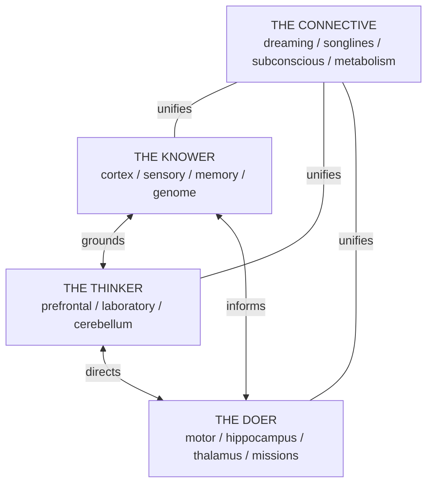

# Vault Manifest

**Read this first.** This vault is organized as a living brain using three interwoven architectures: Percival's Triune Self, Aboriginal relational wisdom, and neural network metaphor.

## The Triune Architecture

Every note participates in all three aspects but *lives* in the aspect it most serves:



---

## Directory Map

### The Knower (I-ness, Selfness — "That which knows")

Pure awareness. Ground truth. What IS, without reasoning about it.

| Directory | Purpose | Put Here When... | Naming |
|-----------|---------|-------------------|--------|
| `cortex/` | Core definitions, frameworks, techniques | Defining a reusable idea, technology, or methodology | `kebab-case.md` |
| `sensory/` | Research papers, articles, external observations | Summarizing external research with citations | `kebab-case-descriptive-title.md` |
| `memory/` | Lessons learned — embodied knowledge | Capturing something learned the hard way | `kebab-case-lesson-title.md` |
| `genome/` | System blueprints — skills, agents, specs | Defining what the system IS | Subdirs: `skills/`, `agents/`, `tools/` |

### The Thinker (Rightness, Reason — "That which reasons")

Deliberation. Judgment. Connecting what is known into understanding.

| Directory | Purpose | Put Here When... | Naming |
|-----------|---------|-------------------|--------|
| `prefrontal/` | Architecture Decision Records (ADRs) | Recording a choice with context, alternatives, consequences | `YYYY-MM-DD-decision-name.md` |
| `laboratory/` | Hypothesis testing and results | Testing a hypothesis with method, results, learnings | `YYYY-MM-DD-experiment-name.md` |
| `cerebellum/` | Reusable patterns and procedures | Documenting a repeatable solution to a recurring problem | `kebab-case-pattern-name.md` |
| `benchmarks/` | Performance measurement | Quantified reasoning — metrics and baselines | `kebab-case.md` |

### The Doer (Feeling, Desire — "That which acts in the body")

Action. Lived experience. The part that touches the world.

| Directory | Purpose | Put Here When... | Naming |
|-----------|---------|-------------------|--------|
| `motor/` | Project tracking and action plans | Tracking a multi-session effort with goals and status | `YYYY-MM-DD-project-name.md` |
| `hippocampus/` | Daily notes, session logs, episodic memory | Recording a session's work, daily standup, or checkpoint | `YYYY-MM-DD-*.md` |
| `thalamus/` | Unsorted intake — sensory relay | Dropping raw ideas, unprocessed content for triage | Any `.md` name |
| `missions/` | Multi-agent coordinated tasks | Orchestrating multiple agents toward a shared goal | `mission-name.md` |
| `retrospectives/` | Post-session analysis | Reviewing what worked, what didn't, and why | `YYYY-MM-DD-retrospective.md` |
| `Agents/` | Agent execution records | Storing agent run artifacts, traces | `AgentName/UUID/` |

### The Connective (Where All Three Meet)

The unity that makes it triune — not three separate things but one self.

| Directory | Purpose | Content |
|-----------|---------|---------|
| `dreaming/` | The Everlasting Now — cross-domain resonances | SurrealDB-generated notes surfacing deep semantic connections |
| `songlines/` | Narrative knowledge paths across Country | Traversable routes through the knowledge graph |
| `subconscious/` | Latent associations | Notes that SHOULD be linked but aren't yet |
| `metabolism/` | Whole-system health dashboards | Lifecycle reports, activation heatmaps, Country health |
| `visual-cortex/` | Spatial reasoning, diagrams | Standalone canvases and relationship maps |

### Navigation

| Directory | Purpose | Key Files |
|-----------|---------|-----------|
| `cortex/MOC-*.md` | Maps of Content — curated topic indexes | 8 MOCs: agentic-ai, quantum-physics, vault-architecture, platform-infrastructure, machine-learning, astrophysics, compound-engineering, safety-alignment |

### Infrastructure (Tooling, Not Content)

| Directory | Purpose |
|-----------|---------|
| `docs/` | Long-form documentation, brand guides |
| `research/` | Research guides and API specs |
| `teleport/` | Cloud-to-local file sync |
| `meta/` | Self-recording, compound demos |
| `templates/` | Note templates |
| `tools/` | Cohezion engine CLI source |
| `obsidian-plugin/` | 3D graph visualization plugin |
| `mcp-server/` | MCP server source |
| `scripts/` | Migration and import scripts |

---

## Output Routing Rules

```
I found a new technique/technology    -> cortex/
I summarized external research        -> sensory/
I made an architectural choice        -> prefrontal/
I documented a reusable solution      -> cerebellum/
I tested a hypothesis                 -> laboratory/
I'm tracking a multi-session effort   -> motor/
I learned something the hard way      -> memory/
I have raw/unstructured content       -> thalamus/    (vault keeper triages)
I'm logging today's session work      -> hippocampus/
I ran a multi-agent mission           -> missions/
I'm reviewing what worked/didn't      -> retrospectives/
I mapped relationships visually       -> visual-cortex/ (standalone) or companion .canvas
I defined a skill, agent, or tool     -> genome/<type>/
I don't know where this goes          -> thalamus/    (always safe default)
```

### Project Artifacts

> [!danger] Mandatory Rule
> **All project artifacts belong in the vault.** PRDs, architecture docs, epics, stories, and engineering specs are vault notes.

| Artifact | Where |
|----------|-------|
| PRD / Product Requirements | `motor/YYYY-MM-DD-project-name.md` |
| Architecture Decision | `prefrontal/YYYY-MM-DD-architecture-name.md` |
| Spike / investigation | `laboratory/YYYY-MM-DD-spike-name.md` |
| Retrospective | `retrospectives/YYYY-MM-DD-retro-name.md` |
| Runbook / how-to | `cerebellum/how-to-name.md` |

---

## Neural Frontmatter

Every note has both standard and neural metadata:

```yaml
---
title: "Note Title"
date: 2026-03-09
tags: [tag1, tag2]
aspect: knower          # knower | thinker | doer | connective
neural:
  activation: 0.73      # 0.0 (dormant) to 1.0 (firing)
  stage: mature          # embryo | growing | mature | resting | composting | renewed
  cluster: quantum-physics
---
```

**Tags are ALWAYS arrays** — never comma-separated strings.

**Status values:**
- `prefrontal/`: `proposed` -> `accepted` -> `deprecated` | `rejected`
- `laboratory/`: `in-progress` -> `complete` | `failed`
- `motor/`: `active` -> `complete` -> `archived`

**Lifecycle stages (circular, not linear):**
- **Embryo:** < 3 links, < 500 words — just born from the Dreaming
- **Growing:** 3-10 links, active edits — being sung into existence
- **Mature:** 10+ links, stable content — an Elder in its Country
- **Resting:** Low activation, no recent edits — returned to the Dreaming
- **Composting:** Marked for transformation — feeds new growth
- **Renewed:** A resting note that receives new links — re-enters the cycle

---

## The Aboriginal Layer

### Country

Every note belongs to **Country** — a domain cluster with agency. Country cares for its notes.

### Songlines

Paths of knowledge across Country — chains of notes connecting distant domains that share deep truth. Well-walked Songlines become highways of knowledge.

### The Dreaming

The everlasting present where all knowledge coexists. SurrealDB surfaces cross-domain resonances — notes whose embeddings are close but whose explicit links are distant.

### Kinship

Deeper-than-wiki-link connections:
- **Elder/Younger** — a mature concept note is elder to a growing experiment
- **Parent/Child** — a decision spawns a project
- **Moiety** — complementary pairs (theory/practice, problem/solution)

---

## SurrealDB Connectome

The Akashic Records — every note, link, and event recorded eternally in SurrealDB 3.0.

| Table | Purpose | Count |
|-------|---------|-------|
| `neuron` | Every vault note | ~1502 |
| `synapse` | Every wiki-link | ~9488 |
| `country` | Domain clusters | Dynamic |
| `songline` | Knowledge paths | Dynamic |
| `kinship` | Deep relationships | Dynamic |
| `dream` | Cross-domain resonances | Generated daily |
| `hiho_event` | Coherence fusion events | When threshold crossed |
| `neuron_history` | Akashic Records | All events, eternal |

**Port:** 8001 (RocksDB storage)
**Auth:** root/root
**Namespace:** cohezion / Database: vault

---

## Canvas Files

Canvas files live alongside their companion note:
- `cortex/MOC-agentic-ai.canvas` (next to the MOC)
- `prefrontal/2026-03-05-pick-database.canvas`
- Standalone -> `visual-cortex/`

---

## Conventions

### Cross-References

Use Obsidian wiki-links: `[[note-name]]`

- Use bare filename (no path prefix): `[[machine-learning]]` not `[[cortex/machine-learning]]`
- Link at first mention of a concept
- Every note should have 3+ outbound wiki-links
- Every new note must be linked FROM at least one existing note (no orphans)

### Templates

Directories with `_template.md` files: `prefrontal/`, `cerebellum/`, `laboratory/`, `motor/`

---

## Quick Start for Agents

### Starting a session:
1. Read this manifest
2. Check `thalamus/` for items needing triage
3. Load the relevant MOC: `cortex/MOC-*.md`
4. Check `memory/` for past mistakes related to your task

### During your session:
5. Create notes in the correct directory per routing rules
6. Add `[[wiki-links]]` to connect every new note to 1-3 existing notes
7. Use proper frontmatter with tags as arrays and `aspect:` field

### Ending a session:
8. Log session summary to `hippocampus/YYYY-MM-DD-session-id.md`
9. Discoveries -> `memory/` or `cerebellum/`
10. Raw output -> `thalamus/`

---

## Key Entry Points

| Need | Start Here |
|------|------------|
| Agent architecture & multi-agent systems | `[[MOC-agentic-ai]]` |
| Quantum mechanics, computing, sensors | `[[MOC-quantum-physics]]` |
| Vault structure, linking, health | `[[MOC-vault-architecture]]` |
| MCP, SurrealDB, CI/CD, infrastructure | `[[MOC-platform-infrastructure]]` |
| ML, transformers, optimization | `[[MOC-machine-learning]]` |
| Space, JWST, cosmology | `[[MOC-astrophysics]]` |
| Compound sessions, retrospectives | `[[MOC-compound-engineering]]` |
| AI safety, alignment, guardrails | `[[MOC-safety-alignment]]` |

---

## Vault Health Invariants

- **0 orphan notes** in content directories
- **0 frontmatter issues** (missing or malformed)
- **0 broken wiki-links**
- **< 10% thin notes** (under 3KB) per directory
- **8+ Maps of Content** covering major topic clusters
- **6+ wiki-links per note** on average

The `/vault-keeper` skill enforces these automatically.
