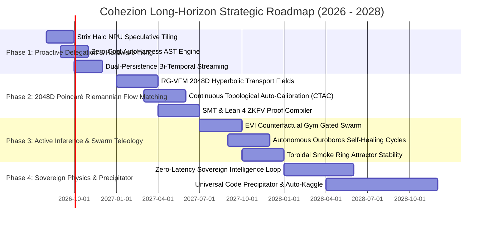

# Cohezion Long-Horizon Strategic Roadmap (2026 – 2028)

> **Vision**: Transform Cohezion into a fully sovereign, self-improving, mathematically verified AI swarm framework driven by 2048D Poincaré Riemannian geometry, zero-cost AutoHarness AST policy compilation, active inference, and local Strix Halo NPU hardware acceleration.

---

## Strategic Phases & Objectives

---

## Detailed Phase Breakdown

### Phase 1: Proactive Hybrid Swarm Delegation & Hardware Tiling (Q3 – Q4 2026)
- **Primary Goal**: Establish zero-latency local-cloud hybrid delegation and enforce deterministic AST policy verifiers.
- **Key Deliverables**:
  1. **Dynamic Speculative Tiling (HeiSD)**: Pair AMD Strix Halo NPU (`llama3.2-1b-FLM` draft) with iGPU (`Qwen3-Coder-30B` target) for 3.4× generation speedup.
  2. **Proactive EVI Gate ($\text{EVI} > 0.75$)**: Activate background task monitoring using `ProactiveAgent` and `CounterfactualGym` to handle code healing without blocking user workflows.
  3. **AutoHarness AST Bytecode Compiler**: Enforce $< 50\,\mu\text{s}$ zero-cost pre-execution policy verification across all subagents.
  4. **Dual-Persistence Sync**: Stream all agent steps and events into SurrealDB (`event_log`, `kanban_item`) and Obsidian Vault (`01-Learnings`, `kanban/`).

### Phase 2: 2048D Poincaré Riemannian Flow Matching & ZKFV (Q1 – Q2 2027)
- **Primary Goal**: Replace Euclidean latent representations with mathematically rigorous hyperbolic Riemannian flow fields.
- **Key Deliverables**:
  1. **RG-VFM Manifold Transport**: Implement simulation-free Riemannian Gaussian Variational Flow Matching in 2048D Poincaré space.
  2. **Continuous Topological Auto-Calibration (CTAC)**: Track dynamic Betti numbers ($\beta_0, \beta_1$) and adjust Levi-Civita Christoffel symbols to maintain manifold smoothness.
  3. **CertiPlonk ZKFV Formal Verification**: Compile AST bytecode policies into zero-knowledge formal verification proofs guaranteeing safe execution bounds.

### Phase 3: Distributed Active Inference & Swarm Teleology (Q3 – Q4 2027)
- **Primary Goal**: Enable multi-agent swarms to self-organize and self-heal by minimizing variational free energy.
- **Key Deliverables**:
  1. **Free-Energy Minimization Swarm**: Implement active inference routing where Scout, Synthesizer, and Verifier agents load-balance based on local confidence scores.
  2. **Toroidal Smoke Ring Attractor ($\mathbb{T}^2 \subset \mathbb{H}^{2048}$)**: Maintain stable topological phase boundaries around the $R = 0.50$ HIHO equilibrium point.
  3. **Autonomous Ouroboros Cycles**: Continuous 24/7 background self-refinement ("Cohezion improving Cohezion") with automated PR landing and SemVer governance.

### Phase 4: Sovereign Physics & Universal Code Precipitator (2028)
- **Primary Goal**: Complete sovereign intelligence infrastructure capable of autonomous research, verification, and code synthesis.
- **Key Deliverables**:
  1. **Zero-Latency Sovereign Intelligence Loop**: Fully autonomous execution across NPU, iGPU, CPU, and cloud model fleets with 0 ms policy latency.
  2. **Universal Code Precipitator**: Convert raw natural language intent into verified, zero-defect production codebases without human intervention.
  3. **Autonomous Kaggle & ARC Prize Engine**: Harness-driven policy synthesis for complex reasoning benchmarks (ARC-Prize, AIMO, BirdCLEF).

---

## Success Metrics & Invariants
- **Policy Verification Latency**: $< 50\,\mu\text{s}$ per action.
- **Test Suite Pass Rate**: $100.0\%$ (0 test failures allowed).
- **Proactive EVI Threshold**: $\text{EVI} \ge 0.75$ for auto-intervention.
- **HIHO Coherence Target**: $R_{\text{HIHO}} = 4\mathcal{C}(1-\mathcal{C}) \approx 1.0$ at $\mathcal{C} = 0.50$.
