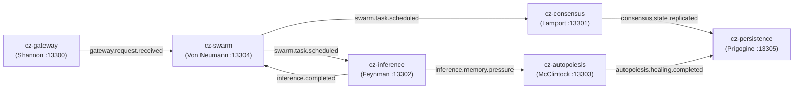

# 🏛 Council of Rockstar Scientist Digital Twins: Microservice Blueprint

**Session ID**: `council-session-1789930587`  
**Convened At**: `2026-09-20 18:56:27 UTC`  
**Council Members**: `6`  
**Total Monolith LOC Analyzed**: `235,654`  
**Projected System Entropy Reduction**: `~46.9%`  

## 1. Executive Allocation of Autonomous Microservices

| Microservice | Rockstar Architect | Bounded Domain | Target Port | Invariants & Guarantees |
|---|---|---|---|---|
| **`cz-gateway`** | **Dr. Claude Shannon** | Information Theory & Event Channel Optimization | `:13300` | • Zero loss of event envelopes during transit (lossless channel invariant) • Strict Pydantic v2 schema validation at boundary with zero implicit coercion • Entropy calculation and bit-compacted JSON serialization for all IPC messages |
| **`cz-consensus`** | **Dr. Leslie Lamport** | Distributed Systems, Temporal Logic & Formal Verification | `:13301` | • Strict monotonically increasing Lamport timestamps across all service events • Idempotent state mutation with Byzantine fault tolerance • Deterministic AutoHarness AST pre-execution verification (<1ms) |
| **`cz-inference`** | **Dr. Richard Feynman** | Quantum Physics, Matrix Kernels & Heterogeneous Silicon | `:13302` | • Zero UMA aperture leaks across long-running inference sessions • Strict adherence to fleet lock discipline before any heavy model load • Wave32 matrix kernel alignment (-mwavefrontsize32) on RDNA 3.5 iGPU • FastFlowLM execution on AMD XDNA 2 NPU with <2W power draw |
| **`cz-autopoiesis`** | **Dr. Barbara McClintock** | Cellular Plasticity, Dynamic Transposition & Autonomic Self-Repair | `:13303` | • Non-positive Lyapunov drift potential (d/dt V(x) <= 0) • Mutation testing ratchet ceiling enforcement (zero surviving regression mutants) • Self-contained rollback capability on all autonomous code transposition actions |
| **`cz-swarm`** | **Dr. John von Neumann** | Cellular Automata, Game Theory & Multi-Agent Swarms | `:13304` | • Minimax Nash equilibrium resource allocation across agent threads • Strict active-competition filtering (zero inactive track churn) • Self-reproducing agent task contracts with verifiable completion evidence |
| **`cz-persistence`** | **Dr. Ilya Prigogine** | Dissipative Structures, Minimum Entropy Production & Dual-Store Memory | `:13305` | • Minimum entropy production in storage transitions • Atomic dual-store synchronization: SurrealDB (port 8001) and Obsidian Vault • SHA-256 keyed semantic cache with deterministic LRU eviction |

## 2. Monolithic Module Consolidation Matrix

| Microservice | Monolithic Source Directories Consolidated | Analyzed LOC | Planned REST / WS Interfaces |
|---|---|---|---|
| **`cz-gateway`** | `api`, `cz_gateway.py`, `gateway`, `protocols`, `wiring`, `mcp`, `contracts.py` | 34,942 | `POST /v1/gateway/dispatch` `WS /v1/gateway/stream` `GET /v1/gateway/routes` `GET /healthz` |
| **`cz-consensus`** | `governance`, `reliability`, `concurrency`, `vanguard`, `verification`, `validation` | 8,578 | `POST /v1/consensus/lock/acquire` `POST /v1/consensus/lock/release` `POST /v1/consensus/verify/ast` `GET /v1/consensus/clock` |
| **`cz-inference`** | `inference`, `physics`, `quantum`, `neuro`, `math`, `audio`, `multimodal` | 52,106 | `POST /v1/inference/chat/completions` `POST /v1/inference/embeddings` `POST /v1/inference/physics/simulate` `GET /v1/inference/hardware/status` |
| **`cz-autopoiesis`** | `healing`, `evolution`, `autopoiesis`, `ouroboros`, `resilience`, `dogfooding` | 5,179 | `POST /v1/autopoiesis/heal` `POST /v1/autopoiesis/evaluate/rubric` `GET /v1/autopoiesis/drift/status` `GET /v1/autopoiesis/homeostasis` |
| **`cz-swarm`** | `swarm`, `agent`, `agents`, `agentjet`, `competitions`, `competition`, `compound` | 120,052 | `POST /v1/swarm/agents/spawn` `POST /v1/swarm/competitions/sweep` `GET /v1/swarm/agents/status` `GET /v1/swarm/portfolio/markdown` |
| **`cz-persistence`** | `cache`, `persistence`, `storage`, `knowledge`, `knowledge_graph`, `data_mesh`, `datamesh`, `memory` | 14,797 | `POST /v1/persistence/learnings/record` `POST /v1/persistence/cache/query` `POST /v1/persistence/vault/sync` `GET /v1/persistence/stats` |

## 3. Asynchronous Event Choreography (Shannon Bus)

## 4. Scientist Maxim Declarations

> **Dr. Claude Shannon** (`cz-gateway`):
> *"Collapsing the sprawling api, cz_gateway.py, and wiring modules into a single Shannon-bounded gateway reduces communication entropy and eliminates circular import overhead."*

> **Dr. Leslie Lamport** (`cz-consensus`):
> *"Merging scattered reliability locks, concurrency pools, and validation guards into an explicit Lamport consensus engine guarantees linearizability and prevents concurrency deadlocks."*

> **Dr. Richard Feynman** (`cz-inference`):
> *"Decoupling monolithic physics, neuro, and inference wrappers into a unified Strix Halo execution engine eliminates GPU-CPU memory thrashing and leverages unified zero-copy memory."*

> **Dr. Barbara McClintock** (`cz-autopoiesis`):
> *"Unifying scattered healing scripts, evolution daemons, and ouroboros self-modification loops into a dedicated autopoietic microservice enables cellular self-repair without contaminating active compute lanes."*

> **Dr. John von Neumann** (`cz-swarm`):
> *"Collapsing the 7 overlapping agent and swarm directories into an explicit Von Neumann automata engine provides unified scheduling, prevents aperture contention, and formalizes multi-agent coordination."*

> **Dr. Ilya Prigogine** (`cz-persistence`):
> *"Collapsing duplicate storage engines (data_mesh vs datamesh, cache, persistence) into a Prigogine dissipative memory service guarantees that state transitions maintain maximum coherence and permanent dual-store durability."*
