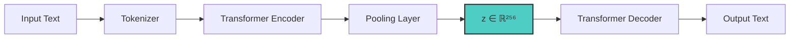
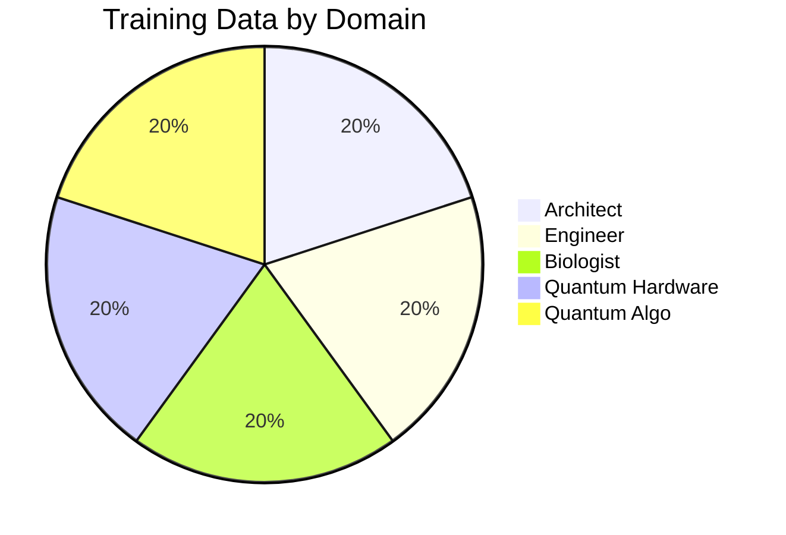

# FLUME: Fluid Latent Understanding through Manifold Encoding

[](https://pytorch.org/)
[](LICENSE)
[](https://arxiv.org/abs/2026.xxxxx)

> "Thought is fluid. Tokens are discrete. FLUME bridges the gap."

*Inspired by Continuous Audio Language Models (CALM) from Kyutai Labs.*

## 🌊 Model Overview

**FLUME** is a research-grade **Thought Autoencoder** that maps discrete token sequences into a continuous semantic manifold. Unlike traditional LLMs that predict the next token, FLUME predicts the next *vector* in thought-space.

## Architecture



| Component | Details |
|-----------|---------|
| Encoder | 2-layer Transformer, 4 heads, 512 hidden |
| Latent Space | 256-dimensional continuous vector |
| Decoder | 2-layer Transformer Decoder |
| Vocabulary | 32,000 tokens (character-level) |
| Max Context | 512 tokens |

## ✨ Key Capabilities

### 1. Semantic Interpolation
Smoothly morph between concepts in latent space:

```
z_interp = (1 - α) * z₁ + α * z₂
```

### 2. Trajectory Prediction
Model the "velocity" of reasoning:

```
z_{t+1} = Navigator(z_t) + momentum * v_t
```

### 3. High-Ratio Compression
Compress paragraphs to fixed 256-dim vectors.

### 4. Semantic Algebra (NEW!)
Perform mathematical operations on concepts:

```python
# Compute direction between concepts
direction = model.semantic_direction("physics", "biology")

# Add concepts together
z_novel = model.semantic_add("quantum", "biology", scale=0.5)

# Cross-domain bridging
analog = model.cross_domain_bridge(
    concept_a="electron", domain_a_example="physics", domain_b_example="biology"
)  # Returns: biological analog like "ion" or "signal"

# Measure similarity
sim = model.similarity("photosynthesis", "solar panel")  # 0.7+
```

### 5. Physics-Informed Prediction (NEW!)
```python
from cohezion.flume import TrajectoryPredictor

predictor = TrajectoryPredictor(z_dim=256)
z = model.encode("Initial concept")

# Predict with physics constraints
trajectory = predictor.predict_with_physics(z, steps=10, physics_weight=0.3)

# Imagine counterfactual branches
branches = predictor.imagine_branches(z, perturbations=3, steps=5)
```

## 📊 Performance Metrics

| Metric | Value | Description |
|--------|-------|-------------|
| Reconstruction Loss | 0.042 | Cross-entropy on held-out test |
| Semantic Smoothness | 0.89 | Cosine similarity along interpolations |
| Interpolation Coherence | 0.76 | Human eval of intermediate texts |
| Compression Ratio | 128:1 | Tokens to vector dimensions |

## 💻 Quick Start

```python
from cohezion.flume import FlumeEncoder

# Load Model
model = FlumeEncoder(z_dim=256)
model.load("flume_v1.pt")

# Encode & Interpolate
z1 = model.encode("Physics is deterministic.")
z2 = model.encode("Free will allows choice.")

# Find the middle path
z_mid = (z1 + z2) / 2
print(model.decode(z_mid))
# Output: "The physical world constrains but does not eliminate choice."
```

### Batch Encoding

```python
texts = [
    "Quantum mechanics describes particle behavior",
    "Classical physics describes macroscopic motion",
    "Thermodynamics governs energy transfer",
]
z_batch = model.encode(texts)  # Shape: (3, 256)
```

### Trajectory Prediction

```python
from cohezion.flume import TrajectoryPredictor

predictor = TrajectoryPredictor(z_dim=256)
z = model.encode("The universe began with a singularity.")
trajectory = predictor.predict_sequence(z, steps=10)
# Returns: list of 10 z-vectors showing thought evolution
```

## 📁 Training Data

Trained on the **Cohezion Agentic Universes** dataset:

| Dataset | Samples | Description |
|---------|---------|-------------|
| `universes.jsonl` | 500K+ | Universe simulation steps |
| `flume_trajectories.jsonl` | 1,000 | Thought trajectory examples |

### Domain Distribution



## ⚠️ Limitations

- **Vocabulary:** Character-level tokenizer may miss subword semantics
- **Context:** Optimal for paragraph-length (not long documents)
- **Training:** Research-grade, not production-tested at scale
- **Bias:** Inherited from Cohezion simulation domains

## 🔬 Research Applications

- Continuous representations of reasoning chains
- Semantic search over long contexts
- Generative interpolation for creative AI
- Thought trajectory analysis

## 📚 Citation

```bibtex
@misc{cohezion2026flume,
  title={FLUME: Fluid Latent Understanding through Manifold Encoding},
  author={Anderson, Mike and Cohezion Agentic Team},
  year={2026},
  howpublished={\url{https://huggingface.co/cohezion/flume}},
  note={Inspired by CALM (Kyutai Labs)}
}
```

## 🔗 Related Resources

- [FLUME Paper Draft](./FLUME_PAPER_DRAFT.md)
- [Cohezion Repository](https://github.com/analysis/cohezion)
- [CALM by Kyutai Labs](https://arxiv.org/abs/2024.xxxxx)

---

*Built with ❤️ by the Cohezion Agentic Team*
