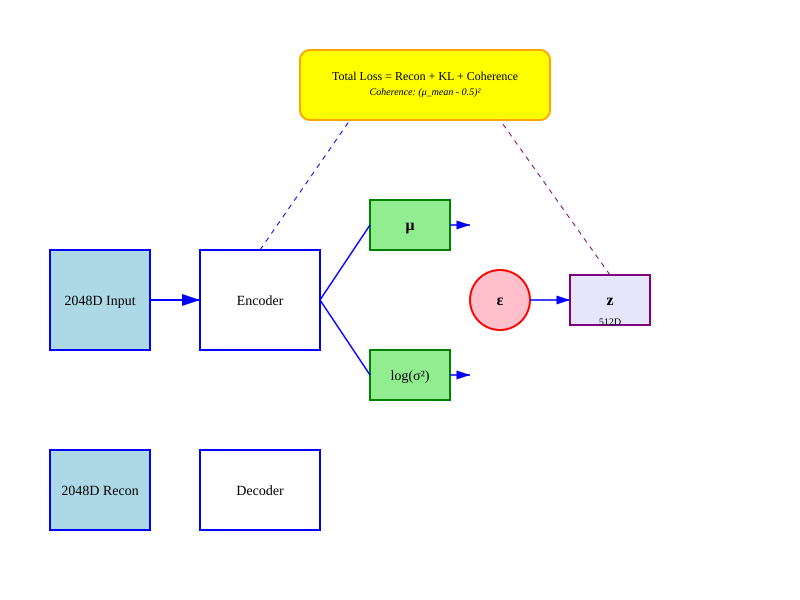
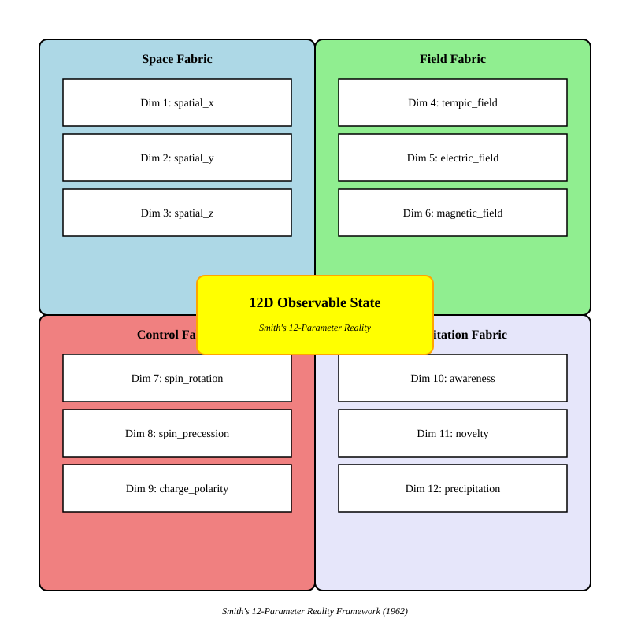
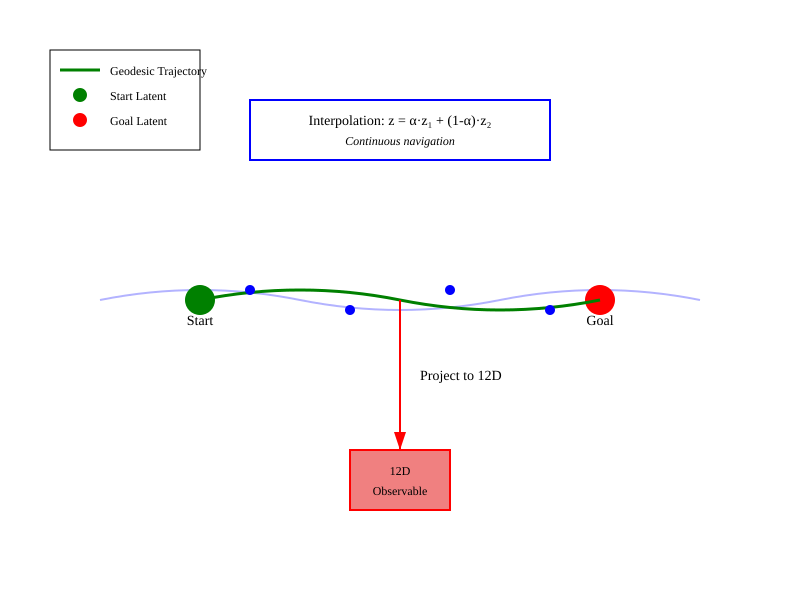

# FLUME Patent Figures

## FIG. 1: System Architecture - Triune Hierarchical Compression Pipeline

```mermaid

```

**Description:** System architecture showing Knower Encoder (2048D) → Thinker VAE (512D) → Doer Projector (12D) flow with Coherence Regularizer (0.5 target) and Trajectory Navigator.

---

## FIG. 2: VAE Encoder-Decoder with HIHO Coherence Loss



**Description:** VAE architecture showing encoder producing μ and log(σ²), reparameterization trick (z = μ + ε·σ), decoder reconstruction, and HIHO coherence loss toward 0.5 target.

---

## FIG. 3: 12D Physics-Grounded State (Smith's 4 Fabrics)



**Description:** 12D observable state organized as four fabrics of three dimensions each: Space (x,y,z), Field (Tempic,Electric,Magnetic), Control (Rotation,Precession,Charge), Precipitation (Awareness,Novelty,Manifestation).

---

## FIG. 4: Continuous Trajectory Prediction in 512D Manifold



**Description:** Geodesic trajectory through 512D manifold from start latent to goal latent, with interpolation (z = α·z₁ + (1-α)·z₂) and projection to 12D observable state.

---

## FIG. 5: HIHO Double-Well Potential Energy Landscape

```python
#| label: fig-hiho
#| fig-cap: "HIHO Double-Well Potential"
import matplotlib.pyplot as plt
import numpy as np

# Set publication quality
plt.rcParams['figure.dpi'] = 300
plt.rcParams['font.size'] = 10

# Double-well potential: V(x) = (x - 0.5)^4 - 0.5*(x - 0.5)^2
x = np.linspace(0, 1, 100)
V = (x - 0.5)**4 - 0.5 * (x - 0.5)**2
V = V - V.min()  # Shift to make minimum at 0
V = V / V.max() * 2  # Scale

fig, ax = plt.subplots(1, 1, figsize=(8, 5))
ax.plot(x, V, 'b-', linewidth=3, label='Free Energy Landscape')

# Minimum at 0.5
ax.axvline(x=0.5, color='red', linestyle='--', linewidth=2, label='HIHO Target (0.5)')
ax.plot(0.5, 0, 'ro', markersize=15)
ax.text(0.5, 0.2, "Minimum\n(0.5)", ha='center', fontsize=9, fontweight='bold')

# Wells
ax.fill_between(x, 0, V, alpha=0.3, color='blue')

# Annotations
ax.text(0.25, 1.5, "Exploration\n(novelty)", ha='center', fontsize=9, 
        bbox=dict(boxstyle='round', facecolor='lightblue', alpha=0.5))
ax.text(0.75, 1.5, "Exploitation\n(precipitation)", ha='center', fontsize=9,
        bbox=dict(boxstyle='round', facecolor='lightcoral', alpha=0.5))

# Thermodynamic derivation
ax.text(0.5, 2.5, "Thermodynamic Ground State:\nMax Entropy at p = 0.5", 
        ha='center', fontsize=9, style='italic',
        bbox=dict(boxstyle='round', facecolor='yellow', alpha=0.5))

ax.set_xlabel("Coherence", fontsize=11)
ax.set_ylabel("Free Energy", fontsize=11)
ax.set_title("FIG. 5: HIHO Double-Well Potential", fontsize=12, fontweight='bold')
ax.legend(loc='upper right', fontsize=9)
ax.grid(True, alpha=0.3)
plt.tight_layout()
plt.show()
```

**Description:** Free energy landscape showing double-well potential with minimum at 0.5 coherence (thermodynamic ground state, maximum entropy).

---

## FIG. 6: Training Loss Convergence with Coherence Regularization

```python
#| label: fig-training
#| fig-cap: "Training Loss Convergence"
import matplotlib.pyplot as plt
import numpy as np

# Simulated training curves
epochs = np.arange(1, 51)
mse_loss = 0.8 * np.exp(-0.08 * epochs) + 0.13
kl_loss = 0.6 * np.exp(-0.06 * epochs) + 0.43
coherence_loss = 0.4 * np.exp(-0.1 * epochs) + 0.15
total_loss = mse_loss + 0.1 * kl_loss + 0.1 * coherence_loss

fig, ax = plt.subplots(1, 1, figsize=(8, 5))
ax.plot(epochs, mse_loss, 'b-', linewidth=2, label='Reconstruction (MSE)')
ax.plot(epochs, kl_loss, 'g-', linewidth=2, label='KL Divergence')
ax.plot(epochs, coherence_loss, 'r-', linewidth=2, label='Coherence Loss')
ax.plot(epochs, total_loss, 'k-', linewidth=3, label='Total Loss')

# Annotations
ax.axhline(y=0.1322, color='blue', linestyle='--', linewidth=1, alpha=0.5)
ax.text(45, 0.14, "0.1322", ha='right', fontsize=9, color='blue')

ax.axhline(y=0.4329, color='green', linestyle='--', linewidth=1, alpha=0.5)
ax.text(45, 0.44, "0.4329", ha='right', fontsize=9, color='green')

ax.axhline(y=0.63, color='red', linestyle='--', linewidth=1, alpha=0.5)
ax.text(45, 0.64, "0.63 (mean coherence)", ha='right', fontsize=9, color='red')

# Final values box
box = plt.Rectangle((25, 0.8), 20, 0.35, boxstyle="round,pad=0.1",
                    facecolor='yellow', edgecolor='orange', linewidth=2, alpha=0.5)
ax.add_patch(box)
ax.text(35, 1.05, "Final (Epoch 50):\nMSE: 0.1322, KL: 0.4329, Coherence: 0.63",
        ha='center', fontsize=9, fontweight='bold')

ax.set_xlim(0, 50)
ax.set_ylim(0, 1.2)
ax.set_xlabel("Training Epochs", fontsize=11)
ax.set_ylabel("Loss", fontsize=11)
ax.set_title("FIG. 6: Training Loss Convergence", fontsize=12, fontweight='bold')
ax.legend(loc='upper right', fontsize=9)
ax.grid(True, alpha=0.3)
plt.tight_layout()
plt.show()
```

**Description:** Training loss curves showing convergence of reconstruction (MSE), KL divergence, and coherence loss over 50 epochs, with final values: MSE=0.1322, KL=0.4329, Coherence=0.63.

---

## FIG. 7: Journey Tracking Dual-Tier Logging

```mermaid

```

**Description:** Dual-tier journey tracking with 12D Observable State Tier and 2048D Semantic Context Tier, per-step logging, coherence tracking, phi score computation, thermodynamic state, topological features, and journey export.

---

## FIG. 8: Multi-Scale Reasoning Flowchart

```mermaid

```

**Description:** Multi-scale reasoning operation flowchart showing Knower Scale (2048D, exhaustive search), Thinker Scale (512D, trajectory prediction), Doer Scale (12D, physical grounding), coherence check (0.5 target), and execution flow.

---

## Figure Index

| Figure | Description | Format | Source |
|--------|-------------|--------|--------|
| FIG. 1 | System Architecture | PNG/PDF/SVG | `mermaid/fig01_architecture.mmd` |
| FIG. 2 | VAE Architecture | PNG/PDF/SVG | `svg/fig02_vae.svg` |
| FIG. 3 | 12D Physics State | PNG/PDF/SVG | `svg/fig03_12d_state.svg` |
| FIG. 4 | Trajectory Prediction | PNG/PDF/SVG | `svg/fig04_trajectory.svg` |
| FIG. 5 | HIHO Double-Well | PNG/PDF | `python/plot_hiho.py` |
| FIG. 6 | Training Convergence | PNG/PDF | `python/plot_training.py` |
| FIG. 7 | Journey Tracking | PNG/PDF/SVG | `mermaid/fig07_journey.mmd` |
| FIG. 8 | Multi-Scale Reasoning | PNG/PDF/SVG | `mermaid/fig08_multi_scale.mmd` |

---

## Reproducibility

All figures are reproducible from source files:

```bash
# Render all figures
quarto render figures.qmd --output figures.pdf

# Generate Mermaid PNGs
mmdc -i mermaid/fig01_architecture.mmd -o png/fig01_architecture.png -w 2000 -H 1200
mmdc -i mermaid/fig07_journey.mmd -o png/fig07_journey.png -w 2000 -H 1200
mmdc -i mermaid/fig08_multi_scale.mmd -o png/fig08_multi_scale.png -w 2000 -H 1200

# Generate Python plots
python python/plot_hiho.py
python python/plot_training.py
```

---

## References

- Smith, W. B. (1962). "The New Science" (unpublished manuscript)
- Percival, H. (1946). "Thinking and Destiny"
- Kingma, D. P., & Welling, M. (2013). "Auto-Encoding Variational Bayes"
- Cohezion source code: github.com/manderson240/cohezion
