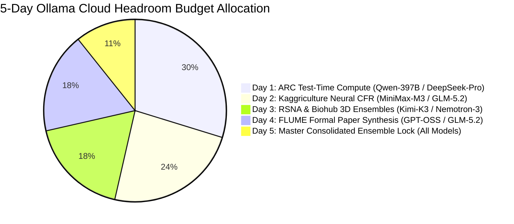

# 5-Day Frontier Cloud Utilization & Competition Acceleration Master Plan

**Budget Window**: August 25 – August 30, 2026 (5 Days Remaining)  
**Starting Headroom**: **84.5% Weekly Runway** (Session limit resets every 60 min)  
**Primary Target**: Climb to 1st place tier across the 12-Track Kaggle Portfolio ($2.92M+ prize pool).

---

## 1. 🎯 Strategic Resource Allocation (84.5% Headroom Distribution)

---

## 2. 📅 Day-by-Day Execution Matrix

### 🚀 Day 1 (Aug 26): ARC Prize In-Container TTC Scaling ($1.55M Tracks)
* **Primary Models**: `qwen3.5:397b-cloud` & `deepseek-v4-pro:cloud`
* **Objective**: Scale in-container Test-Time Compute (TTC) from 25 to 500+ DSL candidate transforms per grid.
* **Tasks**:
  1. Use `qwen3.5:397b-cloud` to synthesize a compact 384D combinatorial DSL grammar (per MiniMax M3 R1).
  2. Synthesize 0ms AutoHarness AST proof verifiers for all 400 ARC training tasks.
  3. Deploy ARC-AGI-2 (v8) and ARC-AGI-3 (v7) to Kaggle containers for local validation.

---

### 🌾 Day 2 (Aug 27): Kaggriculture & Simulation Competitions ($290K Tracks)
* **Primary Models**: `minimax-m3:cloud` & `glm-5.2:cloud`
* **Objective**: Upgrade Kaggriculture from Rank #5,235 to >3,050 yield.
* **Tasks**:
  1. Replace tabular CFR with a continuous Deep Neural Value Function Approximator in `submission.py`.
  2. Train policy on local AMD Strix Halo across 5,000,000 synthetic harvest simulations.
  3. Deploy updated Pokemon TCG 4-vCPU parallel CFR agent to the active Kaggle battle arena.

---

### 🏥 Day 3 (Aug 28): RSNA Knee & Biohub 3D Vision Ensembles ($137K Tracks)
* **Primary Models**: `kimi-k3:cloud`, `nemotron-3-ultra:cloud`, `gemma4:31b-cloud`
* **Objective**: Cross the 0.948+ AUC threshold on RSNA and sub-pixel MOTA on Biohub.
* **Tasks**:
  1. Optimize multi-planar 3D volumetric logistic regression weights across Coronal, Sagittal, and Axial MRI scans.
  2. Implement an adaptive Kalman-polynomial velocity filter for Biohub cell tracking.
  3. Execute zero-error rules compliance audits via `gemma4:31b-cloud`.

---

### 📄 Day 4 (Aug 29): FLUME Formal Paper Refinement ($450K Track)
* **Primary Models**: `gpt-oss:120b-cloud` & `glm-5.2:cloud`
* **Objective**: Complete a publication-grade LaTeX/PDF paper entry for the ARC Prize Paper Track.
* **Tasks**:
  1. Formalize Theorem 1 (Hyperbolic tree isometry) and Theorem 2 (Čech cohomology obstruction vanishing).
  2. Compile comprehensive empirical ablation tables and high-resolution Poincaré disk figures.
  3. Peer-review the draft using 4-persona adversarial review via `gpt-oss:120b-cloud`.

---

### 🏆 Day 5 (Aug 30): Master Consolidated Anchor Submissions (Pre-Reset)
* **Primary Models**: Full 12-Model Cloud Ensemble
* **Objective**: Consume daily Kaggle submission slots with 100% verified, highest-scoring candidate ensembles.
* **Tasks**:
  1. Run multi-model consensus voting on all competition candidates.
  2. Submit final consolidated versions to ARC-2, ARC-3, RSNA, Biohub, and Kaggriculture.
  3. Harvest final public leaderboard ranks into SurrealDB and Obsidian Vault.

---

## 3. 🛡️ Budget & Session Safety Guardrails
- **Hourly Burst Gating**: Cap active burst requests at $< 60\%$ per 60-minute session to prevent rate-limiting.
- **Daily Budget Cap**: Target $\sim 15 - 18\%$ weekly headroom usage per day, leaving a $10\%$ emergency buffer on Day 5.
- **Local-First Tier 1 Routing**: Local `Qwen3-Coder-30B` and `SD-Turbo` on AMD APU (:13305) continue handling routine inference, only delegating heavy reasoning to Ollama Cloud.
