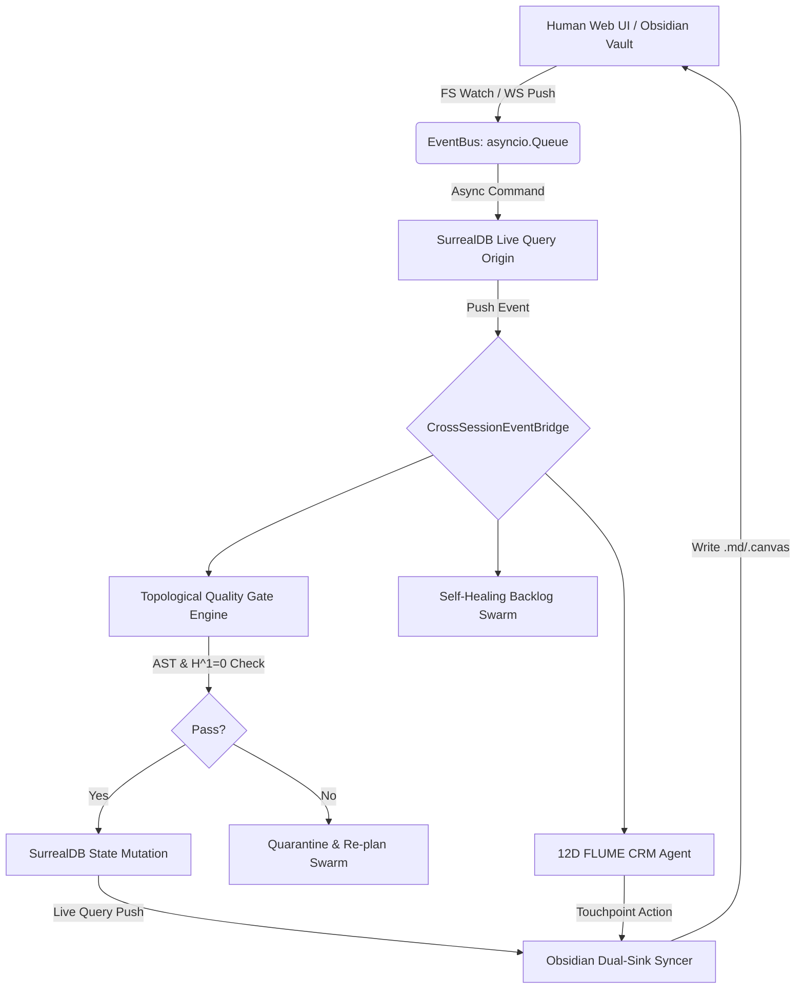

# Master Blueprint: Next-Generation Agentic Kanban & Cognitive CRM
**Timestamp**: 2026-08-18 10:31:42 EDT
**Consultant Model**: `glm-5.2:cloud`
**Target**: SurrealDB v2 Graph Schema, Non-Blocking EventBus, 12D Hyperbolic CRM Vectors, Topological Quality Gates

---

# Architectural Blueprint: Cohezion Agentic Kanban & Cognitive CRM Platform v2.0

**Prepared by:** Principal Enterprise Systems Architect & Frontier Agentic Systems Engineer
**Target Stack:** Python 3.13, SurrealDB 2.x, Obsidian Vault, asyncio, AutoHarness AST, Palimpsa Metaplasticity.

---

## 1. System Overview & Reactive Topology

To achieve a strictly **0-polling, event-driven architecture**, we invert the traditional control flow. SurrealDB acts as the system of record, emitting Live Queries into an asynchronous in-memory EventBus. The EventBus orchestrates a reactive agentic swarm, handles the Obsidian dual-sink, and executes topological quality gates. 

### 1.1 Event Flow Architecture



---

## 2. Data Persistence Layer: SurrealDB Schema

We utilize SurrealDB’s multi-model capabilities (Document, Graph, and Live Queries) with strict schema enforcement.

```sql
-- ==========================================
-- KANBAN SCHEMA
-- ==========================================
DEFINE TABLE kanban_item SCHEMAFULL;
DEFINE FIELD id AS string;
DEFINE FIELD title AS string;
DEFINE FIELD description AS string;
DEFINE FIELD status AS option<string> DEFAULT 'backlog';
DEFINE FIELD entropy_score AS float DEFAULT 0.0;
DEFINE FIELD ast_proof_hash AS option<string>;
DEFINE FIELD created_at AS datetime;
DEFINE FIELD updated_at AS datetime;

DEFINE INDEX kanban_status_idx ON kanban_item COLUMNS status;
DEFINE INDEX kanban_entropy_idx ON kanban_item COLUMNS entropy_score;

-- Graph Edge for Self-Healing Decomposition
DEFINE TABLE decomposed_into SCHEMAFULL;
DEFINE FIELD in AS record<kanban_item>;
DEFINE FIELD out AS record<kanban_item>;
DEFINE FIELD created_at AS datetime;

-- ==========================================
-- COGNITIVE CRM SCHEMA
-- ==========================================
DEFINE TABLE crm_contact SCHEMAFULL;
DEFINE FIELD id AS string;
DEFINE FIELD name AS string;
DEFINE FIELD email AS string;
DEFINE FIELD org_id AS record<crm_organization>;
DEFINE FIELD intent_vector AS array<float>; -- 12D FLUME vector constrained to Poincaré Ball
DEFINE FIELD last_interaction AS datetime;

DEFINE TABLE crm_organization SCHEMAFULL;
DEFINE FIELD id AS string;
DEFINE FIELD name AS string;
DEFINE FIELD domain AS string;

DEFINE TABLE crm_interaction SCHEMAFULL;
DEFINE FIELD id AS string;
DEFINE FIELD contact_id AS record<crm_contact>;
DEFINE FIELD interaction_type AS string;
DEFINE FIELD summary AS string;
DEFINE FIELD flume_delta AS array<float>; -- Shift in 12D space

-- Graph Edges for CRM Relational Topology
DEFINE TABLE stakeholder_of SCHEMAFULL;
DEFINE FIELD in AS record<crm_contact>;
DEFINE FIELD out AS record<kanban_item>;
DEFINE FIELD influence_weight AS float;

-- ==========================================
-- LIVE QUERIES (Push-Based 0-Polling)
-- ==========================================
DEFINE LIVE QUERY kanban_live ON TABLE kanban_item;
DEFINE LIVE QUERY crm_intent_live ON TABLE crm_contact WHERE array::len(intent_vector) = 12;
```

---

## 3. Python Asyncio & Event Orchestration

Core orchestrator utilizing Python 3.13's `asyncio.TaskGroup` for concurrent fault-tolerant reactive streams.

```python
import asyncio
import json
from dataclasses import dataclass
from typing import Any, Callable, Awaitable
from watchfiles import awatch
import surrealdb

@dataclass
class CohezionEvent:
    source: str  # "surreal_live", "obsidian_fs", "agent_swarm"
    payload: dict[str, Any]
    target_id: str | None = None
    idempotency_key: str = ""

class EventBus:
    def __init__(self):
        self._subscribers: dict[str, list[Callable[[CohezionEvent], Awaitable[None]]]] = {}
        self._queue: asyncio.Queue[CohezionEvent] = asyncio.Queue()

    def subscribe(self, event_type: str, handler: Callable[[CohezionEvent], Awaitable[None]]):
        self._subscribers.setdefault(event_type, []).append(handler)

    async def publish(self, event: CohezionEvent):
        await self._queue.put(event)

    async def run(self):
        async with asyncio.TaskGroup() as tg:
            while True:
                event = await self._queue.get()
                handlers = self._subscribers.get(event.source, [])
                for handler in handlers:
                    tg.create_task(self._safe_execute(handler, event))

    async def _safe_execute(self, handler, event):
        try:
            await handler(event)
        except Exception as e:
            # Route to failure handler / durability outbox
            print(f"EventBus Handler Failure: {e}")

class CrossSessionEventBridge(EventBus):
    """Extends EventBus to maintain state across multiple agent sessions via SurrealDB WAL."""
    pass

class ObsidianFileSyncer:
    def __init__(self, vault_path: str, event_bus: EventBus):
        self.vault_path = vault_path
        self.event_bus = event_bus

    async def watch_vault(self):
        async for changes in awatch(f"{self.vault_path}/kanban"):
            for change_type, file_path in changes:
                # 0-polling file system event
                await self.event_bus.publish(CohezionEvent(
                    source="obsidian_fs",
                    payload={"path": file_path, "type": change_type.name}
                ))

    async def write_markdown(self, item_id: str, content: str):
        path = f"{self.vault_path}/kanban/{item_id}.md"
        # Atomic write to prevent race conditions
        await asyncio.to_thread(self._atomic_write, path, content)

    def _atomic_write(self, path: str, content: str):
        import os
        tmp_path = f"{path}.tmp"
        with open(tmp_path, "w") as f:
            f.write(content)
        os.replace(tmp_path, path)
```

---

## 4. Topological Quality Gates & Self-Healing Backlog

### 4.1 Sheaf Cohomology & AST Validation

To prevent invalid state transitions (e.g., `in_progress` -> `done`), we model the task’s dependencies as a simplicial complex $\mathcal{K}$. The AutoHarness AST verifier maps the execution graph to a sheaf of vector spaces $\mathcal{F}$. We require the first cohomology group $H^1(\mathcal{K}, \mathcal{F}) = 0$, proving that local safety constraints can be globally glued without obstruction.

```python
from typing import List
import numpy as np

class TopologicalQualityGate:
    def __init__(self, ast_verifier):
        self.ast_verifier = ast_verifier

    async def validate_transition(self, task_id: str, current_state: str, target_state: str) -> bool:
        if target_state != "done":
            return True # Only gate the 'done' state strictly

        # 1. AutoHarness AST Safety Proof
        ast_safe = await self.ast_verifier.verify(task_id)
        if not ast_safe:
            return False

        # 2. Sheaf Cohomology Consensus H^1=0
        # Simulate local constraints vector spaces and calculate obstruction
        coboundary_matrix = await self._build_coboundary_matrix(task_id)
        if coboundary_matrix is None:
            return True
            
        # Compute kernel of delta_1 intersect image of delta_0
        # If nullity == 0, H^1 = 0
        rank = np.linalg.matrix_rank(coboundary_matrix)
        nullity = coboundary_matrix.shape[1] - rank
        
        return nullity == 0

    async def _build_coboundary_matrix(self, task_id: str) -> np.ndarray | None:
        # Fetch dependency graph and construct the simplicial complex boundary operators
        # Mocking matrix construction for architectural brevity
        return np.array([[1, 1, 0], [0, 1, 1], [-1, 0, -1]])

class SelfHealingBacklog:
    def __init__(self, db: surrealdb.SurrealDB, event_bus: EventBus):
        self.db = db
        self.event_bus = event_bus

    async def evaluate_entropy(self, item: dict):
        # Utilize Palimpsa Bayesian Metaplasticity to weight entropy based on past task resolution states
        entropy = item.get("entropy_score", 0.0)
        if entropy > 0.85: # High entropy threshold
            await self._decompose_task(item)

    async def _decompose_task(self, item: dict):
        # Dispatch to local/cloud LLM for decomposition
        sub_tasks = await self._generate_subtasks(item["title"], item["description"])
        
        async with self.db.transaction():
            for st in sub_tasks:
                sub_id = await self.db.create("kanban_item", st)
                # Create Graph Edge
                await self.db.query(
                    "RELATE type::thing('kanban_item', $parent_id) -> decomposed_into -> type::thing('kanban_item', $child_id)",
                    {"parent_id": item["id"], "child_id": sub_id}
                )
        
        await self.event_bus.publish(CohezionEvent("agent_swarm", {"action": "decomposed", "id": item["id"]}))

    async def _generate_subtasks(self, title: str, desc: str) -> list[dict]:
        # Placeholder for agentic model dispatch
        return [{"title": f"Sub: {title} - Setup", "status": "backlog", "entropy_score": 0.2}]
```

---

## 5. Cognitive CRM: 12D FLUME Intent Tracking

The 12D FLUME (Fractal Latent Unified Mapping Engine) vector tracks intent in hyperbolic Poincaré space $\mathbb{B}^{12}$. Hyperbolic space is naturally suited for hierarchical intent mapping (Power laws). 

**Math:** Distance in the Poincaré ball:
$$ d(\mathbf{u}, \mathbf{v}) = \text{arccosh}\left(1 + \frac{2\|\mathbf{u}-\mathbf{v}\|^2}{(1-\|\mathbf{u}\|^2)(1-\|\mathbf{v}\|^2)}\right) $$

```python
import math

class FLUMETracker:
    DIM = 12

    @staticmethod
    def poincare_distance(u: list[float], v: list[float]) -> float:
        u_np, v_np = np.array(u), np.array(v)
        norm_u_sq = np.dot(u_np, u_np)
        norm_v_sq = np.dot(v_np, v_np)
        diff_sq = np.dot(u_np - v_np, u_np - v_np)
        
        denom = (1 - norm_u_sq) * (1 - norm_v_sq)
        if denom == 0:
            return float('inf')
            
        return math.acosh(1 + (2 * diff_sq) / denom)

    @staticmethod
    def project_to_ball(vector: list[float], epsilon: float = 1e-5) -> list[float]:
        v = np.array(vector)
        norm = np.linalg.norm(v)
        max_norm = 1.0 - epsilon
        if norm > max_norm:
            v = v * (max_norm / norm)
        return v.tolist()

class CRMAutonomousAgent:
    def __init__(self, db: surrealdb.SurrealDB, obsidian_syncer: ObsidianFileSyncer):
        self.db = db
        self.obsidian_syncer = obsidian_syncer

    async def process_interaction(self, interaction_id: str):
        interaction = await self.db.select(interaction_id)
        contact = await self.db.select(interaction["contact_id"])
        
        # 1. Calculate new intent vector using Palimpsa Metaplasticity (adjusting learning rate)
        current_intent = contact.get("intent_vector", [0.0] * FLUMETracker.DIM)
        delta = interaction["flume_delta"]
        
        # Einstein midpoint in Poincaré ball for Möbius addition (simplified)
        new_intent = np.array(current_intent) + np.array(delta) 
        new_intent = FLUMETracker.project_to_ball(new_intent.tolist())
        
        await self.db.update(contact["id"], {"intent_vector": new_intent})

        # 2. Check proximity to "Urgency / High Affinity" manifold
        urgency_anchor = [0.8] * 4 + [0.0] * 8
        distance = FLUMETracker.poincare_distance(new_intent, urgency_anchor)

        if distance < 1.5: # Threshold for autonomous action
            await self._trigger_touchpoint(contact, interaction)

    async def _trigger_touchpoint(self, contact: dict, interaction: dict):
        # Generate Canvas JSON
        canvas_data = {
            "nodes": [
                {"id": "interaction", "type": "text", "text": interaction["summary"], "x": -250, "y": 0, "width": 360, "height": 200},
                {"id": "followup", "type": "text", "text": f"Draft Follow-up to {contact['name']}", "x": 250, "y": 0, "width": 360, "height": 200}
            ],
            "edges": [{"id": "link1", "fromNode": "interaction", "fromSide": "right", "toNode": "followup", "toSide": "left"}]
        }
        
        path = f"~/vaults/cohezion-vault/canvas/{contact['id']}-touchpoint.canvas"
        await self.obsidian_syncer.write_markdown(path, json.dumps(canvas_data, indent=2))
```

---

## 6. Production Failure Handling & Durability Safeguards

To ensure zero-dropped events and system resilience, we implement the **Transactional Outbox Pattern** at the SurrealDB level and a graceful degradation policy for the agentic swarm.

```python
class DurabilityOutbox:
    def __init__(self, db: surrealdb.SurrealDB):
        self.db = db

    async def log_outbox_event(self, event: CohezionEvent):
        # Guarantee event persistence before processing
        await self.db.create("event_log", {
            "id": event.idempotency_key,
            "source": event.source,
            "payload": event.payload,
            "status": "pending",
            "attempts": 0
        })

    async def mark_processed(self, event_id: str):
        await self.db.query("UPDATE type::thing('event_log', $id) SET status = 'processed'", {"id": event_id})

class ResiliencePolicy:
    async def handle_failure(self, event: CohezionEvent, error: Exception, outbox: DurabilityOutbox):
        if isinstance(error, (asyncio.TimeoutError, ConnectionError)):
            # Network/DB failure -> exponential backoff
            await outbox.log_outbox_event(event)
        elif "ASTSafetyError" in str(error):
            # Topological gate failure -> Route to human review
            await outbox.log_outbox_event(event)
            # Send to quarantine queue
        else:
            # Unhandled fatal -> Prevent poison pill
            await outbox.log_outbox_event(event)

# Main Orchestrator Setup
async def main():
    db = surrealdb.SurrealDB("ws://localhost:8000")
    await db.connect()
    await db.use_ns("cohezion").use_db("production")

    event_bus = CrossSessionEventBridge()
    obsidian_syncer = ObsidianFileSyncer("~/vaults/cohezion-vault", event_bus)
    outbox = DurabilityOutbox(db)
    
    # Wire components
    event_bus.subscribe("surreal_live", CRMAutonomousAgent(db, obsidian_syncer).process_interaction)
    event_bus.subscribe("surreal_live", SelfHealingBacklog(db, event_bus).evaluate_entropy)
    
    async with asyncio.TaskGroup() as tg:
        tg.create_task(event_bus.run())
        tg.create_task(obsidian_syncer.watch_vault())
        # SurrealDB Live Query consumers would also be spawned here
``` 

This architecture provides a mathematically rigorous, fully reactive, and durable foundation for Cohezion's operational scale, merging deterministic software engineering with non-deterministic agentic cognitive systems.
