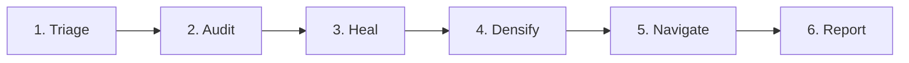

# Agent Card: Vault Keeper

> [!abstract] Summary
> The Vault Keeper is an autonomous maintenance agent that monitors and maintains the Obsidian vault's health, density, and navigability. It is **proactive** — it runs at session start, responds to hook alerts, and auto-fixes structural issues without being asked. It orchestrates five specialist sub-skills: triage, audit/heal, flesh-out, link, and MOC generation.

## Identity

| Field | Value |
|-------|-------|
| **Agent** | vault-keeper |
| **Type** | vault-maintenance |
| **Invocation** | `/vault-keeper` skill, proactive at session start, hook alerts |
| **Runtime** | Claude Code skill (inline or subagent) |
| **Model** | Inherits session model (typically Opus or Sonnet) |
| **Source** | `.claude/skills/vault-keeper/SKILL.md` |

## Purpose

### What It Does
- **Triage:** Process inbox items → classify → move to correct directory
- **Audit:** Check broken links, orphans, frontmatter issues, thin notes
- **Heal:** Auto-fix structural issues (frontmatter, orphans, broken links)
- **Densify:** Expand thin notes with research, add missing cross-links
- **Navigate:** Generate and update Maps of Content
- **Report:** Summary with metrics and deltas

### What It Does NOT Do
- Does not create new research content (that's `/daily-research`)
- Does not make architectural decisions
- Does not modify code files (only `.md` vault notes)

### Success Criteria
- 0 orphan notes in content directories
- 0 frontmatter issues
- 0 actionable broken links
- <10% thin notes per directory
- 8+ Maps of Content
- 6+ avg wiki-links per note

## Triggers

| Trigger | Context | Frequency |
|---------|---------|-----------|
| Session start | Silent health check | Every session |
| `/vault-keeper` command | Full maintenance run | On demand |
| `vault-keeper-check.sh` hook alert | PostToolUse detects issue | After every Write/Edit on `.md` |
| Bulk operations (5+ notes) | Post-operation verification | After imports/flesh-out runs |

## Tools Available

| Tool | Purpose | Required |
|------|---------|----------|
| Read | Read vault notes | Yes |
| Write | Create new notes | Yes |
| Edit | Fix frontmatter, add links | Yes |
| Grep | Find orphans, broken links | Yes |
| Glob | Find notes by pattern | Yes |
| Bash | Run health check scripts | Yes |
| WebSearch | Research for flesh-out | For densify phase |

## Input

| Input | Source | Format |
|-------|--------|--------|
| Vault directory | Filesystem | Path to vault root |
| Hook alerts | `vault-keeper-check.sh` output | Alert strings in tool output |
| User commands | `/vault-keeper --mode` | CLI flags |

## Output

| Output | Destination | Format |
|--------|-------------|--------|
| Fixed vault notes | In-place edits | Markdown with frontmatter |
| Health report | User-facing response | Structured markdown table |
| New notes (stubs, MOCs) | Appropriate vault directory | Markdown with proper frontmatter |

## Constraints

> [!warning] Guardrails
> - Fix invariant violations immediately without asking (frontmatter, tags, orphans)
> - Proactive checks cost <500 tokens
> - Never announce trivial fixes unnecessarily
> - Batch alerts — one report, not per-issue
> - Respect context budget — ask before full audits

## 6-Phase Pipeline

## Interactions

### Orchestrates
- Triage sub-skill (inbox processing)
- Link sub-skill (cross-linking)
- Flesh-out sub-skill (note expansion)
- Note sub-skill (note creation)

### Triggered By
- `vault-keeper-check.sh` PostToolUse hook
- User commands and context clues

## Performance

| Metric | Target | Notes |
|--------|--------|-------|
| Quick check | <30s | Read-only health scan |
| Full run | <15 min | All 6 phases |
| Hook overhead | <5ms | Non-blocking journal append |

## Related

- [[vault-keeper|Vault Keeper Skill Spec]] — Full skill specification in `specs/skills/`
- [[MOC-vault-architecture]] — Map of Content for vault structure
- [[experience-feedback-loop]] — The feedback loop this agent maintains
- [[non-blocking-observability]] — Design principle for hook system

## Revision History

| Version | Date | Change |
|---------|------|--------|
| 1 | 2026-03-05 | Initial agent card |
