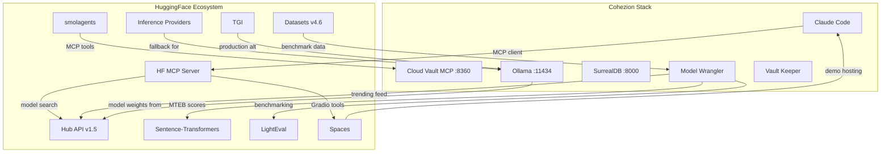

# Integration Map: HuggingFace

> [!abstract] Summary
> HuggingFace is the ML ecosystem hub — 2M+ models, 500K datasets, 1M Spaces, and the de facto platform for open-source AI. This document maps every integration point between HuggingFace services and the Cohezion stack: MCP servers, embedding pipelines, model discovery, agent frameworks, evaluation, and deployment.

---

## Integration Architecture



---

## Integration Points

### 1. HuggingFace MCP Server

> [!tip] Highest Priority — Ready to Use Today
> Official MCP server at `huggingface.co/mcp`. Connect Claude Code to the entire HF ecosystem with one config change.

| Field | Value |
|-------|-------|
| **Endpoint** | `https://huggingface.co/mcp` |
| **Transport** | Streamable HTTP (also STDIO, SSE) |
| **Auth** | `HF_TOKEN` or OAuth via `?login` |
| **Status** | GA (production, 164+ clients in first week) |
| **Open Source** | Yes ([evalstate/hf-mcp-server](https://github.com/evalstate/hf-mcp-server)) |

#### Built-in Tools

| Tool | Description | Cohezion Use Case |
|------|-------------|-------------------|
| **Model Search** | Filter by task, library, author, tags | Model Wrangler discovery |
| **Dataset Search** | Filter by author, tags, size | Find training/eval datasets |
| **Papers Semantic Search** | NLP search across ML papers | Daily research pipeline |
| **Spaces Semantic Search** | Find AI apps on Spaces | Tool discovery for agents |
| **Documentation Search** | Search HF library docs | Development reference |
| **Hub Repository Details** | Full metadata + README for any repo | Model card data extraction |
| **Run & Manage Jobs** | Run/monitor jobs on HF infrastructure | Remote compute for training |

#### Gradio Space Extensions

Any MCP-compatible Gradio Space can be added as a dynamic tool. Examples:
- Image generation, audio transcription, document search
- 1000+ MCP-compatible Spaces available
- Dynamic discovery (experimental): assistant finds Spaces on-the-fly

#### Configuration for Claude Code

```json
{
  "huggingface": {
    "type": "http",
    "url": "https://huggingface.co/mcp",
    "headers": {
      "Authorization": "Bearer <HF_TOKEN>"
    }
  }
}
```

Settings dashboard: [huggingface.co/settings/mcp](https://huggingface.co/settings/mcp)

#### Integration with Cohezion

| Integration | How | Priority |
|-------------|-----|----------|
| Add to `~/.claude/mcp.json` | Direct MCP connection | **P0** — immediate |
| Model Wrangler feeds | Use Model Search tool for trending/new models | **P1** |
| Research pipeline | Use Papers Semantic Search for daily research | **P1** |
| Document in `specs/mcp-servers/` | Create HF MCP server spec | **P0** |

---

### 2. Hub API (`huggingface_hub` v1.5.0)

| Field | Value |
|-------|-------|
| **Library** | `huggingface_hub` (Python) |
| **Version** | 1.5.0 |
| **Install** | `pip install huggingface_hub` |
| **Auth** | `HF_TOKEN` env var or `~/.cache/huggingface/token` |
| **Status** | GA, stable |

#### Key Capabilities

| API | Method | Use Case |
|-----|--------|----------|
| `list_models()` | Filter by author, library, task, tags | Model discovery feed |
| `search_models()` | Semantic query + filters | "Find best embedding model for X" |
| `model_info()` | Full metadata, card data, downloads | Model card enrichment |
| `hf_hub_download()` | Download model files | Model pull for Ollama conversion |
| `list_datasets()` | Dataset discovery | Find benchmark/training data |
| `snapshot_download()` | Full repo download | Clone model repos |

#### Integration with Cohezion

| Integration | How | Priority |
|-------------|-----|----------|
| Model Wrangler daily digest | `list_models(sort="trending")` for daily feed | **P1** |
| Card enrichment | `model_info(expand=["cardData"])` → parse into vault model cards | **P2** |
| Automated model monitoring | Scheduled script checking for new releases | **P2** |
| Ollama model conversion | Download GGUF weights → `ollama create` | **P2** |

---

### 3. Inference Providers (Serverless + Dedicated)

| Field | Value |
|-------|-------|
| **Free Tier** | Monthly credits for experimentation |
| **PRO Plan** | $9/mo — 20x credits, priority queues |
| **Pay-as-you-go** | No markup, 200+ models, multi-provider |
| **Dedicated** | From $0.03/hr (CPU) to $80/hr (GPU) |
| **Status** | GA |

#### Pricing Tiers

| Tier | Cost | Best For |
|------|------|----------|
| Free (Serverless) | $0 (monthly credits) | Experimentation |
| PRO | $9/mo (20x credits) | Higher rate limits |
| Inference Providers | Pay-as-you-go | Flexible multi-provider |
| Dedicated (CPU) | ~$0.03/hr | Lightweight production |
| Dedicated (GPU) | ~$1-80/hr | High-performance |

#### Integration with Cohezion

| Integration | How | Priority |
|-------------|-----|----------|
| Ollama fallback | When Ollama is down, route embeddings to HF Inference API | **P2** |
| High-quality embeddings | Use `gemini-embedding-001` or `Qwen3-Embedding` via HF | **P3** |
| Batch processing | Free tier for bulk experimentation | **P3** |

---

### 4. Sentence-Transformers & MTEB

| Field | Value |
|-------|-------|
| **Library** | `sentence-transformers` |
| **Pre-trained Models** | 15,000+ on Hub |
| **MTEB** | 1000+ tasks, 1000+ languages |
| **RTEB** | New retrieval-focused benchmark (2025) |
| **Status** | GA, actively maintained |

#### Current MTEB Leaders (2026)

| Model | Type | Score | License |
|-------|------|-------|---------|
| Gemini Embedding | Proprietary | #1 overall | API-only |
| Qwen3-Embedding-8B | Open Source | 70.58 (multilingual) | Apache 2.0 |
| Cohere embed-v4 | Proprietary | ~65.2 | API-only |
| OpenAI text-3-large | Proprietary | ~64.6 | API-only |
| BGE-M3 | Open Source | ~63.0 | Open |
| NV-Embed | NVIDIA | 69.32 | API |

#### Integration with Cohezion

| Integration | How | Priority |
|-------------|-----|----------|
| Embedding benchmarking | Run MTEB on `nomic-embed-text` and alternatives | **P1** |
| Model Wrangler eval | Compare embedding models using MTEB tasks | **P1** |
| Static embeddings | Explore 100-400x faster static models for bulk ops | **P3** |
| RTEB adoption | Use retrieval-specific benchmark for vault search quality | **P2** |

---

### 5. smolagents (Agent Framework)

| Field | Value |
|-------|-------|
| **Library** | `smolagents` |
| **Install** | `pip install smolagents` |
| **Architecture** | Code-first agents (Python, not JSON) |
| **Model Support** | Ollama, Anthropic, OpenAI, HF Inference, LiteLLM |
| **MCP Support** | Yes — can use any MCP server's tools |
| **Sandboxing** | Docker, E2B, Pyodide, Blaxel, Modal |
| **Status** | GA, actively maintained |

#### Key Features

- **CodeAgent**: Writes Python code to invoke tools (composable, loops, conditionals)
- **ToolCallingAgent**: JSON-based tool calling (traditional approach)
- **MCP integration**: Use any MCP server's tools directly
- **Hub integration**: Share/load agents and tools as Gradio Spaces
- **CLI tools**: `smolagent`, `webagent` for quick agent runs
- **Modality-agnostic**: Text, vision, video, audio inputs

#### Integration with Cohezion

| Integration | How | Priority |
|-------------|-----|----------|
| Alternative agent runtime | Run local agents via Ollama + smolagents | **P3** |
| MCP tool bridge | smolagents can call Cloud Vault MCP tools | **P2** |
| Vault research agents | Build lightweight research agents on local models | **P3** |
| Gradio demo agents | Deploy Cohezion agents as Spaces for demo | **P3** |

---

### 6. Datasets Library (v4.6.1)

| Field | Value |
|-------|-------|
| **Library** | `datasets` v4.6.1 |
| **Hub Scale** | 500K+ datasets |
| **Formats** | CSV, JSON, Parquet, Arrow, Lance, HDF5, etc. |
| **Features** | Streaming, resharding, Polars/Arrow integration |
| **Status** | GA, actively maintained |

#### Integration with Cohezion

| Integration | How | Priority |
|-------------|-----|----------|
| Benchmark dataset hosting | Version COHEZION benchmark tests on Hub | **P3** |
| Fine-tuning data management | Store/version training datasets | **P3** |
| Vault export | Export vault content as HF dataset for model training | **P3** |

---

### 7. LightEval (Evaluation Framework)

| Field | Value |
|-------|-------|
| **Library** | `lighteval` |
| **Replaces** | `evaluate` (now maintenance mode) |
| **Tasks** | 1000+ evaluation tasks |
| **Backends** | inspect-ai, Transformers, vLLM, HF Inference |
| **Status** | GA, actively developed |

#### Integration with Cohezion

| Integration | How | Priority |
|-------------|-----|----------|
| Model Wrangler benchmarking | Use LightEval for standardized model comparison | **P2** |
| Custom eval tasks | Create COHEZION-specific evaluation tasks | **P3** |
| Automated eval pipeline | Integrate into daily model monitoring | **P2** |

---

### 8. Text Generation Inference (TGI)

| Field | Value |
|-------|-------|
| **Type** | Self-hosted inference server |
| **Purpose** | Production-grade model serving |
| **Features** | Continuous batching, tensor parallelism, quantization |
| **Docker** | `ghcr.io/huggingface/text-generation-inference` |
| **Status** | GA |

#### Integration with Cohezion

| Integration | How | Priority |
|-------------|-----|----------|
| Production inference | Replace Ollama for high-throughput workloads | **P3** |
| GPU optimization | Better GPU utilization than Ollama for large models | **P3** |

---

### 9. Spaces (Deployment Platform)

| Field | Value |
|-------|-------|
| **Free Tier** | CPU-basic instances |
| **GPU** | $0.40-40/hr (A10G, A100, H200) |
| **Frameworks** | Gradio, Streamlit, Docker |
| **MCP** | Spaces can serve as MCP tools |
| **Status** | GA |

#### Integration with Cohezion

| Integration | How | Priority |
|-------------|-----|----------|
| Demo hosting | Deploy Cohezion dashboards/visualizations | **P3** |
| MCP tool extensions | Use community AI Spaces as vault tools | **P2** |
| FLUME demo | Host interactive FLUME visualization | **P3** |

---

### 10. Claude Code Plugin System

> [!tip] Opportunity
> No official HuggingFace plugin exists in the Claude Code marketplace. This is a gap we could fill.

| Field | Value |
|-------|-------|
| **Official Marketplace** | `claude-plugins-official` |
| **Install** | `/plugin install plugin-name@marketplace` |
| **Plugin Structure** | `.claude-plugin/`, `.mcp.json`, commands/, agents/, skills/ |
| **Existing Integrations** | GitHub, GitLab, Atlassian, Slack, Vercel, Firebase, etc. |
| **HuggingFace Plugin** | Does not exist yet |

#### Plugin Discovery Sources

| Source | URL | Notes |
|--------|-----|-------|
| Official Anthropic | Built into Claude Code `/plugin` | Auto-available |
| Demo marketplace | `anthropics/claude-code` | Example plugins |
| skills.sh | [skills.sh](https://skills.sh) | 85K+ agent skills, no HF skill found |
| SkillHub | [skillhub.club](https://skillhub.club) | 7K+ skills |
| SkillsMP | [skillsmp.com](https://skillsmp.com) | 350K+ skills |

#### Potential Cohezion HF Plugin

A Claude Code plugin wrapping the HF MCP Server + model management utilities:
- Auto-configure HF MCP connection
- Model search/comparison slash commands
- Embedding benchmark runner
- Trending models feed

---

### 11. Gemini CLI Extensions

| Field | Value |
|-------|-------|
| **Org** | [github.com/gemini-cli-extensions](https://github.com/gemini-cli-extensions) |
| **Repos** | 39 total |
| **Relevant** | MCP Toolbox, Conductor, Security, Code Review |
| **HF Integration** | None found |

---

## Priority Matrix

| Priority | Integration | Effort | Impact | Dependencies |
|----------|-------------|--------|--------|-------------|
| **P0** | Add HF MCP Server to Claude Code config | 5 min | High — instant model/paper search | HF_TOKEN |
| **P0** | Create `specs/mcp-servers/huggingface.md` | 30 min | Med — vault documentation | HF MCP config |
| **P1** | Hub API for Model Wrangler feeds | 2-4 hr | High — automated model monitoring | `huggingface_hub` install |
| **P1** | MTEB benchmarking for embedding eval | 2-4 hr | High — data-driven embedding selection | `mteb` install |
| **P1** | HF Papers search in research pipeline | 1 hr | Med — enriched daily research | HF MCP Server |
| **P2** | LightEval for model comparison | 4-8 hr | Med — standardized eval | `lighteval` install |
| **P2** | RTEB for vault search quality | 2-4 hr | Med — retrieval-specific metrics | `mteb` install |
| **P2** | smolagents MCP bridge | 2-4 hr | Med — local agent loops | `smolagents` install |
| **P2** | Inference API as Ollama fallback | 4-8 hr | Med — reliability | HF_TOKEN + billing |
| **P3** | TGI for production inference | 8+ hr | Low — Ollama sufficient now | Docker, GPU |
| **P3** | Spaces for demo deployment | 4-8 hr | Low — nice to have | HF account |
| **P3** | Datasets for benchmark hosting | 2-4 hr | Low — local storage works | HF account |
| **P3** | Claude Code HF plugin | 8+ hr | Med — ecosystem contribution | Plugin dev knowledge |

---

## Immediate Actions

### P0: Add HF MCP Server (Today)

1. Get HF token: [huggingface.co/settings/tokens](https://huggingface.co/settings/tokens)
2. Configure MCP settings: [huggingface.co/settings/mcp](https://huggingface.co/settings/mcp)
3. Add to `~/.claude/mcp.json`:
```json
{
  "huggingface": {
    "type": "http",
    "url": "https://huggingface.co/mcp",
    "headers": {
      "Authorization": "Bearer <HF_TOKEN>"
    }
  }
}
```
4. Create `specs/mcp-servers/huggingface.md` with server documentation

### P1: Model Wrangler Integration (This Week)

1. Install `huggingface_hub`: `pip install huggingface_hub`
2. Add trending model feed to daily research pipeline
3. Run MTEB on current embedding models (`nomic-embed-text`, `mxbai-embed-large`)
4. Compare against HF-hosted alternatives

---

## Related

- [[cloud-vault-mcp]] — Primary MCP server (port 8360)
- [[ollama]] — Local inference system card
- [[2026-02-09-model-wrangler-strategy]] — Model monitoring and swapping strategy
- [[nomic-embed-text]] — Primary embedding model card
- [[mxbai-embed-large]] — Alternative embedding model card
- [[gemini-embedding]] — Google API embedding card
- [[transformers-v5-huggingface-release]] — Transformers v5 ecosystem paper
- [[semantic-search]] — Semantic search concept
- [[mcp-model-context-protocol]] — MCP protocol concept
- [[ide-and-model-providers]] — IDE and model provider integration spec
- [[ai-documentation-cards-standards]] — Documentation standards paper
- [[agentic-ai]] — Agentic AI concept
- [[multi-agent-systems]] — Multi-agent systems concept

## Revision History

| Version | Date | Change |
|---------|------|--------|
| 1 | 2026-03-05 | Initial integration map |
