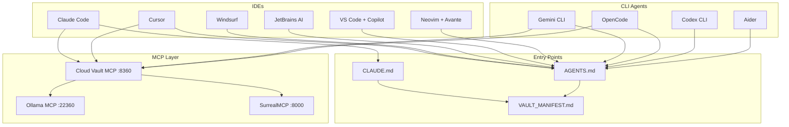

# IDE and Model Provider Integration Points

> [!abstract] Purpose
> Define how agents from any IDE or model provider can connect to the Cohezion vault, read system definitions, query SurrealDB, and contribute knowledge back.

---

## Integration Architecture



---

## Entry Points by Tool

> [!tip] Universal Rule
> Every tool reads a different instruction file, but all roads lead to `VAULT_MANIFEST.md`.

| IDE / Agent | Instruction File | Format | Auto-Read? |
|-------------|-----------------|--------|------------|
| **Claude Code** | `CLAUDE.md` | Markdown | Yes (built-in) |
| **Cursor** | `AGENTS.md` or `.cursorrules` | Markdown | Yes |
| **Windsurf** | `AGENTS.md` or `.windsurfrules` | Markdown | Yes |
| **JetBrains AI** | `AGENTS.md` | Markdown | Partial |
| **VS Code + Copilot** | `AGENTS.md` or `.github/copilot-instructions.md` | Markdown | Yes |
| **Gemini CLI** | `GEMINI.md` or `AGENTS.md` | Markdown | Yes |
| **OpenCode** | `AGENTS.md` (fallback: `CLAUDE.md`) | Markdown | Yes |
| **Codex CLI** | `AGENTS.md` | Markdown | Yes |
| **Aider** | `AGENTS.md` or `.aider.conf.yml` | YAML/MD | Partial |

> [!warning] Keep AGENTS.md and CLAUDE.md in Sync
> `AGENTS.md` is vendor-neutral and points at `VAULT_MANIFEST.md`. `CLAUDE.md` has Claude-specific tool guidance. Both reference the same vault structure and conventions.

---

## MCP Integration Layer

MCP is the universal integration protocol. Any tool supporting MCP can access the full vault programmatically.

### Available MCP Servers

| Server | Port | Protocol | What It Does |
|--------|------|----------|-------------|
| **Cloud Vault MCP** | 8360 | HTTP (Streamable) | Vault read/write/search, SurrealDB query, agent context |
| **Ollama MCP** | 22360 | stdio | Semantic search, embeddings, model selection |
| **Context7** | — | stdio (npx) | Library documentation lookup |
| **SurrealMCP** | 8000 | HTTP | Direct SurrealDB access (official MCP server) |

### Adding MCP to Any Tool

**Claude Code** (`~/.claude/mcp.json`):
```json
{
  "cloud-vault-mcp": {
    "type": "http",
    "url": "http://127.0.0.1:8360",
    "headers": {"Authorization": "Bearer <API_KEY>"}
  }
}
```

**Cursor** (`.cursor/mcp.json`):
```json
{
  "mcpServers": {
    "cloud-vault-mcp": {
      "url": "http://127.0.0.1:8360"
    }
  }
}
```

**Gemini CLI** (`~/.gemini/mcp.json` or project-level):
```json
{
  "mcpServers": {
    "cloud-vault-mcp": {
      "command": "npx",
      "args": ["mcp-remote", "http://127.0.0.1:8360"]
    }
  }
}
```

**OpenCode** (`.opencode/config.toml`):
```toml
[mcp.cloud-vault-mcp]
type = "http"
url = "http://127.0.0.1:8360"
```

**VS Code + Copilot** (`.vscode/mcp.json`):
```json
{
  "servers": {
    "cloud-vault-mcp": {
      "type": "http",
      "url": "http://127.0.0.1:8360"
    }
  }
}
```

---

## Model Provider Compatibility

| Provider | Models | MCP Support | Notes |
|----------|--------|-------------|-------|
| **Anthropic** | Claude 4.6 Opus/Sonnet, Haiku 4.5 | Native (Claude Code) | Primary provider |
| **Google** | Gemini 2.5 Pro/Flash | Via Gemini CLI | MCP via mcp-remote proxy |
| **OpenAI** | GPT-4o, o3, Codex | Via Codex CLI | MCP support emerging |
| **Ollama (local)** | Llama 3, Mistral, etc. | Via Ollama MCP | Embeddings + semantic search |
| **DeepSeek** | DeepSeek V3, R1 | Via OpenCode | OpenAI-compatible API |
| **Groq** | Llama, Mixtral | Via API | Fast inference, no native MCP |

### Model-Agnostic Design Principles

1. **Instructions are markdown** — Every model can read `.md` files
2. **MCP is the API layer** — Tools work the same regardless of model
3. **No model-specific prompts in vault notes** — Keep content neutral
4. **Embeddings are pluggable** — Ollama MCP supports model switching

---

## Hook System Integration

The vault-keeper hooks fire on file operations regardless of which tool made the change:

| Hook | Fires On | Works With |
|------|----------|------------|
| `vault-keeper-check.sh` | Write/Edit/Read of `.md` files | Claude Code (native PostToolUse) |
| `vault-link-suggest.sh` | Write/Edit of `.md` files | Claude Code (native PostToolUse) |

> [!warning] Hook Gap
> Hooks are Claude Code-specific (PostToolUse). Gemini CLI, Cursor, and other tools don't fire these hooks. For cross-tool coverage, the sync daemon (Epic 3 of [[2026-03-05-vault-surrealdb-sync-pipeline]]) should use filesystem watching as a fallback.

---

## Onboarding a New Tool

To connect a new IDE or agent to the Cohezion vault:

1. **Create instruction file** if the tool uses a non-standard one (e.g., `.windsurfrules`)
2. **Point at VAULT_MANIFEST.md** from the instruction file
3. **Configure MCP** with cloud-vault-mcp connection (see examples above)
4. **Test connectivity:** Call `vault_read` with `path: "VAULT_MANIFEST.md"`
5. **Document** the integration in `specs/integrations/<tool-name>.md`

---

## Related

- [[2026-03-05-vault-as-system-of-record]] — ADR for storing system definitions in vault
- [[2026-03-05-vault-surrealdb-sync-pipeline]] — Sync pipeline PRD
- [[cloud-vault-mcp]] — The MCP server concept
- [[mcp-model-context-protocol]] — MCP protocol concept
- [[multi-agent-systems]] — Multi-agent systems concept
- [[agentic-ai]] — Agentic AI concept
- [[huggingface]] — HuggingFace integration spec (MCP server, Hub API, MTEB, smolagents)
