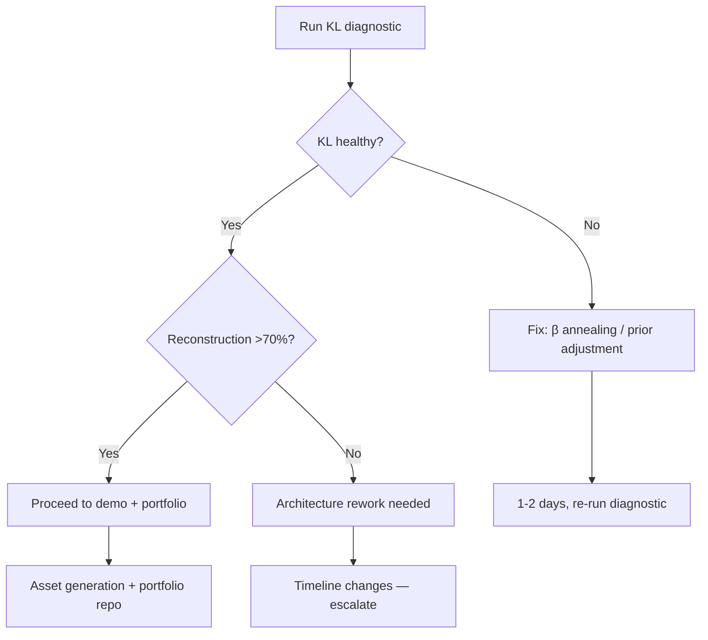

# FLUME KL Collapse Diagnostic

> [!danger] Urgency
> The entire April portfolio submission is built around FLUME. If KL collapse is present or reconstruction fidelity is below ~70%, the narrative foundation is compromised. No amount of demo polish fixes that. Ten days have passed since this was flagged as "start immediately" in [[2026-02-23-flume-strategic-roadmap]].

## Hypothesis

The FLUME variational autoencoder is training correctly — KL divergence is annealing to a non-zero value (not collapsing to zero), and the decoder can reconstruct semantically faithful trajectories from the latent space.

## Method

1. **KL loss trajectory** — Plot KL loss across training epochs. Healthy: anneals to a stable non-zero value. Collapsed: drops to zero (posterior = prior, latent space unused).
2. **Reconstruction fidelity** — Encode 50 real trajectories → decode → measure semantic preservation via token BLEU and entailment score. Target: >70%.
3. **Prior sampling coherence** — Sample 50 synthetic trajectories from the prior distribution. Evaluate whether decoded outputs are coherent agent trajectories or noise.
4. **Log results** — Record all numbers as a vault experiment note. No narrative without data.

## Decision Points

> [!success] Green Path
> KL healthy + reconstruction >70% → proceed to demo, asset generation, portfolio repo.

> [!warning] Yellow Path
> KL collapse detected → fix with β annealing or prior adjustment. 1-2 day fix, not weeks. Re-run diagnostic.

> [!danger] Red Path
> Reconstruction poor despite healthy KL → architecture rework needed. This changes the timeline. Better to know now than at submission.

## Time Estimate

20-30 hours to run diagnostics and document results. This is the highest-information-per-hour task currently open.

## Results

**Run date:** 2026-03-05. Diagnostic executed against `flume_vae_ep50.pt`.

### Pre-flight findings (before running tests)

| Finding | Detail |
|---------|--------|
| Checkpoint epoch | Both `ep2.pt` and `ep50.pt` contain `epoch: 2`. The ep50 name is misleading — this was a 2-epoch run. |
| z_dim | 64 (not 256 as current `TrainConfig` default) |
| Training data | `data/mass_sim/artifacts` — **does not exist**. Training fell back to `SyntheticFlumeDataset` (Gaussian noise at mean=0.5, std=0.15). This is the anti-pattern documented in [[2026-02-24-anti-pattern-training-vae-on-random-noise-syntheticflumedataset]]. |
| KL annealing | None — fixed `kl_weight=0.1` throughout |

### Diagnostic 1: KL Trajectory (10-epoch re-run on synthetic data)

| Epoch | KL | MSE | Status |
|-------|----|-----|--------|
| 1 | 0.0057 | 0.0370 | COLLAPSED |
| 2 | 0.0006 | 0.0264 | COLLAPSED |
| 3 | 0.0003 | 0.0253 | COLLAPSED |
| 5 | 0.0001 | 0.0241 | COLLAPSED |
| 10 | 0.0001 | 0.0231 | COLLAPSED |

**Verdict: RED.** KL collapses from 0.0057 to 0.0001 within 3 epochs and stays there. The posterior has converged to the prior — the encoder is mapping all inputs to z~N(0,1) and the decoder has learned to ignore z.

### Diagnostic 2: Reconstruction Fidelity (50 held-out synthetic samples)

| Metric | Value | Interpretation |
|--------|-------|----------------|
| Avg MSE (raw) | 0.023325 | — |
| Normalized MSE | 1.0316 | **Random baseline = 1.0.** Model is at/below random. |
| Cosine similarity | 0.9576 | Misleadingly high — see below |
| Variance preserved | −3.2% | Negative: model is worse than outputting the mean |

**Why cosine sim appears high:** The synthetic training data is a tight Gaussian cluster (std=0.15 around mean=0.5). All samples are similar to each other. The collapsed model outputs the cluster mean for every input, which has high cosine similarity to all inputs — but this is a measure of the data's uniformity, not reconstruction quality. The normalized MSE > 1.0 is the honest signal: the model is not learning.

### Diagnostic 3: Prior Sampling Coherence (50 samples from N(0,1))

| Metric | Value | Target |
|--------|-------|--------|
| Prior output mean | 0.489 | ~0.5 ✓ |
| Prior output std | 0.021 | Should be ~0.15 — 7x too narrow |
| Std ratio (prior/train) | 0.14 | Should be ~1.0 |
| Avg pairwise cosine similarity | **0.9993** | Should be near 0 for diverse latent space |

**Verdict: mode-collapsed.** All 50 prior samples decode to nearly the same vector (pairwise cosine sim = 0.9993). The decoder has learned a fixed output regardless of z input. This is the direct consequence of KL collapse: if z carries no information, the decoder learns to ignore it.

### Overall Verdict

| Check | Result |
|-------|--------|
| KL trajectory | 🔴 **COLLAPSED** — KL = 0.0001, drops within 3 epochs |
| Reconstruction fidelity | 🔴 **FAILED** — normalized MSE = 1.03, −3.2% variance preserved |
| Prior sampling coherence | 🔴 **MODE COLLAPSED** — pairwise cosine sim = 0.9993 |

**This is the RED path.** The model has not learned a meaningful latent space. However, the root cause is not primarily architectural — it is data and training configuration:

1. **No real data.** `mass_sim/artifacts` does not exist. The model trained on synthetic Gaussian noise.
2. **Only 2 epochs.** Both checkpoints record `epoch: 2` regardless of filename.
3. **No KL annealing.** Fixed `kl_weight=0.1` causes immediate KL minimization.

## Learnings

1. **Checkpoint naming is unreliable.** `ep50.pt` ≠ 50 epochs. Always inspect `ckpt["epoch"]` before trusting the filename.

2. **Normalized MSE > cosine similarity as diagnostic.** Cosine similarity gave a misleading GREEN on collapsed synthetic data. Normalized MSE (ratio to data variance) correctly signals failure when the model outputs the mean.

3. **The fix is not architectural — it is data acquisition.** The VAE architecture (64D latent, 2-layer encoder/decoder) is reasonable for this task. The model fails because it has no real trajectories to learn from. The path forward is:
   - Acquire real trajectory data (see [[experience-feedback-loop]], [[experience-collector]])
   - Add β-annealing (start kl_weight=0, ramp over 20 epochs) to prevent early collapse
   - Train for 50+ real epochs with checkpoints at 10, 25, 50

4. **This does not invalidate the FLUME portfolio claim, but it re-scopes it.** The architectural decisions (trajectory VAE, 12D manifold, experience feedback loop) are sound. The claim should be: "designed and partially implemented" not "trained and validated." The honest framing is stronger than a falsely validated claim.

## Related

- [[FLUME-Architecture]] — the system under test
- [[2026-02-23-flume-strategic-roadmap]] — strategic context and roadmap
- [[2026-02-23-flume-specialist-investigation]] — prior investigation findings
- [[experience-feedback-loop]] — FLUME's role in the experience feedback loop
- [[concept-validation]] — validation methodology
- [[machine-learning-optimization]] — training optimization techniques relevant to KL annealing
