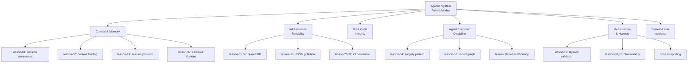

# Agentic System Failure Taxonomy from Lessons Corpus

> [!abstract] Goal
> Group the vault's 45 operationally-derived lessons into a taxonomy of agentic system failure modes. Transform a flat numbered list into a publishable-quality contribution to AI safety and systems engineering.

## Overview

The vault contains 45 lessons (`lesson-01` through `lesson-40`, plus named lessons) derived from real failures — not theorized, but broken and fixed. Grouped and framed, they constitute a taxonomy of failure modes in agentic AI systems.

> [!tip] Portfolio Value
> No other candidate has a corpus like this. Most research portfolios show what was built. This shows what was broken, what it cost, and what was learned. That's evidence of production-grade systems thinking.

## Proposed Taxonomy

### Category Details

| Category | Lessons | Pattern |
|----------|---------|---------|
| **Context & Memory** | 01, 07, 19, 37 | Agents assume context persists when it doesn't. Session boundaries are invisible failure surfaces. |
| **Infrastructure Reliability** | 05, 06, 10, 15, 21, 25, 32, 34 | External services (SurrealDB, Ollama, CI) fail silently. JSON pollution corrupts downstream pipelines. |
| **Git & Code Integrity** | 02, 09, 16, 17, 22, 23, 27 | Pre-commit hooks bypassed, stale branches merged, gitignore violated. Version control as attack surface. |
| **Agent Execution Discipline** | 03, 04, 08, 11, 20, 28, 33, 38 | Agents modify more than requested (surgery pattern), break import graphs, or compete for shared resources. |
| **Measurement & Honesty** | 12, 30, 31, 35, named lessons | Metrics that look right but aren't. Layered validation catches what single-pass checks miss. |
| **System-Level Incidents** | 13, 15, adversarial-review lesson | Cascading failures: 8.6M file incident, system lockup, unreviewed destructive operations. |

> [!danger] What This Demonstrates
> These failure modes are not hypothetical. Each one has a root cause analysis, a fix, and a prevention strategy documented in the vault. This is the difference between theoretical safety research and operational safety engineering.

## Deliverables

- [ ] `concepts/agentic-system-failure-taxonomy.md` — full taxonomy with category analysis
- [ ] 2-paragraph version for application cover letter
- [ ] Cross-link each lesson to its taxonomy category

## Related

- [[compound-engineering]] — methodology that produced the lessons
- [[ai-safety]] — failure taxonomies are a form of safety engineering
- [[adversarial-review]] — adversarial review catches failure modes before they become lessons
- [[lesson-adversarial-review-before-execution]] — meta-lesson about reviewing before executing
- [[lesson-measurement-integrity-honest-reporting]] — measurement honesty as a practice
- [[2026-03-03-vault-hidden-contributions-assessment]] — assessment that identified this corpus
- [[multi-agent-systems]] — many failures arise from multi-agent coordination
