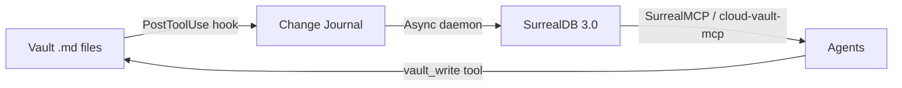

# Vault↔SurrealDB Sync Pipeline

> [!abstract] Product Requirements Document
> Enable real-time, bidirectional communication between the Obsidian vault (filesystem) and SurrealDB 3.0 (graph database), so that every vault change is queryable by agents and every agent insight enriches the vault.

---

## Problem Statement

> [!danger] The Gap
> The vault has **690 notes** with **9,432 wiki-links**. SurrealDB has **102 papers**, **317 concepts**, and **1,458 links** — a stale snapshot from a one-time import. There is no automatic sync. Changes to the vault are invisible to SurrealDB-backed tools. Agent insights stored in SurrealDB never flow back to the vault.

**Current state:**
- SurrealDB 3.0 is running (`cohezion-surreal.service`, port 8000, RocksDB storage)
- Cloud-vault-mcp has 5 SurrealDB tools (`surrealdb_query`, `surrealdb_import_papers`, `surrealdb_import_concepts`, `surrealdb_start_watching`, `surrealdb_stop_watching`)
- Auth works end-to-end (systemd service has correct credentials)
- `.env` now has correct credentials (fixed 2026-03-05)
- But: **no automatic sync**, data is stale, health check lies about connectivity

**Impact:** Agents querying SurrealDB get stale data. Graph queries that should surface connections miss recent notes. The 3D graph plugin scans the filesystem independently — SurrealDB's graph capabilities go unused.

---

## Success Criteria

> [!success] Definition of Done
> 1. **Vault→SurrealDB:** Every vault `.md` change syncs to SurrealDB within 60 seconds
> 2. **SurrealDB→Vault:** Agent-generated insights (from SurrealDB) can be written back as vault notes
> 3. **Health check honest:** Health endpoint tests actual authenticated query, not just `/health`
> 4. **Data current:** SurrealDB record count matches vault note count (±5 for in-flight changes)
> 5. **Zero manual steps:** Sync runs as a daemon — no human intervention needed after setup

---

## Architecture

See [[2026-03-05-vault-surrealdb-architecture]] for the full architecture document.

**Summary:** Three-layer compound pattern:



| Layer | Purpose | Latency |
|-------|---------|---------|
| **Hook** | Detect vault changes, append to journal | <10ms |
| **Journal** | Buffer changes, deduplicate | On-disk |
| **Sync Daemon** | Read journal → upsert SurrealDB | <60s |
| **Query** | Agents query via MCP tools | <50ms |
| **Writeback** | Agents create vault notes via MCP | <100ms |

---

## Epics

### Epic 1: Fix Foundation — [[#E1 Fix Foundation]]

> [!tip] Prerequisite — Must complete before any other epic
> Fix the health check, align credentials everywhere, ensure the existing infrastructure works correctly.

| Story | Description | Estimate | Priority |
|-------|-------------|----------|----------|
| E1-S1 | Fix health check to test authenticated query, not just `/health` | S | P0 |
| E1-S2 | Add SurrealDB credentials to `.env.example` for documentation | XS | P0 |
| E1-S3 | Fix 3D graph plugin SurrealDBClient to include auth headers | S | P1 |
| E1-S4 | Run full re-import (`surrealdb_import_papers` + `surrealdb_import_concepts`) to sync stale data | S | P0 |
| E1-S5 | Add `decisions`, `lessons`, `patterns`, `experiments` table types to SurrealDB schema | M | P1 |

### Epic 2: Change Journal — [[#E2 Change Journal]]

> [!tip] Core plumbing — enables everything downstream

| Story | Description | Estimate | Priority |
|-------|-------------|----------|----------|
| E2-S1 | Design journal format (JSONL: timestamp, action, path, content-hash) | S | P0 |
| E2-S2 | Add journal-append to `vault-keeper-check.sh` PostToolUse hook (Write/Edit only) | S | P0 |
| E2-S3 | Create journal rotation script (daily, keep 30 days) | S | P2 |

### Epic 3: Sync Daemon — [[#E3 Sync Daemon]]

> [!tip] The engine — reads journal, upserts SurrealDB

| Story | Description | Estimate | Priority |
|-------|-------------|----------|----------|
| E3-S1 | Create `vault-surreal-sync` daemon (Python, reads JSONL, upserts via HTTP API) | L | P0 |
| E3-S2 | Handle all vault directory types (papers, concepts, decisions, lessons, patterns, experiments, projects) | M | P0 |
| E3-S3 | Parse frontmatter + wiki-links → SurrealDB record with typed edges | M | P0 |
| E3-S4 | Add systemd service (`cohezion-vault-sync.service`) | S | P1 |
| E3-S5 | Idempotent upserts — same note synced twice produces same record | S | P0 |
| E3-S6 | Handle deletes — track removed files, remove from SurrealDB | M | P1 |

### Epic 4: Schema Enrichment — [[#E4 Schema Enrichment]]

> [!tip] Leverage SurrealDB 3.0 features

| Story | Description | Estimate | Priority |
|-------|-------------|----------|----------|
| E4-S1 | Use Record References for wiki-links (bidirectional, schema-level) | M | P1 |
| E4-S2 | Add HNSW vector index for semantic search (embeddings via Ollama) | L | P2 |
| E4-S3 | Define computed fields: `link_count`, `inbound_count`, `staleness_days` | S | P1 |
| E4-S4 | Add `DEFINE EVENT` triggers for cross-table consistency | M | P2 |

### Epic 5: Agent Integration — [[#E5 Agent Integration]]

> [!tip] Close the loop — agents query and contribute

| Story | Description | Estimate | Priority |
|-------|-------------|----------|----------|
| E5-S1 | Add `surrealdb_search` tool to cloud-vault-mcp (full-text + graph traversal) | M | P1 |
| E5-S2 | Add `surrealdb_import_all` tool (papers + concepts + decisions + lessons + patterns) | S | P1 |
| E5-S3 | Expose SurrealDB graph queries for vault-keeper health checks | M | P2 |
| E5-S4 | Consider adding SurrealMCP as a direct MCP server in `~/.claude/mcp.json` | S | P2 |

---

## Story Details

### E1-S1: Fix Health Check — Authenticated Query Test

> [!warning] Currently Broken
> `check_surrealdb()` in `health.py:114-164` only hits `GET /health` (unauthenticated). This means the health endpoint reports "connected: true" even when credentials are wrong. It has been lying since the service was deployed.

**Acceptance criteria:**
- Health check sends an authenticated `INFO FOR DB` query
- Reports `connected: false` when credentials are wrong
- Reports `connected: true, tables: N` when working
- Latency still measured

**File:** `/home/mike-anderson/dev/cohezion/cloud-vault-mcp/src/mcp_server/health.py`

### E1-S3: Fix 3D Graph Plugin SurrealDBClient Auth

> [!warning] No Auth Headers
> `SurrealDBClient.ts:57-64` sends queries to `/sql` without any `Authorization` header. SurrealDB 3.0 requires Basic auth for the HTTP API.

**Acceptance criteria:**
- Constructor accepts username/password (with env var fallback)
- All `fetch()` calls include `Authorization: Basic <base64>` header
- Also add `surreal-ns: cohezion` and `surreal-db: vault` headers

**File:** `/home/mike-anderson/vaults/cohezion-vault/obsidian-plugin/3d-graph-plugin/src/services/SurrealDBClient.ts`

### E1-S4: Full Re-Import

**Steps:**
1. Call `surrealdb_import_papers` via MCP
2. Call `surrealdb_import_concepts` via MCP
3. Verify counts match vault: `papers/ → paper`, `concepts/ → concept`
4. Report delta (before vs after)

### E1-S5: Expand SurrealDB Schema

**Current tables:** `paper`, `concept`, `links`
**Needed tables:** `decision`, `lesson`, `pattern`, `experiment`, `project`

Each table needs: `id`, `title`, `date`, `status`, `tags`, `content_hash`, `outbound_links[]`, `inbound_links[]`, `frontmatter{}`

### E2-S1: Change Journal Format

```jsonl
{"ts":"2026-03-05T19:30:00Z","action":"upsert","path":"concepts/adversarial-review.md","hash":"a1b2c3d4","dir":"concepts"}
{"ts":"2026-03-05T19:30:01Z","action":"delete","path":"inbox/old-note.md","dir":"inbox"}
```

**Location:** `/home/mike-anderson/vaults/cohezion-vault/.vault-journal/changes.jsonl`
**Rotation:** Daily, gzipped, 30-day retention

### E3-S1: Sync Daemon Design

```
┌─────────────┐     ┌──────────────┐     ┌──────────────┐
│  Journal     │────▶│  Sync Daemon │────▶│  SurrealDB   │
│  (JSONL)     │     │  (Python)    │     │  (port 8000) │
└─────────────┘     └──────────────┘     └──────────────┘
                         │
                    Reads journal
                    Parses .md files
                    Extracts frontmatter
                    Extracts wiki-links
                    Upserts records
                    Creates typed edges
```

**Key design decisions:**
- Poll-based (read journal every N seconds), not inotify
- Checkpoint file tracks last-processed journal position
- Failed upserts logged to DLQ, not retried inline

---

## Diagnostic Summary (2026-03-05)

| Component | Status | Detail |
|-----------|--------|--------|
| SurrealDB 3.0 service | Running | `cohezion-surreal.service`, RocksDB, port 8000 |
| SurrealDB auth | Working | `sdb_admin_session43` / `SA0hhO5QnsFmt6GvZlNaHXS-ufTnRi8o` |
| Cloud-vault-mcp | Running | `cohezion-vault.service`, port 8360 |
| MCP → SurrealDB query | Working | `surrealdb_query` returns 102 papers via authenticated query |
| `.env` credentials | Fixed (today) | Added `SURREALDB_USERNAME/PASSWORD` for dev-mode runs |
| Health check | Misleading | Only tests `/health` (unauthenticated) — reports "ok" without testing auth |
| Data staleness | Stale | 102 papers in DB vs 100+ in vault; concepts/decisions/lessons not synced |
| Automatic sync | Missing | No daemon, no journal, no watcher active |
| 3D graph plugin | No auth | `SurrealDBClient.ts` sends queries without auth headers |

---

## Related

- [[2026-03-05-vault-surrealdb-architecture]] — Full architecture document
- [[compound-engineering]] — The methodology this pipeline operationalizes
- [[surrealdb]] — SurrealDB concept note
- [[knowledge-graph-systems]] — Knowledge graph systems concept
- [[graphrag-knowledge-graph-with-surrealdb]] — GraphRAG integration concept
- [[cloud-vault-mcp]] — The MCP server that bridges vault ↔ SurrealDB
- [[non-blocking-observability]] — The change journal follows non-blocking observability principles
- [[implementation-first-infrastructure-later]] — Epic 1 (fix foundation) before Epic 3 (build new)

---

## Timeline

| Week | Focus | Epics |
|------|-------|-------|
| 1 | Fix foundation + change journal | E1, E2 |
| 2 | Sync daemon + basic schema | E3, E1-S5 |
| 3 | Schema enrichment + agent integration | E4, E5 |
