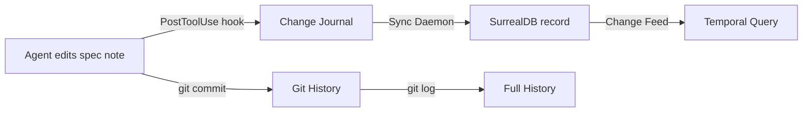

# Vault as System of Record

> [!danger] The Problem
> If the git repo is lost, or an agent session crashes, or MCP config is corrupted — can we rebuild? Today the answer is "partially." Skills live in `.claude/skills/`, agent rules in `.claude/rules/`, MCP config in `~/.claude/mcp.json`, tools in `tools/`. None of this is in the vault's knowledge graph. If the repo is gone, the vault has concepts and papers but not the instructions for how the system operates.

## Context

The vault currently stores **knowledge** (concepts, papers, decisions, lessons) but not **system definitions** (skills, agents, MCP servers, tools, hooks). These system definitions are the operating instructions that make the knowledge useful. Without them, an agent reading the vault can understand *what* Cohezion knows but not *how* Cohezion works.

| Asset | Current Location | In Vault? | Queryable? |
|-------|-----------------|-----------|------------|
| Skills | `.claude/skills/*/SKILL.md` | No | No |
| Agent rules | `.claude/rules/*.md` | No | No |
| MCP servers | `~/.claude/mcp.json`, `.mcp.json` | No | No |
| Tools (CLI) | `tools/cohezion-engine/` | Code only | No |
| Hooks | `.claude/hooks/*.sh` | No | No |
| Agent definitions | Scattered in skills/rules | No | No |
| PRDs / Architecture | Sometimes ad-hoc | Partially | No |

## Decision

> [!tip] Proposed
> **Mirror all system definitions into the vault as structured notes.** The vault becomes the single source of truth for reconstructing the entire Cohezion system — not just the knowledge, but the machinery.

### What Gets Stored

| Asset Type | Vault Location | Format | Update Trigger |
|-----------|----------------|--------|----------------|
| **Skills** | `specs/skills/<name>.md` | Skill spec: purpose, triggers, steps, examples | After `/sync` or skill creation |
| **Agent Definitions** | `specs/agents/<name>.md` | Agent spec: role, tools, constraints, prompts | After agent design changes |
| **MCP Servers** | `specs/mcp-servers/<name>.md` | Server spec: URL, tools, auth, examples | After MCP config changes |
| **Tools** | `specs/tools/<name>.md` | Tool spec: commands, flags, examples, install | After tool releases |
| **Hooks** | `specs/hooks/<name>.md` | Hook spec: trigger, logic, alerts, cooldown | After hook modifications |
| **Workflows** | `specs/workflows/<name>.md` | Workflow spec: phases, gates, transitions | After workflow changes |

### Directory Structure

```
specs/
├── _index.md              ← Directory index with conventions
├── skills/
│   ├── vault-keeper.md    ← Mirrors .claude/skills/vault-keeper/SKILL.md
│   ├── daily-research.md
│   ├── flesh-out.md
│   ├── link.md
│   ├── note.md
│   └── triage.md
├── agents/
│   ├── plan-verifier.md
│   ├── plan-challenger.md
│   ├── spec-reviewer-compliance.md
│   └── spec-reviewer-quality.md
├── mcp-servers/
│   ├── cloud-vault-mcp.md
│   ├── ollama-mcp.md
│   ├── context7.md
│   ├── web-search.md
│   └── web-fetch.md
├── tools/
│   ├── cohezion-engine-cli.md
│   ├── vault-keeper-hook.md
│   └── mcp-cli.md
└── workflows/
    ├── spec-driven-development.md
    ├── compound-engineering.md
    └── vault-keeper-maintenance.md
```

### Document Versioning Strategy

> [!tip] Three-Tier Versioning
> Git for history, frontmatter for metadata, SurrealDB for temporal queries.

**Tier 1 — Git (durable history, already running):**
- Every vault change is a git commit on `track-c`
- `git log --follow specs/skills/vault-keeper.md` shows full evolution
- Git tags mark stable milestones: `git tag v1.0-skills`

**Tier 2 — Frontmatter metadata (self-documenting):**
```yaml
---
title: "Vault Keeper Skill"
date: 2026-03-05
version: 3
last_revised: 2026-03-05
revision_history:
  - {v: 1, date: 2026-03-04, change: "Initial skill creation"}
  - {v: 2, date: 2026-03-05, change: "Added Read mode, canvas nudge"}
  - {v: 3, date: 2026-03-05, change: "Added callout and alias nudges"}
tags: [spec, skill, vault-keeper]
---
```

**Tier 3 — SurrealDB temporal queries (queryable history):**
```surql
-- Define changefeed on specs table
DEFINE TABLE spec CHANGEFEED 90d;

-- Query: what changed in the last week?
SELECT * FROM spec WHERE synced_at > time::now() - 7d ORDER BY synced_at DESC;

-- Future: temporal queries when SurrealDB supports VERSION AT
```

### How Versioning Flows



| Need | Tool |
|------|------|
| "What did this spec look like last week?" | `git show HEAD~5:specs/skills/vault-keeper.md` |
| "Which specs changed today?" | `git diff --name-only HEAD~1 specs/` |
| "Show me all skill versions" | SurrealDB query on `spec` table with changefeed |
| "What's the current version?" | Read frontmatter `version:` field |

## Consequences

> [!success] If Accepted
> - **Disaster recovery:** The vault alone is enough to rebuild the entire system — skills, agents, MCP config, tools, hooks, workflows
> - **Traceability:** Every system change is tracked (git + frontmatter + SurrealDB)
> - **Agent onboarding:** New agents read `specs/` to understand what tools and skills are available
> - **Cross-agent compatibility:** Gemini CLI, OpenCode, Codex agents can read `specs/` to understand the system
> - **Compound value:** System definitions participate in the knowledge graph — linked to concepts, decisions, and lessons

> [!warning] Maintenance Cost
> - Specs must stay in sync with actual `.claude/` config — stale specs are worse than no specs
> - Mitigation: `/sync` skill already exists; extend it to write vault specs as part of the sync cycle
> - Mitigation: vault-keeper hook can detect stale specs (compare `.claude/` timestamps vs `specs/` timestamps)

## Alternatives

| Alternative | Rejected Because |
|-------------|-----------------|
| **Just keep `.claude/` in git** | Hidden from knowledge graph, not queryable, not cross-linked |
| **Store in `patterns/`** | Patterns are reusable solutions, not system definitions — different lifecycle |
| **Store in `docs/`** | Docs is long-form prose, not structured specs |
| **Don't mirror, just reference** | References break when config changes; vault needs self-contained copy |

## Related

- [[2026-03-05-vault-surrealdb-sync-pipeline]] — The sync pipeline that makes SurrealDB versioning possible
- [[2026-03-05-vault-surrealdb-architecture]] — Architecture for vault↔SurrealDB communication
- [[compound-engineering]] — System definitions compound just like knowledge
- [[implementation-first-infrastructure-later]] — Start with manual specs, automate sync later
- [[non-blocking-observability]] — Versioning is observability of system evolution
- [[adversarial-review]] — Stale specs are a failure mode adversarial review should catch
