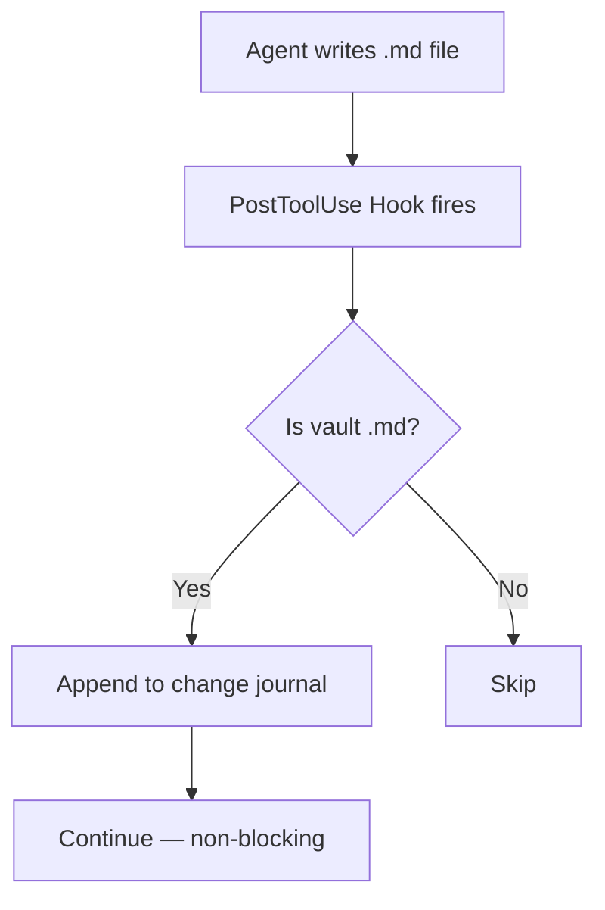
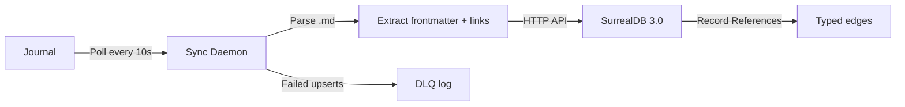

# Vault↔SurrealDB Sync Architecture

> [!abstract] Architecture Decision Record
> Defines how the Obsidian vault communicates with SurrealDB 3.0 — the three-layer compound pattern that turns a filesystem-based knowledge graph into a queryable, real-time database.

---

## Context

The Cohezion vault is the source of truth for knowledge. SurrealDB 3.0 is the query engine. Today they are disconnected:

- **Vault** (filesystem): 690 notes, 9,432 wiki-links, human-editable, Obsidian-native
- **SurrealDB** (database): 102 papers, 317 concepts, 1,458 links — stale snapshot, no auto-sync

Agents need both: the vault for reading/writing markdown, SurrealDB for graph traversal, semantic search, and cross-note analytics.

---

## Decision

> [!tip] Three-Layer Compound Pattern
> Hook → Change Journal → Sync Daemon → SurrealDB

Each layer does one thing, non-blocking, with clear boundaries.

### Layer 1: Change Detection (Hook)



**Implementation:** Extend `vault-keeper-check.sh` (already fires on Write/Edit) to append a single JSONL line to `.vault-journal/changes.jsonl`.

**Properties:**
- Adds <5ms to every Write/Edit — non-blocking
- Journal is append-only — no locking, no corruption risk
- Works for any agent (Claude Code, Gemini CLI, OpenCode) via the PostToolUse hook

### Layer 2: Change Journal (Buffer)

```
.vault-journal/
├── changes.jsonl      ← current journal (append-only)
├── checkpoint.json    ← last-synced position
└── archive/           ← rotated daily, gzipped, 30-day retention
```

**JSONL format:**
```json
{"ts": "2026-03-05T19:30:00Z", "action": "upsert", "path": "concepts/adversarial-review.md", "hash": "sha256:a1b2c3d4", "dir": "concepts"}
```

**Why a journal and not direct sync?**
- **Decoupling:** Hook completes in <5ms regardless of SurrealDB latency
- **Reliability:** If SurrealDB is down, changes queue up and sync when it's back
- **Deduplication:** If the same file is written 5 times in 10 seconds, the daemon processes the latest state once
- **Audit trail:** Journal is a timestamped log of all vault mutations

### Layer 3: Sync Daemon (Engine)



**Daemon design:**
- Python process, runs as `cohezion-vault-sync.service`
- Reads journal from checkpoint → end
- For each changed file: parse frontmatter, extract wiki-links, compute content hash
- Upsert record in SurrealDB (idempotent — hash-based skip for unchanged content)
- Create/update typed edges for wiki-links
- Update checkpoint after successful batch

**SurrealDB record structure:**
```surql
CREATE paper:adversarial_review SET
  title = "Adversarial Review",
  vault_path = "concepts/adversarial-review.md",
  date = d"2026-02-23",
  status = "active",
  tags = ["adversarial-review", "planning"],
  content_hash = "sha256:a1b2c3d4",
  outbound_links = [concept:compound_engineering, concept:meta_learning],
  frontmatter = { ... },
  synced_at = time::now()
;
```

**Edge structure (SurrealDB 3.0 Record References):**
```surql
RELATE concept:adversarial_review->links->concept:compound_engineering SET
  type = "related",
  context = "mandatory phase gate in compound engineering workflow",
  source_section = "Related"
;
```

### Layer 4: Query Path (Read)

Agents query SurrealDB through cloud-vault-mcp's existing tools:

| Tool | Query Type | Use Case |
|------|-----------|----------|
| `surrealdb_query` | Raw SurrealQL | Ad-hoc graph traversal |
| `surrealdb_import_papers` | Bulk import | Full re-sync |
| `surrealdb_import_concepts` | Bulk import | Full re-sync |
| (new) `surrealdb_search` | Full-text + graph | Semantic + structural search |

### Layer 5: Writeback Path (Write)

Agents write vault notes via cloud-vault-mcp's `vault_write` tool. The PostToolUse hook fires → journal appended → sync daemon picks it up → SurrealDB updated. The loop closes automatically.

---

## Consequences

> [!success] If Accepted
> - Every vault change reaches SurrealDB within 60 seconds
> - Agents can graph-traverse the knowledge base (find all notes 2 hops from X)
> - Semantic search via HNSW vectors (future: Epic 4)
> - Vault-keeper can use SurrealDB for orphan/density queries instead of grep
> - Complete audit trail of all vault mutations

> [!warning] Risks
> - **Journal disk growth:** ~1KB per change × 100 changes/day = ~30KB/day. Rotation at 30 days. Negligible.
> - **Sync lag:** 10-60s delay. Acceptable — vault is not a real-time system.
> - **SurrealDB downtime:** Changes queue in journal. On restart, daemon catches up.
> - **Schema drift:** If vault directory types change, daemon must be updated.

---

## Alternatives Considered

| Alternative | Rejected Because |
|-------------|-----------------|
| **Direct sync in hook** | Would add 50-500ms to every Write. Blocks the agent. |
| **Filesystem watcher (inotify)** | Misses changes from non-file-API writes. Hook is more reliable. |
| **SurrealDB Change Feeds** | Goes DB→consumer, not vault→DB. Wrong direction. |
| **Polling full vault** | O(N) every cycle. Journal is O(changes). |

---

## SurrealDB 3.0 Features Leveraged

| Feature | How Used |
|---------|----------|
| **Record References** | Wiki-links become typed, bidirectional schema-level edges |
| **HNSW Vector Search** | Semantic search via Ollama embeddings (Epic 4) |
| **Computed Fields** | `link_count`, `inbound_count`, `staleness_days` auto-calculated |
| **DEFINE EVENT** | Cross-table consistency triggers |
| **HTTP API** | Daemon upserts via REST — no driver dependency |
| **8-22x faster graph queries** | Sub-50ms traversals for vault-keeper |

---

## Related

- [[2026-03-05-vault-surrealdb-sync-pipeline]] — PRD with epics, stories, and timeline
- [[surrealdb]] — SurrealDB concept note
- [[graphrag-knowledge-graph-with-surrealdb]] — GraphRAG integration concept
- [[cloud-vault-mcp]] — The MCP server bridging vault ↔ SurrealDB
- [[non-blocking-observability]] — Journal follows non-blocking observability principles
- [[implementation-first-infrastructure-later]] — Fix foundation before building new
- [[compound-engineering]] — Three-layer pattern is compound engineering applied to infrastructure
- [[knowledge-graph-densification]] — SurrealDB enables graph-aware densification
