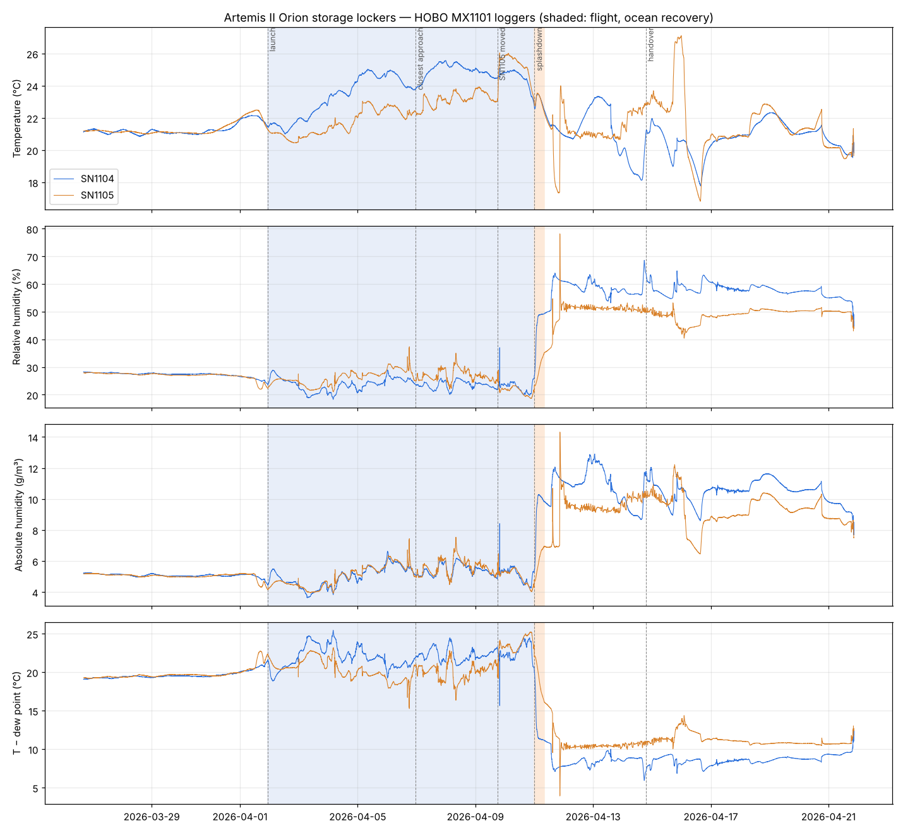
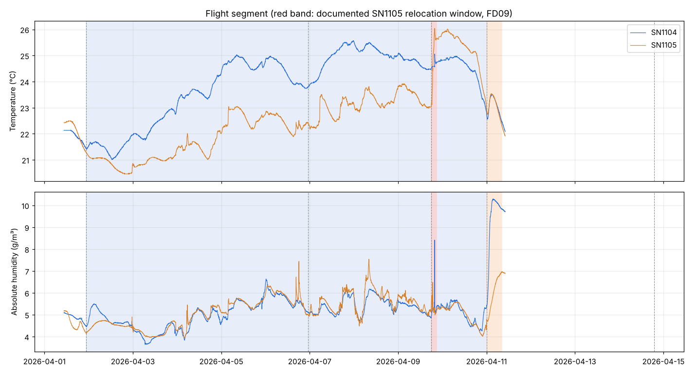

# Artemis II science archive — first look (PDS release 2026-10-07)

Source: PDS Geosciences Node, <https://pds-geosciences.wustl.edu/missions/artemis2/index.htm>.
The first delivery has four bundles: crew cameras, Orion cameras, mission audio (all at the
PDS Cartography and Imaging Sciences Node), and the Mission Bundle (documents plus Orion
locker temperature/humidity) at the Geosciences Node. The SPICE geometry bundle is still
**delayed**, so nothing here depends on pointing or footprints.

Reproduce the locker analysis (it downloads its own inputs into the git-ignored `data/` directory):

```bash
uv run --no-project --with pandas --with matplotlib python research/artemis2/analyze_hobo.py
```

Outputs: `hobo_results.json` and `figures/`. Every number quoted in this section is written
to `hobo_results.json` by the script, under the key named in brackets. The script checks
both downloads against the MD5s in the PDS bundle manifest, and reads the label statistics
from the PDS4 XML labels.

## 1. Orion locker environment (2 × HOBO MX1101, 60 s cadence)

Two loggers sat in bags in the crew-cabin storage lockers that future missions will use for
returned lunar samples. SN 1104 was in **Locker E** (bag L_011) for the whole mission. SN 1105
started in **Locker D** (bag L_022) and was moved to **Locker F** (bag R_027) on FD09. The logs
run from 2026-03-26 to 2026-04-21: six days on the pad, the 9.1-day flight, and ten days of
recovery and shipping. With two loggers on one flight, every comparison below mixes the
locker, the bag and the position inside it. These data cannot separate those effects.



### Data quality: clean
- **Complete:** 37,706 and 37,690 records with no gaps. Every interval is exactly 60 s and the
  sequence numbers are continuous.
- **Labels are accurate:** the PDS4 label statistics (min, max, mean, std) match the data to
  rounding [`label_vs_data`].
- **Dew point checks out:** the logged dew point matches a Magnus–Tetens recomputation to
  ≤0.04 °C with the coefficients used here; the residual depends on the coefficient set
  [`dewpoint_resid_C`].
- **Cross-calibration is good:** on the pad the two loggers have a mean offset of 0.05 °C and
  0.27 % RH, with single-minute differences up to 0.39 °C and 3.2 % RH
  [`diff_1105_minus_1104_by_phase`, `pad_single_minute_max_abs_diff`].
- **The timezone is CDT (UTC−5), as labelled.** The PDS label start (16:25:46Z) equals the
  first CSV row (11:25:46 CDT) + 5 h. DST ran 2026-03-08 to 11-01, so the offset is constant
  across the record.

### What the data tells us
1. **The lockers stayed as dry in flight as on the pad.** Mean absolute humidity was 5.1 g/m³
   in flight and 5.1 g/m³ on the pad, with RH between 18 and 37 % [`abs_humidity_by_phase_gm3`].
   During flight the air never came within 15.3 °C of its dew point, so condensation in the
   lockers was not a concern [`flight_min_dewpoint_margin_C`].
2. **The lockers warmed slowly, then cooled before reentry.**
   - The linear trend was +0.37 °C/day in Locker E and +0.49 °C/day in Locker D→F
     [`flight_T_trend_C_per_day`].
   - Locker E's 12-hour mean peaked at 25.4 °C on 04-07/08 [`flight_T_12h_mean_max`] and was
     22.8 °C in the 30 minutes before splashdown.
   - A detrended power spectrum shows no clear periodicity, such as a 24-hour crew-schedule
     line (`figures/hobo_flight_spectrum.png`).
3. **There is no detectable thermal trace of the flyby or the eclipse.** Between 22:00 and
   02:00, covering closest approach (23:00) and the roughly 56-minute solar eclipse (section 2),
   the loggers' temperatures stayed in these ranges [`flyby_window_22_02`]:
   - Locker E: 23.74–23.98 °C, a 0.24 °C range, the same as the median 4-hour range in flight
     [`flight_4h_T_range_median_C`].
   - Locker D: 22.18–22.44 °C.

   This is a weak test. The loggers are bagged and respond over hours, the eclipse lasted
   under an hour, and the cabin is actively controlled. A small effect would not show.
4. **After splashdown, humidity rose in both lockers, at very different times and rates**
   [`splashdown_humidity`]:
   - **Locker E:** absolute humidity crossed 5σ above its pre-splashdown level at 00:24 UTC,
     17 minutes after splashdown. It reached 9.5 g/m³ two hours after splashdown and 10 g/m³
     at 02:48, and stayed high.
   - **Locker F:** it did not cross 5σ until 01:42. It was still 7.0 g/m³ eight hours later
     and first reached 7 g/m³ at 14:08, just before a sharp excursion near 15:00.
   - **The point for sample-curation planning:** in at least one locker, terrestrial humidity
     reached the samples within about half an hour of splashdown, more than 3.5 days before
     the bags were handed over. These data cannot show why the two lockers differed
     (locker, bag, position, or ventilation path).
5. **Most of the extreme values in the archive are post-mission.**
   - These come from recovery and shipping: SN 1105's label maxima (27.1 °C, 78 % RH), both
     loggers' RH and dew-point maxima, and the smallest dew-point margin (3.9 °C).
   - The exception is SN 1104's temperature maximum of 25.57 °C, reached in flight at 04-07
     23:43 UTC [`T_max_at`, `RH_max_at`, `min_margin_at`].
   - Anyone who uses the label statistics as "the flight environment" will overstate it.

### Anomalies and curiosities
- **Filename error.** Both files are named `art002_086-…`.
  - The guide's filename spec for the HOBO loggers is `art002_<UTC Start Date in
    DOY-hhmmss>_<UTC End Date in DOY-hhmmss>_…` (Appendix, "HOBO data loggers").
  - The actual start, 2026-03-26, is **DOY 085** in both UTC and CDT.
  - The end field, `111`, is correct, so this is an off-by-one in the start field
    [`filename_start_doy`, `actual_start_doy`].
- **The FD09 relocation leaves a clear signature, but the guide gives only a window.** The
  documented move window is 18:00–21:00 UTC. RH transients inside that window
  [`fd09_relocation`]:
  - **SN 1105:** two, at 18:09 (+1.2 %) and 18:45 (+4.5 %).
  - **Locker E (SN 1104):** one large transient at 19:49:
    - RH jumped +12.3 % in one minute and was back within 1 % of its prior level two minutes
      later.
    - Temperature rose from 24.58 to 25.06 °C and was still 24.80 °C after 15 minutes.
    - Absolute humidity went 5.48 → 8.41 → 5.16 g/m³, ending *below* its prior level.
  - **What these show:** the coupled, lasting response rules out a single-sample glitch. The
    logs fit handling of the bags during the documented FD09 stowage. At 19:50 SN 1105 also
    shows a small +0.8 % RH rise, so the two bags may have been handled together.
  - **When the move happened:** the data cannot say which of 18:45 or 19:49 was the move
    itself.
  - **Lockers D and F differ in temperature:** over 6 hours either side of the window,
    SN 1105's mean temperature rose 23.07 → 25.76 °C while Locker E rose 24.50 → 24.78 °C.
    Locker F therefore ran about **2.4 °C warmer than Locker D**, assuming D followed E's
    trend.
- **Sharp RH transients are consistent with bag or locker handling, but no record says what
  caused them.** Counts depend on the threshold [`transient_counts`]:

  | Logger period | ≥1 % | ≥1.5 % | ≥3 % |
  |---|---|---|---|
  | Locker D, launch → FD09 move window | 8 | 4 | 1 |
  | Locker F, after the move | 0 | 0 | 0 |
  | Locker E, whole flight | 2 | 1 | 1 |

  The largest Locker D transient, 04-06 18:09 (+4.6 %), falls inside "Pre-Flyby Crew Conference
  and Camera Setup" (17:03–18:17) in Table 4. That is a coincidence in time, not evidence of
  what was stored where.
- **An RH step shortly before splashdown.** About 7 minutes before splashdown, both loggers
  show an RH step of at least 5 times their own preceding noise [`reentry_rh_step`]:
  - SN 1105: +2.0 % at 00:00, against noise of 0.13 %.
  - SN 1104: +0.4 % at 23:59:46, against noise of 0.03 %.

  The archive gives no parachute or vent timeline, so the cause is unknown.



## 2. Lunar Targeting Package / Outgoing Target Request (`artemis2_outgoing_target_request.json`)

This file lists 39 entries: 30 numbered observation targets and 9 lettered crew-swap or
break entries. The crew request times run from **18:45 to 01:23 UTC**. The geographic targets were
Glushko, Ohm (each scheduled twice), the Aristarchus Plateau, Reiner Gamma, Orientale Basin
(twice), Vavilov and Hertzsprung. Non-geographic targets included Earthset and Earthrise
around loss of signal, **Impact Flashes**, **Lofted Lunar Dust**, and the eclipse sequence
(Sunset, Eclipsed Moon / Deep Space, Sunrise). The file's geometric event times are Earthset
22:42–22:46, Earthrise 23:25, Sunset 00:35 and Sunrise 01:31–01:33, so loss of signal lasted
about 40 minutes and the solar eclipse about 56 minutes. The "request" times are crew
prompts and differ from these by up to 8 minutes; the Sunrise request (01:23) came 8 minutes
before the event.

Defects in the file:
- **Hertzsprung Basin has latitude, longitude and diameter all 0.** It is a real ~570 km
  farside basin, and it has no science-objective (STM) flags. The other geographic targets
  have coordinates, and spot checks against IAU positions agree for Glushko, Ohm,
  Aristarchus and Reiner Gamma. Reiner Gamma's diameter is 0, which may be deliberate for an
  albedo swirl. Hertzsprung looks like an incomplete late addition.
- **Inconsistent time formats.** The time fields use three formats (`06 Apr 2026
  18:00:00.000000`, `6 Apr 2026 18:00:00.000`, and blank for 6 entries), so a naive parser
  will fail. The guide's Table 4 also has a typo: `2026:04:05`.

## 3. Crew camera, Orion camera and mission audio bundles

The PDS Imaging Node has no public directory listing. The files are served from
`https://d1ejlg980osaur.cloudfront.net/archive/artemis/artemis2/<bundle>/`. The full label
contents can be searched through the Atlas Elasticsearch endpoint
(`POST https://pds-imaging.jpl.nasa.gov/api/search/atlas/_search`). Counts below come from
the collection inventories and that index; the key numbers are in `imaging_summary.json`.

| Bundle | Contents |
|---|---|
| Crew camera (~2.5 TB) | 10,329 exposures × 4 forms (NEF source, raw TIFF, processed TIFF, browse PNG). Nikon D5 s/n …015: 7,007; D5 …017: 552; Z9 …019: 2,770. 80–400 mm lens on 75 % |
| Orion camera | 1,012 images (OpNav 404, DCAM 249, SAW3 189, CAB2 148, SAW4 12, SAW2 10) + 22 SAW3 videos |
| Mission audio | 53 crew tablet (PCD) recordings (8.7 h), two 24-h Orion-to-Earth voice-loop days + one clip (~57 h total), 56 transcripts (6,355 lines), 5 annotation PDFs |

**The flyby dominates the crew camera bundle.** Of the 10,329 crew images, 6,484 were taken
on 04-06 UTC and 2,299 on 04-07. The busiest hours were 04-06 21:00 (1,838 images) and 04-07
00:00 (1,715). In comparison, 04-08 has 8 images and 04-09 has 71.

### What the crew reported: lunar impact flashes
From the voice-loop transcript `art002_2026-04-07_oe1_trn-csv_v01.csv`. Times are from its
`utc` column. The `audio_time` column is a position in a stitched-together recording. The
`utc` segment containing these rows has zero offset and matches the eclipse geometry: "The
sun has gone behind the moon" at 00:38, against a computed sunset of 00:35.

> **00:59:10, Wiseman:** "We have seen three impact flashes so far… Jeremy saw two, so that's
> four total… It was not sun glint off a particulate from the thrusters or the purge tanks. It
> was definitely impact flashes on the moon. And Jeremy just saw another one."
>
> **01:00:04, Wiseman:** "they've all been either on or a bit south of the equator and **on
> the Earth side of the moon**."
>
> **01:00:32, science team:** "we have citizen scientists here on Earth looking for impact
> flashes. So hearing you saw them **on the near side** means that people saw them too."

**What is solid:**
- Several crew members reported brief, white, star-like flashes on the unlit Moon:
  - Hansen: "a pinprick of light… no color".
  - Wiseman: "a millisecond… white, bluish white".
- They report the flashes as on or a bit south of the lunar equator, on the Earth-facing
  side. That region could be watched from the ground, and the science team said citizen
  observers were already looking.

**What is uncertain:**
- **Count.** About 3–6 unique flashes.
  - At 00:59 the tally is 4, plus "another one".
  - The next day Hansen says "Reid and I saw two identical ones", which means at least one
    was double-counted.
- **Timing.** The crew were already watching for flashes before the eclipse:
  - Mission control asked for flash reports at 04-06 22:33, as the Moon went dark ahead of
    loss of signal.
  - The plan scheduled an "Impact Flashes" target at 23:02, and 105 images were tagged with
    it.
  - The next day the science team said "we do not feel we have clarity on when the first
    four of those impact flashes occurred".
  - Most or all were probably seen around the eclipse (00:35–01:32), but that is the crew's
    recollection, not a log.
- **Location.** On 04-07 at 19:08 Wiseman said none of *his* were "in the Earth Glow side".
  That conflicts with his own report at 01:00. Positions should come from the crew
  annotation PDF (`art002e016252_pcd_ann_v01.pdf`) and the delayed SPICE geometry. Hansen
  says he "did not record at all where we saw" them.
- **Caveats the crew raised themselves:**
  - At 00:51 Glover relayed that Wiseman had "seen two meteors".
  - Wiseman later added "maybe it was a priming bias".
  - Astronauts routinely see flashes from cosmic rays hitting the retina. The crew said these
    were different, but only from recollection.

**Why the geometry helped:** the eclipse removed the Sun's glare and let the crew dark-adapt
while looking at the night hemisphere. Orion was also thousands of kilometres from the Moon
rather than 384,000, so a given flash was several magnitudes brighter than it would be from
Earth. Together these favour seeing faint, brief flashes. The eclipse is not *required*:
impact flashes are routinely recorded on the Moon's night side from Earth.

**Why it matters:** if near-side positions and times can be pinned down from the annotation
PDF and SPICE, ground-based lunar-impact monitoring records from 04-06/07 could
independently confirm the flashes.

Other notable observations:
- **Glow around the eclipsed Moon.** At 01:02:05 Hansen describes "the glow around the moon… once
  your eyes adjust" as "easily 10 widths or diameters of the sun around the entire moon". This
  is a dark-adapted, naked-eye estimate. It may be the corona or scattered light: the next day
  Wiseman said the crew had underestimated "glare on the window structure".
- **Colour.** 04-06 19:24, Koch: "the more I look at the moon, the browner and browner it looks."
- **Aristarchus.** Wiseman: "so white… but its rays are so dim, so muted."
- **Ohm.** Koch reads Ohm's ray pattern as a grazing-angle impact.
- **Grimaldi.** CAPCOM: the crew's report of how dark Grimaldi looked "was unexpected and was
  something that has got the scientists excited".
- **Spacecraft events heard on the loops:**
  - a "cabin leak suspected" warning during suit drying, later traced to a cabin fan-speed
    pressure shift
  - an unexpected loss of signal during the handover to the DSN Madrid antenna
  - a transient HCN read error from the atmosphere analyser
  - a propulsion-system issue that CAPCOM said was "not an optocoupler glitch. It's something
    internal to the prop system" (04-07 23:51)

### Archive defects found in the imaging and audio bundles
1. **24 crew exposures were archived twice under different IDs.** All are from the Z9, for
   example `art002e009039` and `art002e029909`. Each pair has the same timestamp, camera
   file number, focus distance and file size, and the index MD5s match. A live check of
   three pairs found identical ETags and byte ranges, so these are true duplicates. They
   inflate the image count. In **21 pairs** the labels disagree on observation target: the
   `e009039`–`e009059` copies say "Moon" and their `e029909`–`e029929` twins are empty.
2. **A video segment over the flyby is missing.** SAW3 channel 1 `art002m1010961940`
   (04-06 19:40:51–21:38:52) has no channel-2 counterpart. Channel 2 jumps from a file
   ending at 19:42:40 to one starting at 21:39:14. The inventory lists 11 channel-1 files
   and only 10 channel-2 files.
3. **Target metadata is unreliable.**
   - The primary target is "Moon" on all 10,329 crew labels, including about 825 Earth
     images and the Sun and deep-space frames.
   - The observation-target field is empty on 6,275 labels.
   - 40 crew labels and 1 Orion SAW3 label have an activity name in the target field
     (`01_Discussion #1: Warm up`).
   - The activity tags seem to come from the plan timeline, not from what each image shows.
     Their windows overlap.
4. **Flight-day bookkeeping is inconsistent.**
   - The 249 DCAM images are in folder `fd04` but labelled flight day 0.
   - 249 images in `fd05` (141 CAB2 + 108 SAW3) are labelled flight day 6, and one SAW3
     image in `fd06` is labelled flight day 8.
   - There is no `fd08` folder in the Orion bundle.
5. **Audio inventory problems.**
   - The PDS Atlas search index lists `art002a000052_pcd1_src_v01.m4a` and its label, but
     the collection inventory does not, and the file server returns HTTP 403 for both, the
     same as for a nonexistent path.
   - Its index MD5 is identical to the inventoried `art002a000052_pcd3_raw_v01.m4a`. It
     looks like a stale duplicate left in the search index.
   - PCD recordings `a000001`/`a000003` and `a000002`/`a000004` are byte-identical
     duplicates: they have matching index MD5s, start/stop times and sizes.
   - Loop file `art002_2026-04-07_oe2` actually covers 2026-04-06 22:32–22:37.
6. **Label value errors.**
   - Every crew label has the placeholder stop time `3000-01-01`.
   - A sampled Z9 label has its focus distance unit as mm where metres were meant, and bits
     per sample and bit mask apparently swapped.
   - The transcripts' `audio_time` column is a position in a stitched-together recording,
     not wall-clock time; use the `utc` column.
   - 35 transcript rows go backwards in time.
   - Speaker names are inconsistent: "Wiseman " with a trailing space and 78 blank speakers.
7. **ID gap.** Image IDs `art002e009302`–`009560` don't exist, but three annotation PDFs are
   named exactly `e009303-e009388`, `e009389-e009474` and `e009475-e009560`. Those IDs were
   probably assigned to annotation pages.

## Summary — what's interesting

- **Most notable report:** the crew reported roughly 3–6 naked-eye lunar impact flashes,
  probably around the ~56-minute solar eclipse behind the Moon.
  - They described them as on or south of the equator on the **Earth-facing side**, so
    ground-based monitoring might independently confirm them.
  - These are crew reports with acknowledged caveats ("maybe it was a priming bias"), not
    instrument detections.
  - Times and positions were not logged.
- **Most useful for future sample return:** in flight, the lockers stayed as dry as on the pad
  (~5.1 g/m³). After splashdown, humidity in Locker E rose within about half an hour, days
  before handover. Locker F lagged by hours, for reasons these data cannot separate.
- **Anomalies in the record:**
  - duplicated crew images
  - a missing flyby video segment
  - a stale, unserved audio entry in the search index, plus duplicated audio recordings
  - Hertzsprung's zero coordinates
  - the HOBO filename day-of-year off by one

  The FD09 humidity transients in both lockers fit the documented stowage and relocation;
  they are not an anomaly.
- **Not yet possible:** SPICE (pointing and geometry) is delayed, so image footprints, flash
  locations and the pointing of the frames tagged "Impact Flashes" cannot be checked yet.

_Method note: three independent adversarial reviews (scientific rigor, primary-source
re-verification against the live PDS archive and Atlas index, and
code/reproducibility/security) checked this write-up. Each assumed it
was wrong. Their accepted corrections are applied here: the flash location, timing and
count; the overstated locker interpretations; and every locker number now traced to
`hobo_results.json` with MD5-verified inputs. An earlier recomputation produced the
corrections in commit `6c9d523`._

_Interactive version: `research/artemis2/site/index.html` (self-contained; locker series are 20-minute means of the HOBO data, flyby photo counts are 10-minute bins of crew-camera label times)._
