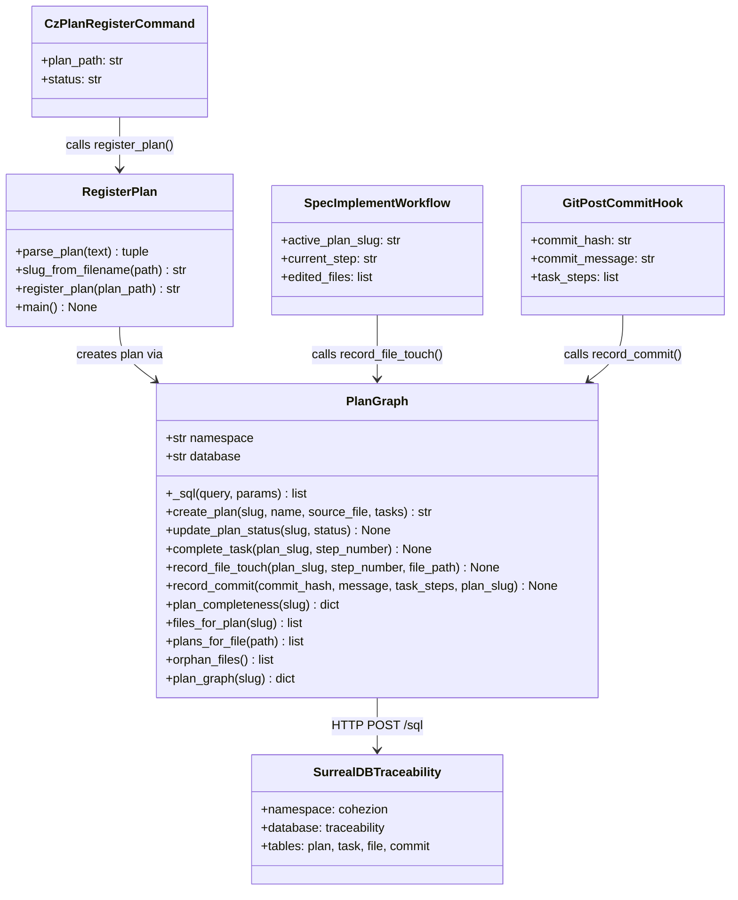

# Wire Traceability Module into Spec Workflow and `cz plan register`

## Requirements

Implement end-to-end plan traceability by wiring the existing `cohezion.traceability` module
into three integration points: the `cz plan register` CLI command, the spec-implement workflow
(`spec-implement.md`), and a git post-commit hook. The traceability module (PlanGraph +
register_plan) is a complete 487-line implementation with 0 external Python importers — the gap
is purely wiring, not implementation.

Goals:
- Create observable plan→task→file→commit lineage in SurrealDB `cohezion:traceability`
- Enable `cz plan register <plan.md>` to create plan and task records at plan approval time
- Enable the spec workflow to emit `record_file_touch` events as files are edited
- Enable git post-commit hook to emit `record_commit` events linking commits to tasks

## Entities



## Approach

1. **CZ CLI integration**:
   - `cz plan register <path> <status>` currently calls `cz plan register` as a no-op name binding
   - Add a shim in the `cz` CLI (cohezion-engine tool) that calls `asyncio.run(register_plan(path))`
     after the existing status write, or invoke it as a subprocess from the spec-plan skill
   - The simpler path: add a call to `register_plan()` directly inside the `cz plan register`
     implementation in the cohezion-engine `cohezion_engine/commands/plan.py`

2. **Spec-implement wiring**:
   - After each `Edit` or `Write` tool call in `spec-implement.md`, emit `record_file_touch(slug, step, path)`
   - The active plan slug is available from `cz plan status --json` → `slug` field
   - Emit asynchronously (fire-and-forget subprocess) to avoid blocking spec execution:
     `uv run python -m cohezion.traceability.record_touch <slug> <step> <path>`
   - Add a thin CLI entry point `record_touch` to `register_plan.py`

3. **Git post-commit hook**:
   - Add `.claude/hooks/post-commit-trace.sh` that reads `GIT_COMMIT`, parses the commit message
     for plan task references (e.g., `[step: 1.2]` convention), and calls
     `uv run python -m cohezion.traceability.record_commit <hash> "<msg>" <steps> <slug>`
   - Alternatively: add to the existing git hooks registered by `entire enable`

4. **Schema initialization**:
   - `PlanGraph.initialize_schema()` must be called once; add to the `cz plan register` path
     before `create_plan()` so the schema is always up to date

## Structure

### Module Layout
1. `src/cohezion/traceability/plan_graph.py` — core async SurrealDB client (exists, 349 LOC)
2. `src/cohezion/traceability/register_plan.py` — CLI + parse logic (exists, 138 LOC)
3. `src/cohezion/traceability/__init__.py` — export surface (exists)
4. `src/cohezion/traceability/record_touch.py` — NEW: thin fire-and-forget CLI for spec workflow
5. `src/cohezion/traceability/record_commit.py` — NEW: thin CLI for git hook

### Dependencies
1. `record_touch.py` → `PlanGraph.record_file_touch()` (async, direct)
2. `record_commit.py` → `PlanGraph.record_commit()` (async, direct)
3. `CzPlanRegisterCommand` → `register_plan()` → `PlanGraph.create_plan()`
4. spec-implement workflow → `record_touch` subprocess → `PlanGraph.record_file_touch()`
5. git post-commit hook → `record_commit` subprocess → `PlanGraph.record_commit()`

### Integration Points
1. **cohezion-engine CLI** (`~/.local/bin/cz`): `plan.py` command handler
   - Source: `~/vaults/cohezion-vault/tools/cohezion-engine/cohezion_engine/commands/plan.py`
2. **spec-implement skill**: `.claude/commands/spec-implement.md` — append touch call after edit steps
3. **Git hook**: `.claude/hooks/post-commit-trace.sh` (new file)

### Layered Architecture
1. Hook/CLI Layer: `record_touch.py`, `record_commit.py`, `plan.py` in cohezion-engine
2. Service Layer: `register_plan.register_plan()`, `PlanGraph` methods
3. Transport Layer: `PlanGraph._sql()` via httpx HTTP POST /sql
4. Data Layer: SurrealDB `cohezion:traceability` (port 8001)

## Operations

### Create `src/cohezion/traceability/record_touch.py`
1. Responsibility: Fire-and-forget CLI to emit a file-touch event from spec-implement workflow
2. Attributes:
   - None (stateless CLI module)
3. Methods:
   - `main()`: None
     - Logic:
       - Parse `sys.argv[1:4]` as `plan_slug, step_number, file_path`
       - Validate 3 args present; print usage to stderr and exit(1) if not
       - Call `asyncio.run(PlanGraph().record_file_touch(plan_slug, step_number, file_path))`
       - Silently succeed or fail (tracing must not block spec execution)
       - Exit 0 always (swallow exceptions, log DEBUG only)
4. Entry point: `__main__` block calls `main()`
5. Constraints:
   - MUST NOT raise or print to stderr on SurrealDB connection failure (DB may be offline)
   - MUST complete in under 2s (httpx timeout=2.0 for resolve_url is the natural bound)

### Create `src/cohezion/traceability/record_commit.py`
1. Responsibility: CLI to record a git commit in the traceability graph from a post-commit hook
2. Methods:
   - `main()`: None
     - Logic:
       - Parse `sys.argv`: `commit_hash, message, plan_slug, step1 [step2 ...]`
       - `task_steps = sys.argv[4:]` (zero or more)
       - Call `asyncio.run(PlanGraph().record_commit(commit_hash, message, task_steps, plan_slug))`
       - Exit 0 always (same non-blocking contract as record_touch)
4. Entry point: `__main__` block calls `main()`

### Update cohezion-engine `cohezion_engine/commands/plan.py`
1. Find the `register` subcommand handler
2. After the `cz plan register <path> <status>` write completes, add:
   ```python
   try:
       import asyncio
       from cohezion.traceability.register_plan import register_plan
       plan_id = asyncio.run(register_plan(plan_path))
       click.echo(f"Traceability: {plan_id}")
   except Exception as e:
       click.echo(f"[traceability skip] {e}", err=True)
   ```
3. The try/except ensures traceability failure never breaks the existing `cz` CLI behavior

### Update `.claude/commands/spec-implement.md`
1. After each step that calls Edit or Write on a Python/JS/TS file, append:
   ```bash
   # Emit file-touch event to traceability graph (fire-and-forget)
   PLAN_SLUG=$(cz plan status --json 2>/dev/null | python3 -c "import sys,json; print(json.load(sys.stdin).get('slug',''))" 2>/dev/null)
   STEP_NUM="<current_step_number>"
   uv run python -m cohezion.traceability.record_touch "$PLAN_SLUG" "$STEP_NUM" "<file_path>" &
   ```
2. The `&` background runs it async — does not block spec execution
3. Add this Bash block as a "Traceability" step in the spec-implement template after the Edit/Write confirmation

### Create `.claude/hooks/post-commit-trace.sh`
1. Shell hook called by git post-commit
2. Logic:
   - `HASH=$(git rev-parse HEAD)`
   - `MSG=$(git log -1 --pretty=%s)`
   - `SLUG=$(cz plan status --json 2>/dev/null | python3 -c ... | plan slug field)`
   - Parse `MSG` for `[step: N.N]` patterns → `STEPS` array
   - Call: `uv run python -m cohezion.traceability.record_commit "$HASH" "$MSG" "$SLUG" "${STEPS[@]}" &`
3. Always exit 0 (tracing must never block a git commit)
4. Convention: plan authors add `[step: 1.2]` to commit messages to link them

### Update `src/cohezion/traceability/__init__.py`
1. Export `PlanGraph`, `register_plan`, `parse_plan`, `slug_from_filename`
2. This surfaces the module for import by cohezion-engine without an explicit deep import

## Norms

1. **Non-blocking contract**: All traceability calls from hooks and workflow steps MUST be
   fire-and-forget (subprocess `&` or `asyncio.run` inside try/except with no reraise).
   Tracing must never block compilation, spec execution, or git operations.
2. **SurrealDB availability**: The module degrades gracefully when SurrealDB is offline.
   `PlanGraph._resolve_url()` has a 2s timeout and falls back silently. Do NOT add retry
   loops — one attempt only.
3. **Exception handling**: In CLI entry points, catch all exceptions at the top level and
   exit 0 silently (or with DEBUG-level log). The callers (spec workflow, git hook) cannot
   handle failures.
4. **Async pattern**: All `asyncio.run()` calls must be at the CLI boundary only.
   `PlanGraph` internals are `async def` — do not call them from sync contexts except via
   `asyncio.run()` at the CLI layer.
5. **SurrealDB record IDs**: Task IDs use `{slug}__{step_number.replace(".", "_")}` convention.
   File IDs use `_path_to_id(path)` (slashes/dots → underscores). Commit IDs use `hash[:12]`.
   These conventions are already established in `plan_graph.py` — do not deviate.
6. **Step convention for git commits**: Adopt `[step: N.N]` bracketed notation in commit
   messages for the hook to parse. Document in `CLAUDE.md` under Git Operations.
7. **cohezion-engine dependency**: The `cz` CLI lives in `~/vaults/cohezion-vault/tools/cohezion-engine/`.
   Add `cohezion` as a dependency to its `pyproject.toml` (or use subprocess to avoid coupling).
   Subprocess is safer given the separate venv.
8. **Schema init**: Call `PlanGraph.initialize_schema()` at the start of `register_plan()` when
   a `SURREAL_INIT_SCHEMA=1` env var is set (opt-in, not default — avoids repeated schema
   pushes in normal operation).

## Safeguards

1. **Functional Constraints**:
   - `cz plan register` must still succeed even if SurrealDB is down — the traceability call
     is additive only, wrapped in try/except
   - `spec-implement` must still proceed even if `record_touch` subprocess fails or is killed
   - Git commits must not be blocked by tracing failures — hook always exits 0

2. **Performance Constraints**:
   - `record_touch` subprocess: ≤2s wall clock (httpx timeout bound + uv startup ~500ms)
   - `record_commit` subprocess: ≤3s (similar bound)
   - Both are backgrounded (`&`) so wall-clock cost to caller ≈ 0

3. **Security Constraints**:
   - SurrealDB credentials from env vars (`SURREAL_USER`, `SURREAL_PASSWORD`) — never hardcode
   - File paths passed to `_path_to_id()` are sanitized to alphanumeric+underscore before use
     as record IDs — this prevents SurrealDB injection via crafted filenames
   - Git commit messages are passed as string arguments, not shell-interpolated — use
     `subprocess.run([...], ...)` not `os.system(f"... {msg} ...")` in any wrappers

4. **Integration Constraints**:
   - SurrealDB must be running at `http://localhost:8001` with `cohezion` namespace and
     `traceability` database (schema in `knowledge_graph/plan_traceability_schema.surql`)
   - `uv` must be on `PATH` for the subprocess calls from hooks and skill files
   - The `cohezion` package must be importable from the venv used by `uv run`

5. **Business Rule Constraints**:
   - Only plans registered via `cz plan register` create plan records — ad-hoc task creation
     outside the spec workflow is out of scope
   - `orphan_files()` returns files edited without a linked plan — this is a diagnostic query,
     not an enforcement mechanism
   - `plans_for_file()` may return multiple slugs — files can be touched by multiple plans

6. **Data Constraints**:
   - Plan slug is derived from filename only (date prefix stripped, `.md` removed) — slugs must
     be unique per project; collisions are not checked at creation time
   - `tasks_total` and `tasks_completed` counters are derived from plan markdown at register time
     and are NOT recomputed from graph edges — they are authoritative for `plan_completeness()`
   - Step numbers must match between plan markdown and the step tags in commit messages exactly
     (e.g., `1.2` not `step 1.2`)

7. **API Constraints**:
   - `record_touch.py` CLI signature: `<plan_slug> <step_number> <file_path>` (positional, no flags)
   - `record_commit.py` CLI signature: `<commit_hash> <commit_message> <plan_slug> [step ...]`
   - These are internal CLIs — no versioning or backward compatibility required beyond this session
