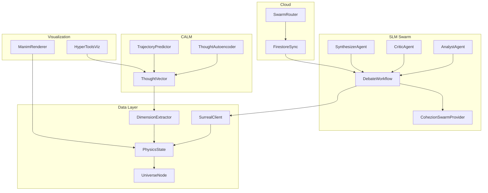

# Cohezion Knowledge Graph - Component Relationships

## Entity: Architecture Foundation
Created: 2026-01-16
Type: CORE_SYSTEM

### Relationships

## Component Relationships

| Source | Relationship | Target | Description |
|--------|-------------|--------|-------------|
| AnalystAgent | PRODUCES | ThoughtVector | Multiple perspectives on query |
| CriticAgent | REVIEWS | ThoughtVector[] | Detects contradictions |
| SynthesizerAgent | CONSUMES | CritiqueResult | Resolves contradictions |
| DebateWorkflow | ORCHESTRATES | All Agents | Parallel → Critique → Synthesize |
| DimensionExtractor | TRANSFORMS | Text → PhysicsState | 12D semantic mapping |
| SurrealClient | STORES | UniverseNode | Graph + document + vector |
| ThoughtAutoencoder | COMPRESSES | Text → z | 256-dim latent space |
| TrajectoryPredictor | PREDICTS | z(t) → z(t+1) | LSTM + flow field |
| ManimRenderer | VISUALIZES | PhysicsState | 3D animation |
| HyperToolsViz | PROJECTS | Embeddings | UMAP/t-SNE reduction |
| SwarmRouter | QUEUES | Tasks | Cloud Run mailbox |
| FirestoreSync | SYNCS | Local ↔ Cloud | Bidirectional |

## Skill Dependencies

| Skill | Depends On |
|-------|-----------|
| SWARM_ORCHESTRATION_PRIME | MODEL_ROUTING_PRIME, PARALLEL_ORCHESTRATION_PRIME |
| CALM_ABSTRACTION_PRIME | EMBEDDING_STRATEGY_PRIME |
| UNIVERSE_VISUALIZATION_PRIME | CALM_ABSTRACTION_PRIME, PHYSICS_PRIME |

## Key Artifacts

| Artifact | Type | Path |
|----------|------|------|
| Architecture Foundation | DOC | library/ARCHITECTURE_FOUNDATION.md |
| Vision Document | PDF | library/Integrating Repos, Visualizations, and CALM.pdf |
| Debate Protocol | CODE | swarm/workflows/debate_protocol.py |
| Physics State | CODE | db/surreal_client.py |
| Thought Autoencoder | CODE | calm/autoencoder.py |
